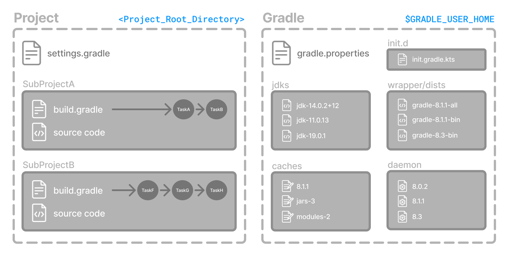
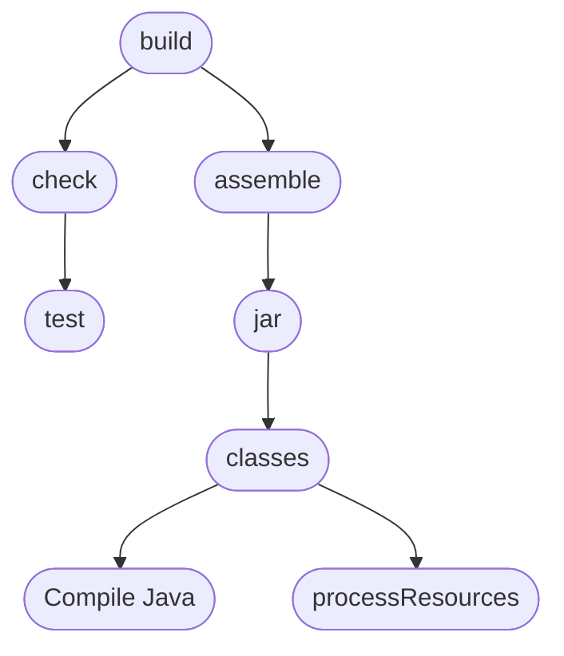
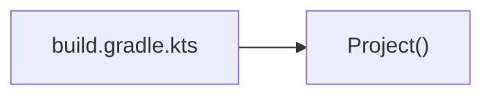

# Authoring builds

## 1. Gradle Directories

Gradle uses two main directories to perform and manage its work: Gradle User Home directory and the Project Root directory.



### Gradle User Home directory

By default, the Gradle User Home (`~/.gradle` or `C:\Users\<USERNAME>\.gradle`) stores global configuration properties, initialization scripts, caches, and log files.

It can be set with the environment variable `GRADLE_USER_HOME`.

It is roughly structured as follows:

```bash
├── caches                  
│   ├── 4.8                     
│   ├── 4.9                     
│   ├── ⋮
│   ├── jars-3                  
│   └── modules-2               
├── daemon 
│   ├── ⋮
│   ├── 4.8
│   └── 4.9
├── init.d                  
│   └── my-setup.gradle
├── jdks                    
│   ├── ⋮
│   └── jdk-14.0.2+12
├── wrapper
│   └── dists                   
│       ├── ⋮
│       ├── gradle-4.8-bin
│       ├── gradle-4.9-all
│       └── gradle-4.9-bin
└── gradle.properties
```

- `caches` is the global cache directory containing version specific caches to support incremental builds.
- `caches/jars-3` and `caches/modules-2` are shared caches for artifacts of dependencies.
- `daemon`: registry and logs for the [Gradle Daemon](https://docs.gradle.org/current/userguide/gradle_daemon.html#gradle_daemon).
- `init.d`: global [initialization scripts](https://docs.gradle.org/current/userguide/init_scripts.html#init_scripts)
- `jdks`: JDKs downloaded by the toolchain support.
- `wrapper/dists`: distribution downloaded by the [Gradle Wrapper](https://docs.gradle.org/current/userguide/gradle_wrapper.html#gradle_wrapper_reference)
- Global [Gradle configuration properties](https://docs.gradle.org/current/userguide/build_environment.html#sec:gradle_configuration_properties)

Consult the [Gradle Directories reference](https://docs.gradle.org/current/userguide/directory_layout.html#dir:gradle_user_home) to learn more.

### Project Root directory

The anatomy of a typical project root directory looks as follows:
```bash
├── .gradle
│   ├── 4.8
│   ├── 4.9
│   └── ⋮
├── build
├── gradle
│   └── wrapper
├── gradle.properties
├── gradlew
├── gradlew.bat     
├── settings.gradle.kts
├── subproject-one    
|   └── build.gradle.kts
├── subproject-two    
|   └── build.gradle.kts
└── ⋮
```

## 2. Multi-Project Builds

Gradle supports _multi-project_ builds. This is sometimes referred to as a multi-module project. Gradle refers to modules as subprojects.

### Multi-Project standards

Gradle community has two standards for multi-project build structures:

1. `buildSrc` - `buildSrc` is a subproject-like directory at the Gradle project root containing all the build logic.
2. Composite builds - a build that includes other builds where `build-logic` is a build directory at the Gradle project root containing reusable build logic.


#### 1. Multi-Project Builds using `buildSrc`

For example, a build that has many modules called `mobile-app`, `web-app`, `api`, `lib`, and `documentation` could be structured as follows:

```bash
.
├── gradle
├── gradlew
├── settings.gradle.kts
├── buildSrc
│   ├── build.gradle.kts
│   └── src/main/kotlin/shared-build-conventions.gradle.kts
├── mobile-app
│   └── build.gradle.kts
├── web-app
│   └── build.gradle.kts
├── api
│   └── build.gradle.kts
├── lib
│   └── build.gradle.kts
└── documentation
    └── build.gradle.kts
```

The modules have dependencies between them such as `web-app` and `mobile-app` depending on `lib`. This means that in order for Gradle to build `web-app` or `mobile-app`, it must build `lib` first.

`buildSrc` is automatically recognized by Gradle. It is a good place to define and maintain shared configuration or imperative build logic, such as custom tasks or plugins.

If the `java` plugin is applied to the `buildSrc` project, the compiled code from `buildSrc/src/main/java` is put in the classpath of the root build script, making it available to any subproject in the build.

#### 2. Composite Builds

Composite Builds, also referred to as _included builds_, are best for sharing logic between builds (_not subprojects_) or isolating access to shared build logic (i.e. convention plugins).

The logic in `buildSrc` from the previous example has been turned into a project that contains plugins and can be published and worked on independently of the root project build.

The plugin is moved to its own build called `build-logic` with a build script and settings file:

```bash
.
├── gradle
├── gradlew
├── settings.gradle.kts
├── build-logic
│   ├── settings.gradle.kts
│   └── conventions
│       ├── build.gradle.kts
│       └── src/main/kotlin/shared-build-conventions.gradle.kts
├── mobile-app
│   └── build.gradle.kts
├── web-app
│   └── build.gradle.kts
├── api
│   └── build.gradle.kts
├── lib
│   └── build.gradle.kts
└── documentation
    └── build.gradle.kts
```

The root settings file includes the entire `build-logic` build:

```kotlin
pluginManagement {
  includeBuild("build-logic")
}
include("mobile-app", "web-app", "api", "lib", "documentation")
```

## 3. Gradle Build Lifecycle

The build author defines the tasks and dependencies between tasks. Gradle guarantees that these tasks will execute in order of their dependencies.

For example, if the project tasks include `build`, `assemble`, `createDocs`, the build scripts can ensure that they are executed in the order `build` -> `assemble` -> `createDocs`.

### Task Graphs

Gradle builds the task graph before executing any task.

Across all projects in the build, tasks form a Directed Acyclic Graph.

Here is a partial task graph for a standard Java build, with dependencies between tasks represented as arrows:



Both plugins and build scripts contribute to the task graph via the task dependency mechanism and annotated inputs/outputs.

### Build Phases

A Gradle build has three distinct phases.


Gradle runs these phases in order:

#### Phase 1. Initialization

- Detects the `settings.gradle.kts` file
- Creates a `Settings` instance
- Evaluates the settings file to determine which projects (and included builds) make up the build.
- Creates a `Project` instance for every project.

#### Phase 2. Configuration

- Evaluates the build scripts, `build.gradle.kts`, of every project participating in the build.
- Creates a task graph for requested tasks.

#### Phase 3. Execution

- Schedules and executes the selected tasks.
- Dependencies between tasks determine execution order.
- Execution of tasks can occur in parallel.


## 4. Writing Settings Files


The initialization phase finds the setting file in the project root directory.

When the settings file `settings.gradle.kts` is found, Gradle instantiates a [`Settings`](https://docs.gradle.org/current/dsl/org.gradle.api.initialization.Settings.html) object.

One of the purposes of the `Settings` object is to allow you to declare all the projects to be included in the build.

### Settings Scripts

Before Gradle assembles the projects for a build, it creates a `Settings` instance and executes the settings file against it.


### The `Settings` Object

Many top-level properties and blocks in a settings script are part of the Settings API.

#### Standard `Settings` properties

The `Settings` object exposes a standard set of properties in your settings script.

The following table lists a few commonly used properties:

| Name | Description |
| --- | ---- |
| buildCache | The build cache configuration. |
| plugins | The container of plugins that have been applied to the settings. |
| rootDir | The root directory of the build. |
| rootProject | The root project of the build |
| settings | Returns this settings object |

The following table lists a few commonly used methods:

| Name | Description |
| --- | ---- |
| include() | Adds the given projects to the build. |
| includeBuild() | Includes a build at the specified path to the composite build. |

### Settings Script structure

Let's take a look at an example `settings.gradle.kts` file and break it down:

```kotlin
pluginManagement {
  repositories {
    gradlePluginPortal()
    google()
  }
}

plugins {
  id("org.gradle.toolchains.foojay-resolver-convention") version "0.8.0"
}

rootProject.name = "root-project"

dependencyResolutionManagement {
  repositories {
    mavenCentral()
  }
}

include("sub-project-a")
include("sub-project-b")
include("sub-project-c")
```

## 5. Writing Build Scripts

The initialization phase in the Gradle Build lifecycle finds the root project and subprojects included in your project root directory using the settings file.

Then, for each project included in the settings file, Gradle creates a `Project` instance.

Gradle then looks for a corresponding build script file, which is used in the configuration phase.

### Build Scripts

Every Gradle build comprises one or more projects; a root project and subprojects.

A build script configures a project and is associated with an object of type `Project`.



#### Build Script structure

```kotlin
```

## 6. Using Tasks

The work that Gradle can do on a project is defined by one or more _tasks_.

A task represents some independent unit of work that a build performs.

## 7. Writing Tasks

## 8. Using Plugins

## 9. Writing Plugins
