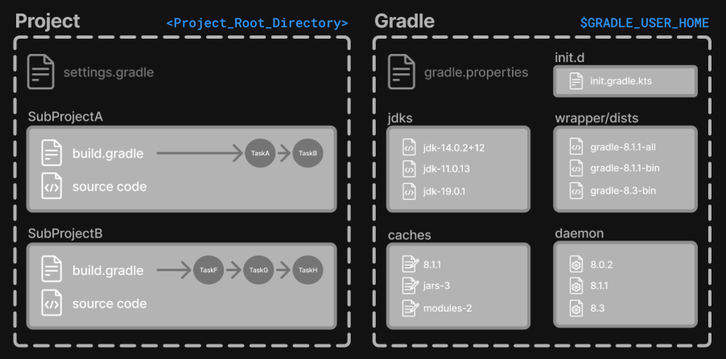

# Learning the Basics

## Gradle Directories

Gradle uses two main directories to perform and manage its work: the Gradle User Home directory and the Project Root directory.



### Gradle User Home directory

By default, the Gradle User Home (`~/.gradle`) stores global configuration properties, initialization scripts, caches, and log files.

It can be set with the environment variable `GRADLE_USER_HOME`.

It is roughly structured as follows:

```bash
├── caches
│   ├── 4.8
│   ├── 4.9
│   ├── ⋮
│   ├── jars-3
│   └── modules-2
├── daemon
│   ├── ⋮
│   ├── 4.8
│   └── 4.9
├── init.d
│   └── my-setup.gradle
├── jdks
│   ├── ⋮
│   └── jdk-14.0.2+12
├── wrapper
│   └── dists
│       ├── ⋮
│       ├── gradle-4.8-bin
│       ├── gradle-4.9-all
│       └── gradle-4.9-bin
└── gradle.properties
```

- `caches`: Global cache directory (for everything that is not project-specific).
- `caches/4.8`, `caches/4.9`:  Version-specific caches (e.g., to support incremental builds).
- `caches/jars-3`, `caches/modules-2`: Shared caches (e.g., for artifacts of dependencies).
- `daemon`: Registry and logs of the Gradle Daemon.
- `init.d`: Global initialization scripts.
- `jdks`: JDKs downloaded by the toolchain support.
- `wrapper/dists`: Distributions downloaded by the Gradle Wrapper.
- `gradle.properties`: Global Gradle configuration properties.

### Project Root directory

The project root directory contains all source files from your project.

It also contains files and directories Gradle generates, such as `.gradle` and `build`, as well as the Gradle configuration directory: `gradle`.

While `gradle` is usually checked into source control, `build` and `.gradle` directories contain the output of your builds, caches, and other transient files Gradle uses to support features like incremental builds.

The anatomy of a typical project root directory looks as follows:

```bash
├── .gradle 
│   ├── 4.8 
│   ├── 4.9 
│   └── ⋮
├── build   
├── gradle
│   └── wrapper 
├── gradle.properties   
├── gradlew 
├── gradlew.bat 
├── settings.gradle.kts 
├── subproject-one  
|   └── build.gradle.kts    
├── subproject-two  
|   └── build.gradle.kts    
└── ⋮
```

## Multi-Project Builds

## Gradle Build Lifecycle

## Writing Settings Files
