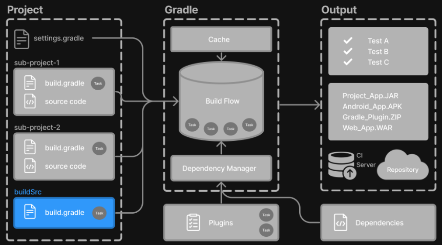
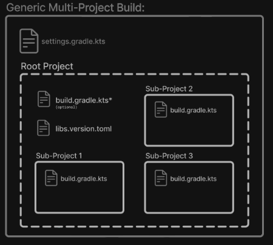
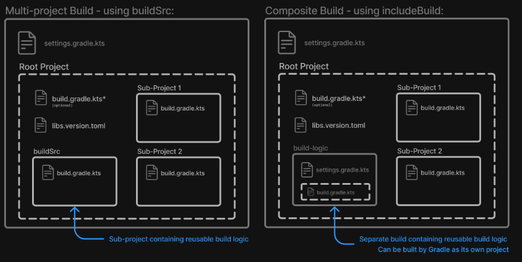

# Learning the Basics

## 1. Gradle Directories

Gradle uses two main directories to perform and manage its work: the [Gradle User Home directory](#gradle-user-home-directory) and the [Project Root directory](#project-root-directory).


### Gradle User Home directory

By default, the Gradle User Home (`~/.gradle`) stores global configuration properties, initialization scripts, caches, and log files.

It can be set with the environment variable `GRADLE_USER_HOME`.

It is roughly structured as follows:

```bash
├── caches
│   ├── 4.8
│   ├── 4.9
│   ├── ⋮
│   ├── jars-3
│   └── modules-2
├── daemon
│   ├── ⋮
│   ├── 4.8
│   └── 4.9
├── init.d
│   └── my-setup.gradle
├── jdks
│   ├── ⋮
│   └── jdk-14.0.2+12
├── wrapper
│   └── dists
│       ├── ⋮
│       ├── gradle-4.8-bin
│       ├── gradle-4.9-all
│       └── gradle-4.9-bin
└── gradle.properties
```

- `caches`: Global cache directory (for everything that is not project-specific).
- `caches/4.8`, `caches/4.9`:  Version-specific caches (e.g., to support incremental builds).
- `caches/jars-3`, `caches/modules-2`: Shared caches (e.g., for artifacts of dependencies).
- `daemon`: Registry and logs of the Gradle Daemon.
- `init.d`: Global initialization scripts.
- `jdks`: JDKs downloaded by the toolchain support.
- `wrapper/dists`: Distributions downloaded by the Gradle Wrapper.
- `gradle.properties`: Global Gradle configuration properties.

### Project Root directory

The project root directory contains all source files from your project.

It also contains files and directories Gradle generates, such as `.gradle` and `build`, as well as the Gradle configuration directory: `gradle`.

While `gradle` is usually checked into source control, `build` and `.gradle` directories contain the output of your builds, caches, and other transient files Gradle uses to support features like incremental builds.

The anatomy of a typical project root directory looks as follows:

```bash
├── .gradle 
│   ├── 4.8 
│   ├── 4.9 
│   └── ⋮
├── build   
├── gradle
│   └── wrapper 
├── gradle.properties   
├── gradlew 
├── gradlew.bat 
├── settings.gradle.kts 
├── subproject-one  
|   └── build.gradle.kts    
├── subproject-two  
|   └── build.gradle.kts    
└── ⋮
```

- `.gradle`: Project-specific cache directory generated by Gradle.
- `.gradle/4.8`, `.gradle/4.9`: Version-specific caches (e.g., to support incremental builds).
- `build`: The build directory of this directory into which Gradle generates all build artifacts.
- `gradle/wrapper`: Contains the JAR file and configuration of the Gradle Wrapper.
- `gradle.properties`: Project-specific Gradle configuration properties.
- `gradlew`, `gradlew.bat`: Scripts for executing builds using the Gradle Wrapper.
- `settings.gradle.kts`: The project's setting file where the list of subprojects is defined.
- `build.gradle.kts`: Each subproject has its own Gradle build script.

## Multi-Project Builds

Gradle supports multi-project builds.



A multi-project build consists of one root project and one or more subprojects.

### Multi-Project structure

The following represents the structure of a multi-project build that contains three subprojects:



The directory structure should look as follows:

```bash
├── .gradle
│   └── ⋮
├── gradle
│   ├── libs.versions.toml
│   └── wrapper
├── gradlew
├── gradlew.bat
├── settings.gradle.kts
├── sub-project-1
│   └── build.gradle.kts
├── sub-project-2
│   └── build.gradle.kts
└── sub-project-3
    └── build.gradle.kts
```

### Multi-Project standards

The Gradle community has two standards for multi-project build structures:

1. __Multi-Project Builds using buildSrc__ - where `buildSrc` is a subproject-like directory at the Gradle project root containing all the build logic.
2. __Composite Builds__ - a build that includes other builds where `build-logic` is a build directory at the Gradle project root containing reusable build logic.



#### 1. Multi-Project Builds using `buildSrc`

Multi-project build allow you to organize projects with many module, wire dependencies between those modules, and easily share common build logic amongst them.

For example, a build that has many modules called `mobile-app`, `web-app`, `api`, `lib`, and `documentation` could be structured as follows:

```bash
.
├── gradle
├── gradlew
├── settings.gradle.kts
├── buildSrc
│   ├── build.gradle.kts
│   └── src/main/kotlin/shared-build-conventions.gradle.kts
├── mobile-app
│   └── build.gradle.kts
├── web-app
│   └── build.gradle.kts
├── api
│   └── build.gradle.kts
├── lib
│   └── build.gradle.kts
└── documentation
    └── build.gradle.kts
```

The modules will have dependencies between them such as `web-app` and `mobile-app` depending on `lib`.

In this example, the root settings file will look as follows:

```kotlin
include("mobile-app", "web-app", "api", "lib", "documentation")
```

The `buildSrc` directory is automatically recognized by Gradle. It is a good place to define and maintain shared configuration or imperative build logic, such as custom tasks or plugins.

`buildSrc` is automatically included in your build as a special subproject if a `build.gradle.kts` file is found under `buildSrc`.

If the `java` plugin is applied to the `buildSrc` project, the compiled code from `buildSrc/src/main/java` is put in the classpath of the root build script, making it available to any subproject (`web-app`, `mobile-app`, `lib`, etc...) in the build.

#### 2. Composite Builds

Composite Builds, also referred to as _included builds_, are best for sharing logic between builds (_not subprojects_) or isolating access to shared build logic (i.e., convention plugins).

Let's take the previous example. The build logic in `buildSrc` has been turned into a project that contains plugins and can be published and worked on independently of the root project build.

The plugin is moved to its own build called `build-logic` with a build script and settings file:

```bash
.
├── gradle
├── gradlew
├── settings.gradle.kts
├── build-logic
│   ├── settings.gradle.kts
│   └── conventions
│       ├── build.gradle.kts
│       └── src/main/kotlin/shared-build-conventions.gradle.kts
├── mobile-app
│   └── build.gradle.kts
├── web-app
│   └── build.gradle.kts
├── api
│   └── build.gradle.kts
├── lib
│   └── build.gradle.kts
└── documentation
    └── build.gradle.kts
```

> [!NOTE]
> The fact that `build-logic` is located in a subdirectory is irrelevant. The folder could be located outside the root project if desired.

The root settings file includes the entire `build-logic` build:

```kotlin
pluginManagement {
    includeBuild("build-logic")
}
include("mobile-app", "web-app", "api", "lib", "documentation")
```

### 2. Multi-Project path

A project path has the following pattern: it starts with an optional colon, which denotes the root project.

The root project, `:`, is the only project in a path not specified by its name.

The rest of a project path is a colon-separated sequence of project names, where the next project is a subproject of the previous project:

```bash
:sub-project-1
```

You can see the project paths when running `gradle projects`:

```bash
------------------------------------------------------------
Root project 'project'
------------------------------------------------------------

Root project 'project'
+--- Project ':sub-project-1'
\--- Project ':sub-project-2'
```

Project paths usually reflect the filesystem layout, but there are exceptions. Most notably for composite builds.

### Identifying project structure

You can use the `gradle projects` command to identify the project structure.

As an example, let's use multi-project build with the following structure:

```bash
$ gradle -q projects

Projects:

------------------------------------------------------------
Root project 'multiproject'
------------------------------------------------------------

Root project 'multiproject'
+--- Project ':api'
+--- Project ':services'
|    +--- Project ':services:shared'
|    \--- Project ':services:webservice'
\--- Project ':shared'

To see a list of the tasks of a project, run gradle <project-path>:tasks
For example, try running gradle :api:tasks
```

Multi-project builds are collections of tasks you can run.

#### Executing tasks by name

The basic rule behind Gradle's behavior is to execute all tasks down the hierarchy with _this_ name. And complain if there is _no_ such task found in any of the subprojects traversed.

> [!NOTE]
> Some task selector, like `help` or `dependencies`, will only run the task on the project they are invoked on and not on all the subprojects to reduce the amount of information printed on the screen.

#### Executing tasks by fully qualified name

You can use a task's fully qualified name to execute a specific task in a particular subproject. For example: `gradle:services:webservice:build` we run the `build` task of the _webservice_ subproject.

### Multi-Project building and testing

The `build` task is typically used to compile, test, and check a single project.

In a multi-project builds, you may often want to do all of these tasks across various projects. The `buildNeeded` and `buildDependents` tasks can help with this.

In [this example](https://docs.gradle.org/current/userguide/declaring_dependencies_between_subprojects.html#javadependencies_2), the `:services:person-service` project depends on both the `:api` and `:shared` projects. The `:api` project also depends on the `:shared` project.

Assuming you are working on a single project, the `:api` project, you have been making changes but have not build the entire project since performing a `clean`. You may want to build any necessary support JARs but only perform code quality and unit tests on the parts of the project you have changes.

The `build` task does this:

```bash
$ gradle :api:build
> Task :shared:compileJava
> Task :shared:processResources
> Task :shared:classes
> Task :shared:jar
> Task :api:compileJava
> Task :api:processResources
> Task :api:classes
> Task :api:jar
> Task :api:assemble
> Task :api:compileTestJava
> Task :api:processTestResources
> Task :api:testClasses
> Task :api:test
> Task :api:check
> Task :api:build

BUILD SUCCESSFUL in 0s
```

If you have just gotten the latest version of the source from your version control system, which included changes in other projects that `:api` depends on, you might want to build all the projects you depend on __AND__ test them too.

The `buildNeeded` task builds AND tests all the projects from the project dependencies of the `testRuntime` configuration:

```bash
$ gradle :api:buildNeeded
> Task :shared:compileJava
> Task :shared:processResources
> Task :shared:classes
> Task :shared:jar
> Task :api:compileJava
> Task :api:processResources
> Task :api:classes
> Task :api:jar
> Task :api:assemble
> Task :api:compileTestJava
> Task :api:processTestResources
> Task :api:testClasses
> Task :api:test
> Task :api:check
> Task :api:build
> Task :shared:assemble
> Task :shared:compileTestJava
> Task :shared:processTestResources
> Task :shared:testClasses
> Task :shared:test
> Task :shared:check
> Task :shared:build
> Task :shared:buildNeeded
> Task :api:buildNeeded

BUILD SUCCESSFUL in 0s
```

You may want to refactor some part of the `:api` project used in other projects. If you make these changes, testing only the `:api` project is insufficient. You must test all projects that depend on the `:api` project.

Thie `buildDependents` task tests ALL the projects that have been a project dependency (in the testRuntime configuration) on the specified project:

```bash
$ gradle :api:buildDependents
> Task :shared:compileJava
> Task :shared:processResources
> Task :shared:classes
> Task :shared:jar
> Task :api:compileJava
> Task :api:processResources
> Task :api:classes
> Task :api:jar
> Task :api:assemble
> Task :api:compileTestJava
> Task :api:processTestResources
> Task :api:testClasses
> Task :api:test
> Task :api:check
> Task :api:build
> Task :services:person-service:compileJava
> Task :services:person-service:processResources
> Task :services:person-service:classes
> Task :services:person-service:jar
> Task :services:person-service:assemble
> Task :services:person-service:compileTestJava
> Task :services:person-service:processTestResources
> Task :services:person-service:testClasses
> Task :services:person-service:test
> Task :services:person-service:check
> Task :services:person-service:build
> Task :services:person-service:buildDependents
> Task :api:buildDependents

BUILD SUCCESSFUL in 0s
```

Finally, you can build and test everything in all projects. Any task you run in the root project folder will cause that same-named task to be run on all the children.

You can run `gradle build` to build and test ALL projects.

## 3. Build Lifecycle

As a build author, you define tasks and specify dependencies between them. Gradle guarantees that tasks will execute in the order dictated by these dependencies.
