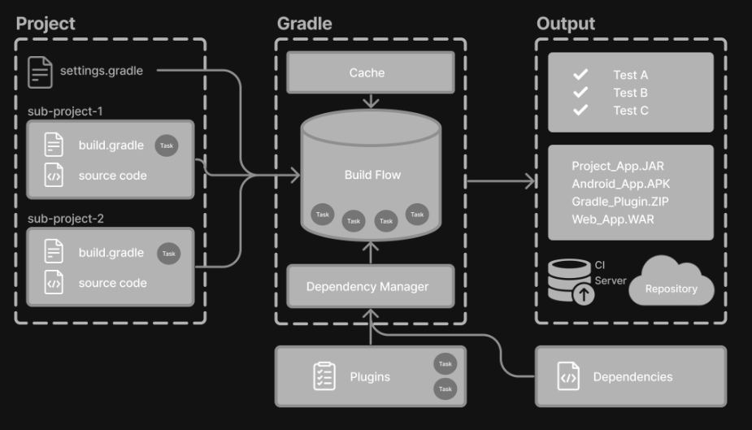

# Core Concepts

Gradle automates building, testing, and deployment of software from information in build scripts.



## Basics

### Core concepts

#### Projects

A Gradle project is a piece of software that can be build, such as an application or a library.

Single project builds include a single project called the root project.

Multi-project builds include one root project and any number of subprojects.

#### Build scripts

Build scripts detail to Gradle what steps to take to build the project.

#### Dependency management

Dependency management is an automated technique for declaring and resolving external resources required by a project.

#### Tasks

Tasks are a basic unit of work such as compiling code or running tests.

Each project contains one or more tasks defined inside a build script or a plugin.

#### Plugins

Plugins are used to extend Gradle's capability and optionally contribute tasks to a project.

### Project structure

A Gradle project will look similar to the following:

```bash
project
├── gradle
│   ├── libs.versions.toml
│   └── wrapper
│       ├── gradle-wrapper.jar
│       └── gradle-wrapper.properties
├── gradlew
├── gradlew.bat
└── settings.gradle.kts
├── subproject-a
│   ├── build.gradle.kts
│   └── src
└── subproject-b
    ├── build.gradle.kts
    └── src
```

- `gradle` directory stores wrapper files and version catalog for dependency management
- `settings.gradle.kts` define a root project name and subprojects
- `build.gradle.kts` files are the build scripts of the two subprojects


## Gradle Wrapper

The recommended way to execute any Gradle build is with the Gradle Wrapper. The *Wrapper* script invokes a declared version of Gradle, downloading it beforehand if necessary.

```bash
.
├── gradle
│   └── wrapper
│       ├── gradle-wrapper.jar  
│       └── gradle-wrapper.properties   
├── gradlew 
└── gradlew.bat 
```

- `gradle-wrapper.jar`: This is a small JAR file that contains the Gradle Wrapper code. It is responsible for downloading and installing the correct version of Gradle for a project if it's not already installed.
- `gradle-wrapper.properties`: This file contains the configuration properties for the Gradle Wrapper, such as the distribution URL and the distribution type.
- `gradlew`: This is a shell script that acts as a wrapper around `gradle-wrapper.jar`. It is used to execute Gradle tasks on Unix-based systems without needing to manually install Gradle.
- `gradlew.bat`: Batch script that serves the same purpose as `gradlew` but on Windows system.

To view or update the Gradle version, use the command line and do **not** edit the wrapper files manually:
```bash
$ ./gradlew --version
$ ./gradlew wrapper --gradle-version 8.10.2
```

## Settings File

Settings file is the entry point of every Gradle project.
Primary purpose of the settings file is to add subprojects to the build.
- For single-project builds, the setting file is optional.
- For multi-project builds, the settings file is mandatory and declares all subprojects.

### Settings script

`setting.gradle.kts` or `setting.gradle` is typically found in the root directory of the project and it defines the project name and defines the structure of the project by including subprojects, if there are any.

```kotlin
rootProject.name = "root-project"

include("sub-project-a")
include("sub-project-b")
include("sub-project-c")
```

### Build File

Every Gradle build comprises at least one build script.

In the build file, two types of dependencies can be added:

  1. The libraries and/or plugins on which Gradle and the build script depend.
  2. The libraries on which the project sources (i.e., source code) depend.

#### Build scripts

```java
plugins {
  id("application")
}

application {
  mainClass = "com.example.Main"
}
```

##### 1. Add plugins

Plugins extend Gradle's functionality and can contribute tasks to a project.

Adding a plugin to build is called _applying_ a plugin.

##### 2. Use convention properties

A plugin adds tasks to a project. It also adds properties and methods to a project.

The `application` plugin defines tasks that package and distribute an application, such as the `run` task. The plugin provides a way to declare the main class of a Java application, which is required to execute the code.


### Dependency Management

Dependency management is an automated technnique for declaring and resolving external resources required by a project.

#### Version Catalog

Version catalogs provide a way to centralize dependency declarations in a `libs.versions.toml` file.

The version catalog typically contains four sections:
 1. [versions] to declare the version numbers that 
 1. [libraries] to define the libraries used in the build files.
 1. [bundles] to define a set of dependencies.
 1. [plugins] to define plugins.

```toml
[versions]
androidGradlePlugin = "7.4.1"
mockito = "2.16.0"

[libraries]
googleMaterial = { group = "com.google.android.material", name = "material", version = "1.1.0-alpha05" }
mockitoCore = { module = "org.mockito:mockito-core", version.ref = "mockito" }

[plugins]
androidApplication = { id = "com.android.application", version.ref = "androidGradlePlugin" }
```

The file is located in the `gradle` directory so that it can be used by Gradle and IDEs automatically. The version catalog should be checked into source control.

#### Declaring Dependencies

To add dependency to your project, specify a dependency in the dependencies block of your `build.gradle.kts` file.

```kotlin
plugins {
  alias(libs.plugins.androidApplication)
}

dependencies {
  implementation(libs.googleMaterial)
  testImplementation(libs.mockitoCore)
}
```


#### Viewing Project Dependencies

```bash
./gradlew :app:dependencies

> Task :app:dependencies

------------------------------------------------------------
Project ':app'
------------------------------------------------------------

annotationProcessor - Annotation processors and their dependencies for source set 'main'.
No dependencies

compileClasspath - Compile classpath for source set 'main'.
\--- com.google.guava:guava:33.2.1-jre
     +--- com.google.guava:failureaccess:1.0.2
     +--- com.google.guava:listenablefuture:9999.0-empty-to-avoid-conflict-with-guava
     +--- com.google.code.findbugs:jsr305:3.0.2
     +--- org.checkerframework:checker-qual:3.42.0
     +--- com.google.errorprone:error_prone_annotations:2.26.1
     \--- com.google.j2objc:j2objc-annotations:3.0.0

compileOnly - Compile-only dependencies for the 'main' feature. (n)
No dependencies
...
```

### Task

A task represents some independent unit of work that a build performs, such as compiling classes, creating a JAR, generating Javadoc, or publishing archives to a repository.

### Plugins

Gradle is built on a plugin system. Gradle itself is primarily composed of infrastructure, such as a sophisticated dependency resolution engine. The rest of its functionality comes from plugins.

A plugin is a piece of software that provides additional functionality to the Gradle build system.

Plugins can be applied to a Gradle build script to add new task, configurations, or other build-related capabilities.

[^1]: [Gradle User Manual](https://docs.gradle.org/current/userguide/userguide.html)
