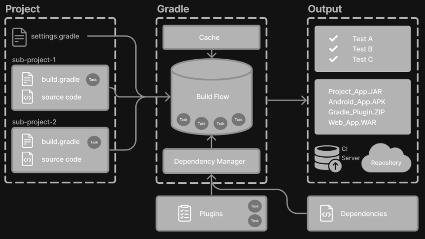
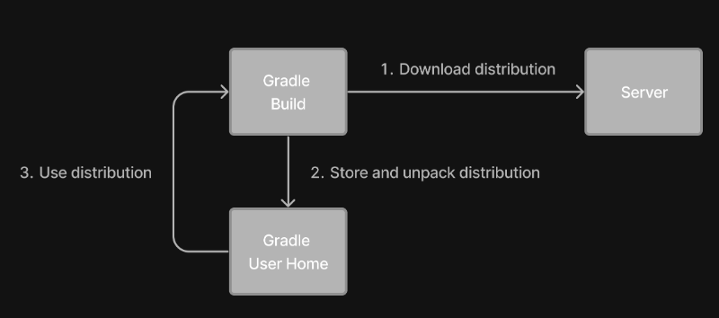

# Learning the Basics

## Gradle Basics

Gradle automates building, testing, and deployment of software from information in __build scripts__.



### Gradle core concepts

#### Projects

A Gradle __project__ is a piece of software that can be built, such as an application or a library.

#### Build Scripts

__Build scripts__ detail to Gradle what steps to take to build the project.

#### Dependency Management

__Dependency management__ is an automated technique for declaring and resolving external resources required by a project.

#### Tasks

__Tasks__ are basic __unit of work__ such as compiling code or running your test.

#### Plugins

Plugins are used to extend Gradle's capability and optionally contribute tasks to a project.

### Gradle project structure

A Gradle project will look similar to the following:

```bash
project
├── gradle
│   ├── libs.versions.toml
│   └── wrapper
│       ├── gradle-wrapper.jar
│       └── gradle-wrapper.properties
├── gradlew
├── gradlew.bat
├── settings.gradle(.kts)
├── subproject-a
│   ├── build.gradle(.kts)
│   └── src
└── subproject-b
    ├── build.gradle(.kts)
    └── src
```

## Gradle Wrapper Basics

The recommended way to execute any Gradle build is with the Gradle Wrapper.

The _Wrapper_ script invokes a declared version of Gradle, downloading it beforehand if necessary.



### Understanding the Wrapper files

```bash
.
├── gradle
│   └── wrapper
│       ├── gradle-wrapper.jar
│       └── gradle-wrapper.properties
├── gradlew
└── gradlew.bat
```

- `gradle-wrapper.jar`: This is a small JAR file that contains the Gradle Wrapper code. It is responsible for downloading and installing the correct version of Gradle for a project if it's not already installed.
- `gradle-wrapper.properties`: This file contains configuration properties for the Gradle Wrapper, such as the distribution URL (where to download Gradle from) and the distribution type (ZIP or TARBALL).
- `gradlew`: This is a shell script that acts as a wrapper around `gradle-wrapper.jar`.
- `gradlew.bat`: This is a batch script (Windows) that serves the same purpose as `gradlew`.

## Settings File Basics

The settings file is the __entry point__ of every Gradle project.

The primary purpose of the _settings file_ is to add subprojects to your build.

### Settings script

The settings file is typically found in the root directory of the project.

```kotlin
rootProject.name = "root-project"

include("sub-project-a")
include("sub-project-b")
include("sub-project-c")
```

## Build File Basics

Generally, a build script details __build configuration, tasks, and plugins__.

Every Gradle build comprises at least one _build script_.

In the build file, two types of dependencies can be added:

1. The libraries and/or plugins on which Gradle and the build script depend.
2. The libraries on which the project sources (i.e., source code) depend.

### Build scripts

```kotlin
plugins {
    id("application")
}

application {
    mainClass = "com.example.Main"
}
```

#### 1. Add plugins

Plugins extend Gradle's functionality and can contribute tasks to a project.

Adding a plugin to a build is called _applying_ a plugin and makes additional functionality available.

```kotlin
plugins {
    id("application")
}
```

#### 2. Use convention properties

A plugin adds tasks to a project. It also adds properties and methods to a project.

```kotlin
application {
    mainClass = "com.example.Main"
}
```

## Dependency Management Basics

Gradle has built-in support for dependency management.

### Version catalog

Version catalog provide a way to centralize your dependency declarations in a `libs.versions.toml` file.

The catalog makes sharing dependencies and version configurations between subprojects simple. It also allows teams to enforce versions of libraries and plugins in large projects.

```toml
[versions]
androidGradlePlugin = "7.4.1"
mockito = "2.16.0"

[libraries]
googleMaterial = { group = "com.google.android.material", name = "material", version = "1.1.0-alpha05" }
mockitoCore = { module = "org.mockito:mockito-core", version.ref = "mockito" }

[plugins]
androidApplication = { id = "com.android.application", version.ref = "androidGradlePlugin" }
```

### Declaring Your Dependencies

```kotlin
plugins {
   alias(libs.plugins.androidApplication)  
}

dependencies {
    // Dependency on a remote binary to compile and run the code
    implementation(libs.googleMaterial)    

    // Dependency on a remote binary to compile and run the test code
    testImplementation(libs.mockitoCore)   
}
```

## Task Basics

A task represents some independent __unit of work__ that a build performs, such as compiling classes, creating a JAR, generating Javadoc, or publishing archives to a repository.

## Plugins Basics

Gradle is built on a plugin system. Gradle itself is primarily composed of infrastructure, such as a sophisticated dependency resolution engine. The rest of its functionality comes from plugins.

A plugin is a piece of software that provides additional functionality to the Gradle build system.

### Plugin distribution

Plugins are distributed in three ways:

1. [Core plugins](https://docs.gradle.org/current/userguide/plugin_reference.html#plugin_reference)
2. [Community plugins](https://plugins.gradle.org/)
3. [Local plugins](https://docs.gradle.org/current/javadoc/org/gradle/api/Plugin.html)

### Applying plugins

You apply plugins in the build script using a plugin id (a globally unique identifier / name) and a version:

```kotlin
plugins {
    id <<plugin id>> version <<plugin version>>
}
```

### 1. Core plugins

Gradle Core plugins are a set of plugins that are included in the Gradle distribution itself.

### 2. Community plugins

Community plugins are plugins developed by the Gradle community, rather than being part of the core Gradle distribution.

### 3. Local plugins

Custom or local plugins are developed and used within a specific project or organization.

Gradle provides users with the ability to develop custom plugins using APIs. To create your own plugin, you'll typically follow these steps:

1. Define the plugin class: create a new class that implements the `Plugin<Project>` interface.

    ```kotlin
    class HelloPlugin : Plugin<Project> {
        override fun apply(project: Project) {
            val helloTask = project.tasks.register("hello") {
                doLast {
                    println("Hello, Gradle!")
                }
            }
        }
    }
    ```

1. Build and optionally publish your plugin: generate a JAR file containing your plugin code and optionally publish this JAR to a repository (local or remote) to be used in other projects.

    ```kotlin
    plugins {
        'maven-publish'
    }

    publishing {
        publications {
            create<MavenPublication>("mavenJava") {
                from(components["java"])
            }
        }
        repositories {
            mavenLocal()
        }
    }
    ```

1. Apply your plugin: when you want to use the plugin, include the plugin ID and version in the `plugins {}` block of the build file.

    ```kotlin
    plugins {
        id("com.example.hello") version "1.0"
    }
    ```

## Incremental Builds + Caching

Gradle uses two main features to reduce build time: incremental builds and build caching.

### Incremental builds

### Build caching

## Build Scans

A build scan is a representation of metadata captured as you run your build.

### Enable Build Scans

To enable build scans on a gradle command, add `--scan` to the command line option:

```bash
./gradlew build --scan
```
