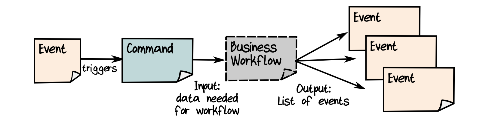
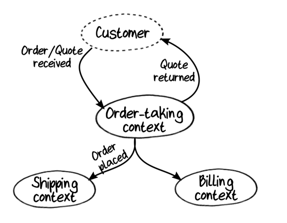

# 1. Introducing DDD

Design approach focused on clear communication and shared domain knowledge: *domain-driven design*.

## Shared Model

The goal of DDD is to have domain experts, development team, other stakeholders, and the source code
itself share the same
*model*.

DDD community has developed some guidelines to help:

- Focus on business events and workflows rather than data.
- Partition the problem domain into smaller subdomains.
- Create a model of each subdomain in the solution.
- Develop a common language ("Ubiquitous Language").

## Domain Events

Business *transforms* data. That is, you can think of a typical business process as a series of data
or document transformations.

*Domain Events* are the starting point for almost all of the business processes we want to model
("new order form received").

### Using Event Storming to Discover the Domain

*Event Storming* is a collaborative process for discovering business events and their associated
workflows.

### Expanding the Events to the Edges

> [!NOTE]
> - A *scenario* describes a goal that a customer wants to achieve. Similar to a "story" in agile
    development. A *use case* is a more detailed version of a scenario, which describes the user
    interactions and other steps that the user needs to take to accomplish a goal.
> - A *business process* describes a goal that the business wants to achieve.
> - A *workflow* is a detailed description of part of a business process.

### Documenting Commands

What makes Domain Events happen? We call these requests *commands* in DDD terminology.

An event triggers a command, which initiates some business workflow. The output of the workflow is
some more events.

Not *all* events are associated with commands. Some events might be triggered by a scheduler or
monitoring system.

## Subdomains

A "domain" is just what a "domain expert" is expert in!

Within a domain, there might be areas that are distinct as well. We call these *subdomains*--a
smaller part of a larger domain.

## Bounded Contexts

We need a distinction between a "problem space" and a "solution space." To build the solution we
will create a *model* of the problem domain, extracting only the aspects of the domain that are
relevant and then re-creating them in our solution space.

In the solution space, domains and subdomains in the problem space are mapped to *bounded contexts*
--a kind of subsystem.

Why *context?* Each context represents some specialized knowledge in the solution.

Why *bounded?* In the real world, domains have fuzzy boundaries, but in software we want to reduce
coupling between separate subsystems.

A domain in the problem space does not always have a one-to-one relationship to a context in the
solution space.

### Getting the Contexts Right

This is an art, not a science, but here are some guidelines:

- *Listen to the domain experts.*
- *Pay attention to existing team and department boundaries.*
- *Don't forget the "bounded" part of a bounded context.*
- *Design for autonomy.*
- *Design for friction-free business workflows.*

### Context Maps

A *context map* shows the various bounded contexts and their relationships at a high level.

### Focusing on the Most Important Bounded Contexts

Some domains are more important than others. These are the *core* domains--the ones that provide a
business advantage, the ones that bring in the money.

Other domains may be required but are not core. These are called *supportive* domains, and if they
are not unique to the business they are called *generic* domains.

## Ubiquitous Language

The set of concepts and vocabulary that is shared between everyone on the team is called the
*Ubiquitous Language*.

## Summarizing the Concepts of DDD

- A *domain*
- A *Domain Model*