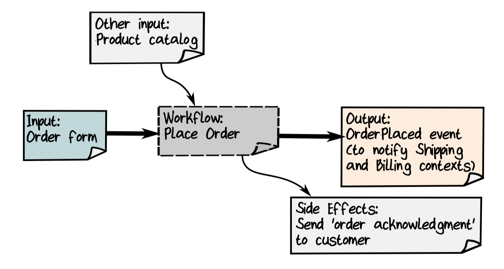
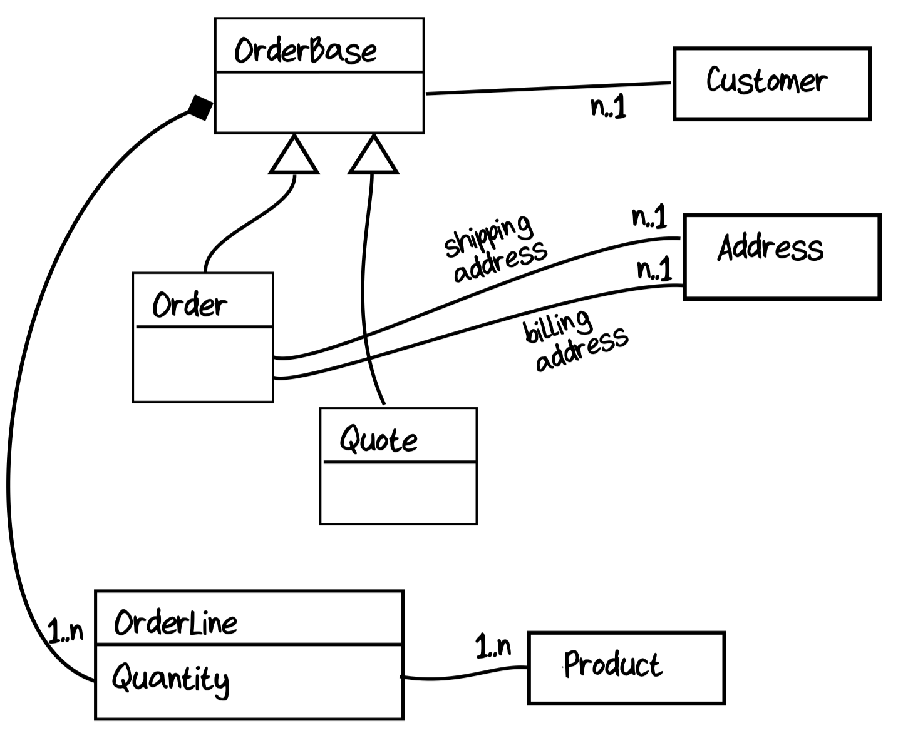

# 2. Understanding the Domain

Take one particular workflow and try to understand it deeply. What exactly triggers it? What data is needed? What other bounded context does it need to collaborate with?

## Interview with a Domain Expert

The nice thing about the commands/events approach is that we can have a series of short interviews, each focusing on only one workflow.

In the first part of the interview, we want to stay at high level and focus only on the inputs and outputs of the workflow.

### Understanding the Non-functional Requirements

Discuss the context and scale of the workflow. Customer expectations of the systems.

### Understanding the Rest of the Workflow

### Thinking About Inputs and Outputs

Output of a workflow should always be the events that it generates, the things that trigger actions in other bounded contexts.

Let's diagram the "Place Order" workflow with its inputs and outputs:

## Fighting the Impulse to Do Database-Driven Design

In domain-driven design, we let the *domain* drive the design, not a database schema.

It's better to work from the domain and to model it without respect to any particular storage implementation. In DDD terminology, this is called *persistence ignorance*.

## Fighting the Impulse to Do Class-Driven Design

Letting classes drive the design can be just as dangerous as letting a database drive the design--again, you're not really listening to the requirements.

In the preliminary design above we have separated orders and quotes, but we have introduced an artificial base class, `OrderBase`, that doesn't exist in the real world.

## Documenting the Domain

- For workflows, we'll document the inputs and outputs and then just use some simple pseudocode for the business logic.
- For data structures, we'll use *AND* to mean that both parts are required. We'll use *OR* to mean that only one part is required.

## Diving Deeper into the Order-Taking Workflow

## Representing Complexity in Our Domain Model
