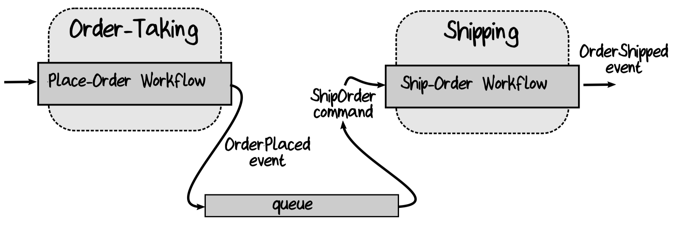

# 3. Functional Architecture

Take a brief look at a typical software architecture for a functionally oriented domain model.

Software architecture terminology from Simon Brown's "C4" approach:

- The "system context" is the top level, representing the entire system.
- The system context comprises a number of "containers," which are deployable units such as website, a web service, a database, and so on.
- Each container in turn comprises a number of "components," which are the major structural building blocks in the code.
- Finally, each component comprises a number of "classes" that contain a set of low-level methods or functions.

## Bounded Contexts as Autonomous Software Components

It is important that a context is an *autonomous* subsystem with a *well-defined boundary.*

A good practice is to build the system as a monolith initially and refactor to decoupled containers only as needed.

## Communicating between Bounded Contexts

How do bounded contexts communicate with each other? The answer is to use events.

This is a decoupled design: the upstream component and the downstream component are not aware of each other and are communicating only through events.

The exact mechanism for transmitting events between contexts depends on the architecture we choose. Queues are great for buffered asynchronous communication. In a monolithic system, we can use the same queuing approach internally, or just use a simple direct linkage between the upstream component and the downstream component via a function call.

As for the handler that translates events (such as `OrderPlaced`) to commands (such as `ShipOrder`), it can be part of the downstream context, or it can be done by a separate router or process manager running as part of the infrastructure, depending on your architecture and where you want to do the coupling between events and commands.

### Transferring Data Between Bounded Contexts

### Trust Boundaries and Validation

## Contracts Between Bounded Contexts

### Anti-Corruption Layers

### Context Map with Relationships

## Workflows within a Bounded Context

## Code Structure within a Bounded Context

### Onion Architecture

### Keep I/O at the Edges
