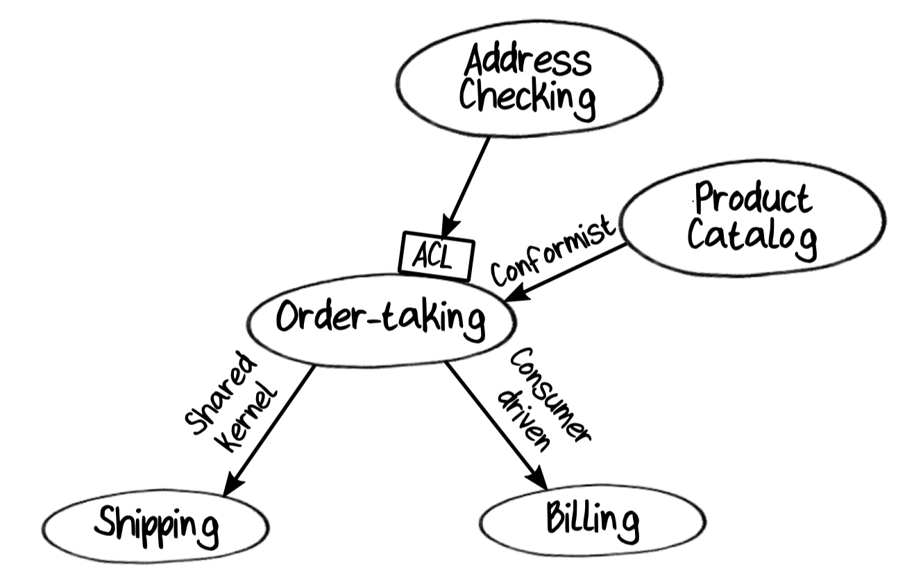
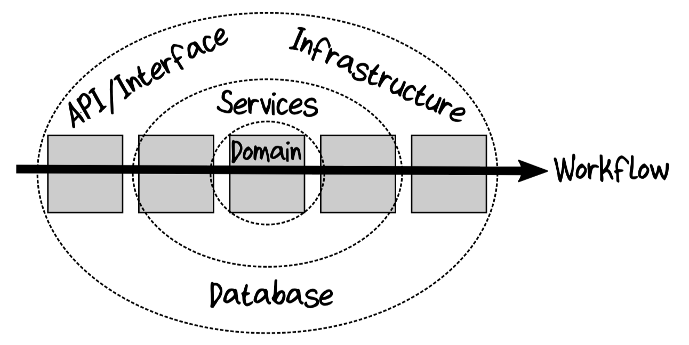

# 3. Functional Architecture

Take a brief look at a typical software architecture for a functionally oriented domain model.

Software architecture terminology from Simon Brown's "C4" approach:

- The "system context" is the top level, representing the entire system.
- The system context comprises a number of "containers," which are deployable units such as a website, a web service, a database, and so on.
- Each container in turn comprises a number of "components," which are the major structural building blocks in the code.
- Finally, each component comprises a number of "classes" that contain a set of low-level methods or functions.

## Bounded Contexts as Autonomous Software Components

It is important that a context is an *autonomous* subsystem with a *well-defined boundary.*

A good practice is to build the system as a monolith initially and refactor to decoupled containers only as needed.

## Communicating Between Bounded Contexts

How do bounded contexts communicate with each other? The answer is to use events.

This is a decoupled design: the upstream component and the downstream component are not aware of each other and are communicating only through events.

The exact mechanism for transmitting events between contexts depends on the architecture we choose. Queues are great for buffered asynchronous communication. In a monolithic system, we can use the same queuing approach internally, or just use a simple direct linkage between the upstream component and the downstream component via a function call.

As for the handler that translates events (such as `OrderPlaced`) to commands (such as `ShipOrder`), it can be part of the downstream context, or it can be done by a separate router or process manager running as part of the infrastructure, depending on your architecture and where you want to do the coupling between events and commands.

### Transferring Data Between Bounded Contexts

The data objects that are passed around are specifically designed to be serialized and shared as part of the intercontext infrastructure. We will call these objects *Data Transfer Objects* or DTOs.

At the boundaries of the upstream context, the domain objects are converted into DTOs, which are in turn serialized into JSON, XML, or some other serialization format.

At the downstream context, the process is repeated in the other direction.

### Trust Boundaries and Validation

The perimeter of a bounded context acts as a "trust boundary." We add "gates" at the beginning and end of the workflow to act as intermediaries between the trusted domain and the untrusted outside world.

At the input gate, we will *always* validate the input to make sure that it conforms to the constraints of the domain model. For example, an incoming `OrderDTO` will have no constraints and could contain anything, but after validation at the input gate, we can be sure that the `Order` domain object is valid.

The job of the output gate is different. Its job is to ensure that private information doesn't leak out of the bounded context, both to avoid accidental coupling between contexts and for security reasons. For example, there's no need for the shipping context to know the credit card number used to pay for an order. The output gate will often deliberately "lose" information in the process of converting domain objects to DTOs.

## Contracts Between Bounded Contexts

We want to reduce coupling between bounded contexts as much as possible, but a shared communication format always induces some coupling: the events and related DTOs form a kind of contract between bounded contexts.

There are various relationships between the contexts, and the DDD community has developed some terms from the common ones:

- A *Shared Kernel* relationship is where two contexts share common domain design. In this relationship, changing the definition of an event or a DTO must be done only in consultation with the owners of the other contexts that are affected.
- A *Customer/Supplier* or *Consumer Driven Contract* relationship is where the downstream context defines the contract that they want the upstream to provide. The two domains can still evolve independently, as long as the upstream context fulfills its obligations under the contract.
- A *Conformist* relationship is the opposite of consumer-driven. The downstream context accepts the contract provided by the upstream context and adapts its own domain model to match.

### Anti-Corruption Layers

Often, when communicating with an external system, the interface that is available does not match our domain model at all. In this case, the interactions and data need to be transformed into something more suitable for use inside the bounded context, otherwise our domain model will become "corrupted" by trying to adapt to the external system's model.

This extra level of decoupling between contexts is called an *Anti-Corruption Layer* in DDD terminology, often abbreviated as "ACL." The "input gate" often plays the role of the ACL--it prevents the internal, pure domain model from being "corrupted" by knowledge of the outside world.

That is, ACL is not primarily about performing validation or preventing data corruption, but instead acts as a translator between two different languages.

### Context Map with Relationships

A context map of our domain showing these kinds of intercontext relationships is shown below:

## Workflows Within a Bounded Context

In our functional architecture, workflows will be mapped to a single function, where the input is a command object and the output is a list of event objects.

A workflow is always contained within a single bounded context and never implements a scenario "end-to-end" through multiple contexts.

### Workflow Inputs and Outputs

### Avoid Domain Events Within a Bounded Context

## Code Structure Within a Bounded Context

### Onion Architecture

Put the domain code at the center and then have the other aspects be assembled around it using the rule that each layer can only depend on inner layers.

In order to ensure that all dependencies point inward, we will have to use the functional equivalent of dependency injection.

### Keep I/O at the Edges

We will try to work with immutable data wherever possible and try to ensure that our functions have *explicit* dependencies. Crucially, we will try to avoid side effects in our functions, including randomness, mutation of variables outside the function, and most importantly, any kind of I/O.

For example, a function that reads or writes to a database or a file system would be considered "impure," so we would try to avoid these kinds of functions in our core domain.

How *do* we read or write data? The answer is to push any I/O to the edges of the onion--to access a database only at the start or end of a workflow.
