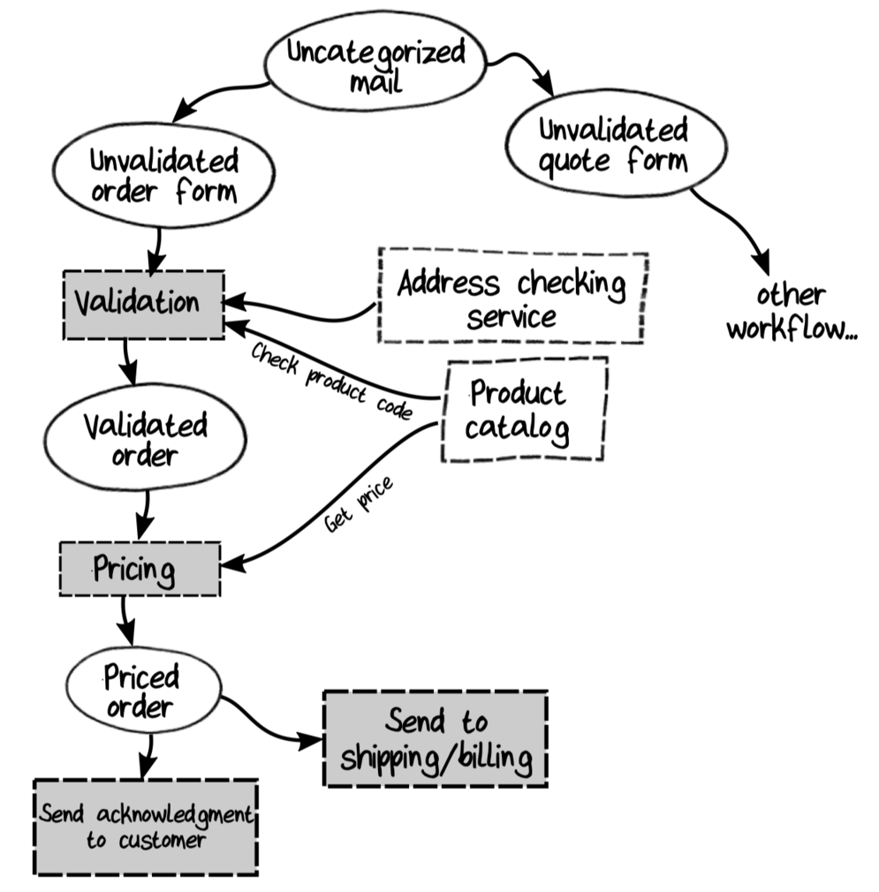

# 5. Domain Modeling with Types

We'll see that types can replace most documentation, and that ability has a powerful benefit: the implementation can never get out of sync with the design because the design is represented in the code itself.

## Reviewing the Domain Model



```text
context: Order-Taking

// ------------------------
// Simple types
// ------------------------

// Product codes
data ProductCode = WidgetCode OR GizmoCode
data WidgetCode = string starting with "W" then 4 digits
data GizmoCode = ...

// Order Quantity
data OrderQuantity = UnitQuantity OR KilogramQuantity
data UnitQuantity = ...
data KilogramQuantity = ...

// ------------------------
// Order lifecycle
// ------------------------

// ----- unvalidated state -----
data UnvalidatedOrder =
    UnvalidatedCustomerInfo
    AND UnvalidatedShippingAddress
    AND UnvalidatedBillingAddress
    AND list of UnvalidatedOrderLine

data UnvalidatedOrderLine =
    UnvalidatedProductCode
    AND UnvalidatedOrderQuantity

// ----- validated state -----

// ----- priced state -----

// ----- output events -----

// ------------------------
// Workflows
// ------------------------

workflow "Place Order" =
    input: UnvalidatedOrder
    output: (on success):
        OrderAcknowledgementSent
        AND OrderPlaced (to send to shipping)
        AND BillableOrderPlaced (to send to billing)
    output: (on error):
        InvalidOrder

// etc
```

The goal of this chapter is to turn this model into code.

## Patterns in a Domain Model

Although each domain model is different, many patterns occur repeatedly.

- *Simple values.* A domain expert does not think in terms of `int` and `string`, but instead thinks in terms of `OrderId` and `ProductCode`--concepts that are part of the ubiquitous language.
- *Combinations of values with AND.*
- *Choices with OR.*
- *Workflows.*

## Simple Values

We can create a wrapper type in Kotlin by using an `inline value class`:

```kotlin
@JvmInline
value class CustomerId(val value: String)
```

We'll call these kinds of wrapper types "simple types" to distinguish them both from compound types (such as records) and the raw primitive types (such as `string` and `int`) that they contain.

### Constrained Values

Almost always, simple types are constrained in some way. We'll discuss how to enforce these constraints in the next chapter.

### Avoiding Performance Issues with Simple Types

We can use type aliases instead of simple types to document the domain. This has no overhead, but it does mean a loss of type-safety.

```kotlin
typealias UnitQuantity = Int
```

## Complex Data

### Record Types

### Unknown Types

### Choice Types

## Workflows with Functions

In this book, we will model workflows and other processes as function types.

```kotlin
typealias ValidateOrder = (UnvalidatedOrder) -> ValidatedOrder
```

It's clear from this code that the `ValidateOrder` process transforms an unvalidated order into a validated one.

### Complex Inputs and Outputs

In the order-placing workflow, the output needs to be three different events, so let's create a compound type to store them as one record:

```kotlin
data class PlaceOrderEvents(
    val acknowledgementSent: AcknowledgementSent,
    val orderPlaced: OrderPlaced,
    val billableOrderPlaced: BillableOrderPlaced
)
```

Using this approach, the order-placing workflow can be written as a function type:

```kotlin
typealias PlaceOrder = (UnvalidatedOrder) -> PlaceOrderEvents
```

On the other hand, if a workflow has an `outputA` *or* an `outputB`, then we can create a choice type to store them both.

```text
workflow "Categorize Inbound Mail" =
    input: Envelope contents
    output:
        QuoteForm (put on appropriate pile)
        OR OrderForm (put on appropriate pile)
        OR ...
```

To model this workflow, we create a new type, say `CategorizedMail`, to represent the choices. Our model might look like this:

```kotlin
@JvmInline
value class EnvelopeContents(val value: String)

sealed interface CategorizedMail {
    data class QuoteForm(...): CategorizedMail
    data class OrderForm(...): CategorizedMail
}

typealias CategorizeInboundMail = (EnvelopeContents) -> CategorizedMail
```

Let's look at modeling inputs. If a workflow has a choice of different inputs, then we can create a choice type. But if a process has multiple inputs that are all required, we can choose between two possible approaches.

```text
workflow "Calculate Prices" =
    input: OrderForm, ProductCatalog
    output: PricedOrder
```
