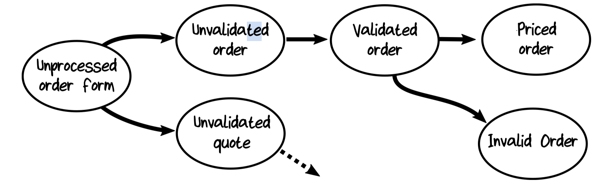

# 7. Modeling Workflows as Pipelines

Modeling an order-placing workflow using types.

Here's the summary of the "Place Order" workflow:

```text
workflow "Place Order" =
    input: UnvalidatedOrder
    output (on success):
        OrderAcknowledgementSent
        AND OrderPlaced (to send to shipping)
        AND BillableOrderPlaced (to send to billing)
    output (on error):
        ValidationError

    // step 1
    do ValidateOrder
    If order is Invalid then:
        return with ValidationError

    // step 2
    do PriceOrder

    // step 3
    do AcknowledgeOrder

    // step 4
    create and return events
```

## 7.1 The Workflow Input

The input to a workflow should always be a domain object.

```kotlin
data class UnvalidatedOrder(
    val orderId: String,
    val customerId: UnvalidatedCustomerInfo,
    val shippingAddress: UnvalidatedAddress,
    ...
)
```

### 7.1.1 Commands as Input

In some sense, then, the *real* input for the workflow is not actually the order form but the command.

```kotlin
data class PlaceOrder(
    val orderForm: UnvalidatedOrder,
    val timestamp: LocalDateTime,
    val userId: String,
    // etc
)
```

### 7.1.2 Sharing Common Structures Using Generics

If we were doing OOP, we would use a base class containing common fields.

In the functional world, the same goal is achieved by using generics.

```kotlin
interface Command<out D> {
    val data: D
    val timestamp: LocalDateTime
    val userId: String
    // etc
}
```

Then we can create a workflow-specific command just by specifying what type goes in the `D` slot:

```kotlin
data class PlaceOrder(
    override val data: UnvalidatedOrder,
    override val timestamp: LocalDateTime,
    override val userId: String,
    // etc
) : Command<UnvalidatedOrder>
```

### 7.1.3 Combining Multiple Commands in One Type

In some cases, all the commands for a bounded context will be sent on the same input channel (such as a message queue), so we need some way of unifying them into one data structure that can be serialized.

```kotlin
sealed interface OrderTakingCommand {
    data class PlaceOrder(...) : OrderTakingCommand
    data class ChangeOrder(...) : OrderTakingCommand
    data class ShipOrder(...) : OrderTakingCommand
}
```

The choice type would be mapped to a DTO and serialized and deserialized on the input channel. We just need to add a new "routing" or "dispatching" input stage at the edge of the bounded context (the "infrastructure" ring).

## 7.2 Modeling an Order as a Set of States

`Order` isn't just a static document but actually transitions through a series of different states:



A naive approach would be to create a single record type that captures all the different states with flags.

But this approach has problems:

- States are implicit and would require lots of conditional code to be handled.
- Some states have data that is not needed in other states.
- It's not clear which fields go with which flags.

Create a new type for each state of the order:

```kotlin
sealed interface Order
class UnvalidatedOrder(...) : Order
class ValidatedOrder(...) : Order
class PricedOrder(...) : Order
```

This is the object that represents the order at any time in its lifecycle, and it is the type that can be persisted to storage or communicated to other contexts.

### 7.2.1 Adding New State Types as Requirements Change

New states can be added without breaking existing code.

## 7.3 State Machines

### 7.3.1 Why Use State Machines?

### 7.3.2 How to Implement Simple State Machines

## 7.4 Modeling Each Step in the Workflow with Types

## 7.5 Documenting Effects

## 7.6 Composing the Workflow from the Steps

## 7.7 Are Dependencies Part of the Design?

## 7.8 The Complete Pipeline

## 7.9 Long-Running Workflows
