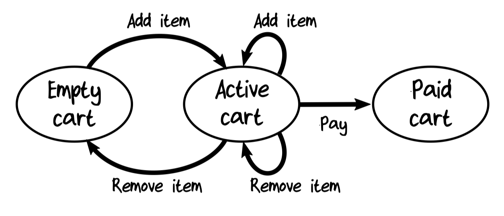
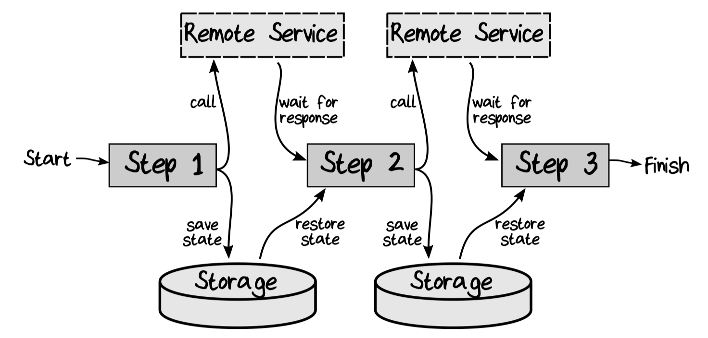

# 7. Modeling Workflows as Pipelines

Modeling an order-placing workflow using types.

Here's the summary of the "Place Order" workflow:

```text
workflow "Place Order" =
    input: UnvalidatedOrder
    output (on success):
        OrderAcknowledgementSent
        AND OrderPlaced (to send to shipping)
        AND BillableOrderPlaced (to send to billing)
    output (on error):
        ValidationError

    // step 1
    do ValidateOrder
    If order is Invalid then:
        return with ValidationError

    // step 2
    do PriceOrder

    // step 3
    do AcknowledgeOrder

    // step 4
    create and return events
```

## 7.1 The Workflow Input

The input to a workflow should always be a domain object.

```kotlin
data class UnvalidatedOrder(
    val orderId: String,
    val customerId: UnvalidatedCustomerInfo,
    val shippingAddress: UnvalidatedAddress,
    ...
)
```

### 7.1.1 Commands as Input

In some sense, the *real* input for the workflow is the command, not the order form.

```kotlin
data class PlaceOrder(
    val orderForm: UnvalidatedOrder,
    val timestamp: LocalDateTime,
    val userId: String,
    // etc
)
```

### 7.1.2 Sharing Common Structures Using Generics

If we were doing OOP, we would use a base class containing common fields.

In the functional world, the same goal is achieved by using generics.

```kotlin
interface Command<out D> {
    val data: D
    val timestamp: LocalDateTime
    val userId: String
    // etc
}
```

Then we can create a workflow-specific command just by specifying what type goes in the `D` slot:

```kotlin
data class PlaceOrder(
    override val data: UnvalidatedOrder,
    override val timestamp: LocalDateTime,
    override val userId: String,
    // etc
) : Command<UnvalidatedOrder>
```

### 7.1.3 Combining Multiple Commands in One Type

In some cases, all the commands for a bounded context will be sent on the same input channel (such as a message queue), so we need some way of unifying them into one data structure that can be serialized.

```kotlin
sealed interface OrderTakingCommand {
    data class PlaceOrder(...) : OrderTakingCommand
    data class ChangeOrder(...) : OrderTakingCommand
    data class ShipOrder(...) : OrderTakingCommand
}
```

The choice type would be mapped to a DTO and serialized and deserialized on the input channel. We just need to add a new "routing" or "dispatching" input stage at the edge of the bounded context (the "infrastructure" ring).

## 7.2 Modeling an Order as a Set of States

`Order` isn't just a static document but actually transitions through a series of different states:


A naive approach would be to create a single record type that captures all the different states with flags.

But this approach has problems:

- States are implicit and would require lots of conditional code to be handled.
- Some states have data that is not needed in other states.
- It's not clear which fields go with which flags.

Create a new type for each state of the order:

```kotlin
sealed interface Order
class UnvalidatedOrder(...) : Order
class ValidatedOrder(...) : Order
class PricedOrder(...) : Order
```

This is the object that represents the order at any time in its lifecycle, and it is the type that can be persisted to storage or communicated to other contexts.

### 7.2.1 Adding New State Types as Requirements Change

New states can be added without breaking existing code.

## 7.3 State Machines

In the previous section, we converted a single type with flags into a set of separate types.

These kinds of situations are extremely common in business modeling scenarios. Let's look at using "states" as a general domain modeling tool.

### 7.3.1 Why Use State Machines?

- Each state can have different allowable behavior.
- All the states are explicitly documented.
- It is a design tool that forces you to think about every possibility that could occur.

### 7.3.2 How to Implement Simple State Machines

Complex state machines, used in language parsers and so on, are generated from rule sets or grammars and are quite complicated to implement. But the simple business-oriented state machines can be coded manually.

Make each state have its own type, which stores the data that is relevant to that state. The entire set of states can then be represented by a choice type with a case for each state. Here's an example using the shopping cart state machine:



```kotlin
class Item(...)

sealed interface ShoppingCart {
    data class Active(val unpaidItems: List<Item>): ShoppingCart
    data class Paid(val paidItems: List<Item>, val payment: BigDecimal): ShoppingCart
    data object Empty: ShoppingCart
}
```

A command handler is then represented by a function that accepts the entire state machine (the choice type) and returns a new version of it (the updated choice type). The state transition function `addItem` takes a `ShoppingCart` parameter and the item to add:

```kotlin
fun ShoppingCart.addItem(item: Item): ShoppingCart {
    return when (this) {
        is ShoppingCart.Empty -> ShoppingCart.Active(listOf(item))              // create a new active cart with one item
        is ShoppingCart.Active -> ShoppingCart.Active(unpaidItems + item)       // create a new active cart with the item added
        is ShoppingCart.Paid -> this                                            // ignore
    }
}
```

The state transition function `makePayment` takes a `ShoppingCart` parameter and the payment information:

```kotlin
fun ShoppingCart.makePayment(payment: Payment): ShoppingCart {
    return when (this) {
        is ShoppingCart.Active -> ShoppingCart.Paid(unpaidItems, payment) // create a new paid cart with the payment
        else -> this                                                      // ignore
    }
}
```

## 7.4 Modeling Each Step in the Workflow with Types

### 7.4.1 Validation Step

We documented the "ValidateOrder" substep like this:

```text
substep "ValidateOrder"
    input: UnvalidatedOrder
    output: ValidatedOrder OR ValidationError
    dependencies: CheckProductCodeExists, CheckAddressExists
```

We will treat dependencies as functions. The type signature of the function will become the "interface" that we need to implement later.

```kotlin
typealias CheckProductCodeExists = (ProductCode) -> Boolean
```

We need a function that takes an `UnvalidatedAddress` and returns a corrected address if valid, or some kind of validation error if the address is not valid.

We also want to distinguish between a "checked address" and our `Address` domain object. For now, we might just say that a `CheckedAddress` is just a wrapped version of an `UnvalidatedAddress`:

```kotlin
@JvmInline
value class CheckedAddress(val value: UnvalidatedAddress)
```

The service then takes an `UnvalidatedAddress` as input and returns `Either` type with `CheckedAddress` value for the success case or an `AddressValidationError` value for the failure case:

```kotlin
typealias CheckAddressExists = (UnvalidatedAddress) -> Either<AddressValidationError, CheckedAddress>
```

We can now define the `ValidateOrder` step.

```kotlin
object AddressValidationError : ValidationError

typealias ValidateOrder = UnvalidatedOrder.(CheckProductCodeExists, CheckAddressExists) -> Either<ValidationError, ValidatedOrder>
```

Overall return value of the function must be a `Either` type because one of the dependencies returns a `Either` type. When `Either` is used, it "contaminates" all it touches, and the "result-ness" needs to be passed up until we get to a top-level function that handles it.

### 7.4.2 Pricing Step

```text
substep "PriceOrder"
    input: ValidatedOrder
    output: PricedOrder
    dependencies: GetProductPrice
```

```kotlin
typealias GetProductPrice = (ProductCode) -> Price
```

The `PriceOrder` function needs information from the product catalog, but instead of passing some sort of heavyweight `IProductCatalog` interface to it, we'll just pass a *function* that represents exactly what we need from the product catalog. That is `GetProductPrice` acts as an abstraction.

The pricing function itself will then look like this:

```kotlin
typealias PriceOrder = ValidatedOrder.(GetProductPrice) -> PricedOrder
```

The function always succeeds, so there's no need to return an `Either` type.

### 7.4.3 Acknowledge Order Step

The next step creates an acknowledgment letter and sends it to the customer.

```kotlin
@JvmInline
value class HtmlString(val value: String)

data class OrderAcknowledgement(
    val emailAddress: EmailAddress,
    val letter: HtmlString
)
```

We'll assume that a service function will generate the content for us and that all we have to do is give it a `PricedOrder`.

```kotlin
typealias CreateOrderAcknowledgementLetter = PricedOrder -> HtmlString
```

Once we have the letter, we need to send it. Should we call some sort of API directly, or write the acknowledgement to a message queue, or what?

We can punt on the exact implementation and just focus on the interface we need.

```kotlin
typealias SendOrderAcknowledgement = (OrderAcknowledgement) -> Unit
```

With this design we can't tell if the acknowledgement was sent.

```kotlin
typealias SendOrderAcknowledgement = (OrderAcknowledgement) -> Boolean
```

Booleans are generally a bad choice in a design, though.

```kotlin
enum class SendResult {
    Sent,
    NotSent,
}

typealias SendOrderAcknowledgement = (OrderAcknowledgement) -> SendResult
```

Or perhaps we should have the service (optionally) return the `OrderAcknowledgement` event itself? If we do that, though, we have created a coupling between our domain and the service via the event type.

Finally, what should the output of this "Acknowledge Order" step be? Let's define that event type now:

```kotlin
data class OrderAcknowledgementSent(
    val orderId: OrderId,
    val emailAddress: EmailAddress,
)
```

And finally, we can put all of this together to define the function type for this step:

```kotlin
typealias AcknowledgeOrder = PricedOrder.(CreateOrderAcknowledgementLetter, SendOrderAcknowledgement) -> OrderAcknowledgementSent?
```

### 7.4.4 Creating Events to Return

## 7.5 Documenting Effects

### 7.5.1 Effects in the Validation Step

### 7.5.2 Effects in the Pricing Step

### 7.5.3 Effects in the Acknowledge Step

## 7.6 Composing the Workflow from the Steps

## 7.7 Are Dependencies Part of the Design?

## 7.8 The Complete Pipeline

### 7.8.1 The Internal Steps

## 7.9 Long-Running Workflows

We expect that, even though there are calls to remote systems, the pipeline will complete within a short time.

But what if these external services took much longer to complete?

First, we would need to save the state into storage before calling a remote service. Then, we'd wait for a message indicating the service has finished, reload the state from storage, and continue with the next step in the workflow.



This is where the state machine model is a valuable framework for thinking about the system. The mini-workflow transitions the order from the original state to a new state and, at the end, the new state is saved back to storage.

These kinds of long-running workflows are sometimes called *Sagas*.

If the number of events and states increases and the transitions get complicated, you may need to create a *Process Manager*, which is in charge of handling incoming messages, determining what action should be taken based on the current state, and then triggering the appropriate workflow.
