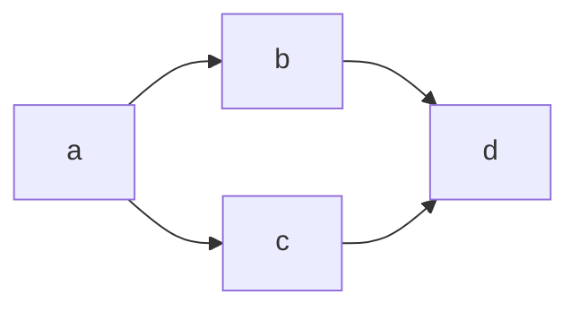

# Introduction

Diagrams are useful for conveying ideas and thoughts. It is useful for communication and even understanding the system architecture.

The book covers two main diagramming techniques: UML and C4 model.

UML deals with three types of diagrams:
 1. structure
 2. behavior
 3. interaction

## Why Mermaid?

PlantUML is not as widely adopted as Mermaid. GitHub and GitLab both have native support for Mermaid.

There are many ways to create diagrams using Mermaid, from the terminal to web-based editors:
  - Mermaid Live
  - [editor integrations](https://github.com/mermaid-js/mermaid/blob/develop/docs/ecosystem/integrations-community.md#editor-plugins)
  - Mermaid CLI

[Markdown Preview Mermaid Support](https://marketplace.visualstudio.com/items?itemName=bierner.markdown-mermaid) is a popular VS Code extension.

## Example

