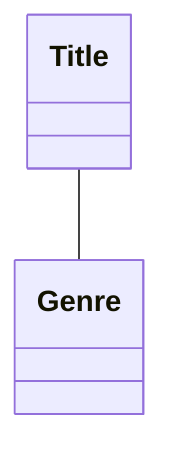
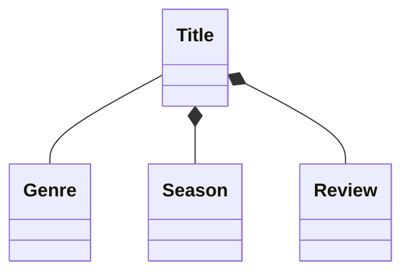
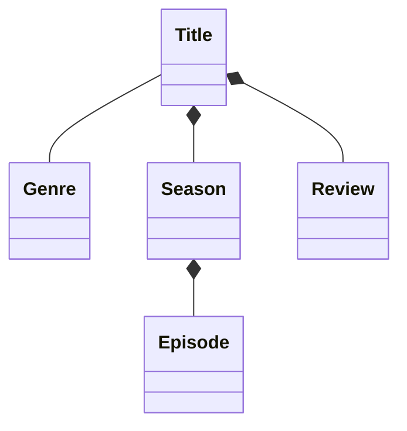
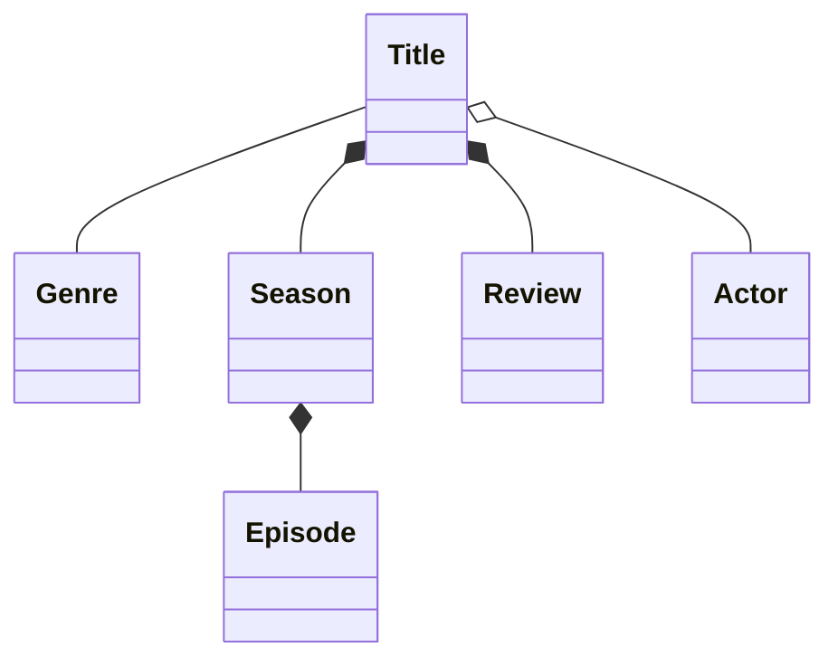

# 1. Document Domain

Domain modeling in the sense of DDD is the primary way fo determining the important aspects of a buisiness. It's usually created collaboratively by engineering, product, and business stakeholders to ensure all major parts of the business are aligned on what the domain model looks like.

Within UML, *class diagram* can be used to model classes adn model domains.

## Entities

*Entity* represents a core concept within the business. Fictional company used in the book is called Streamy, which is a video streaming service.

Each `Title` belongs to a `Genre`, and each `Genre` will have a list of `Titles` associated with it.

In the case of `Title` and `Genre`, where each entity is going to hold a reference to the other, that type of relationship is known as an *association*.

## Associations

Association is the loosest type of relationship available within a UML class diagram; the entities must be able to exist independently of one another and likely have their own life cycles. Furthermore, there is generally no "owner" of the relationship.

## Composite

`Season` and `Review` do not make sense independent of `Title`. This type of relationship is called *composition*.

The side the solid diamond is on indicates the class holding the reference, that is the owner of the relationship.

## Aggregation

An aggregate relationship is also displayed as a diamond, but instead of being a solid diamond, it's empty. In an aggregate relationship, there's still an owner - the parent. However, the bond between them isn't as strong, and if the parent were to be deleted, the child can still exist.

