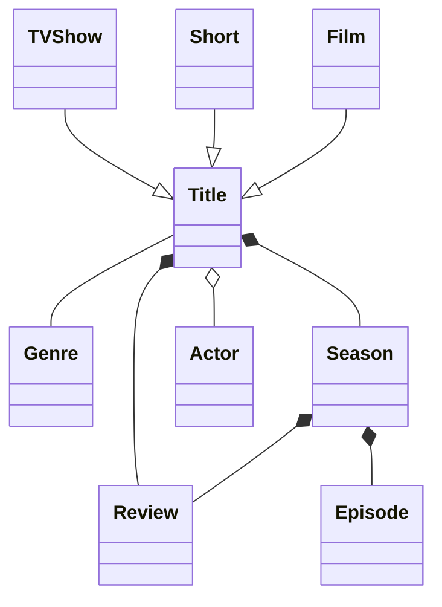
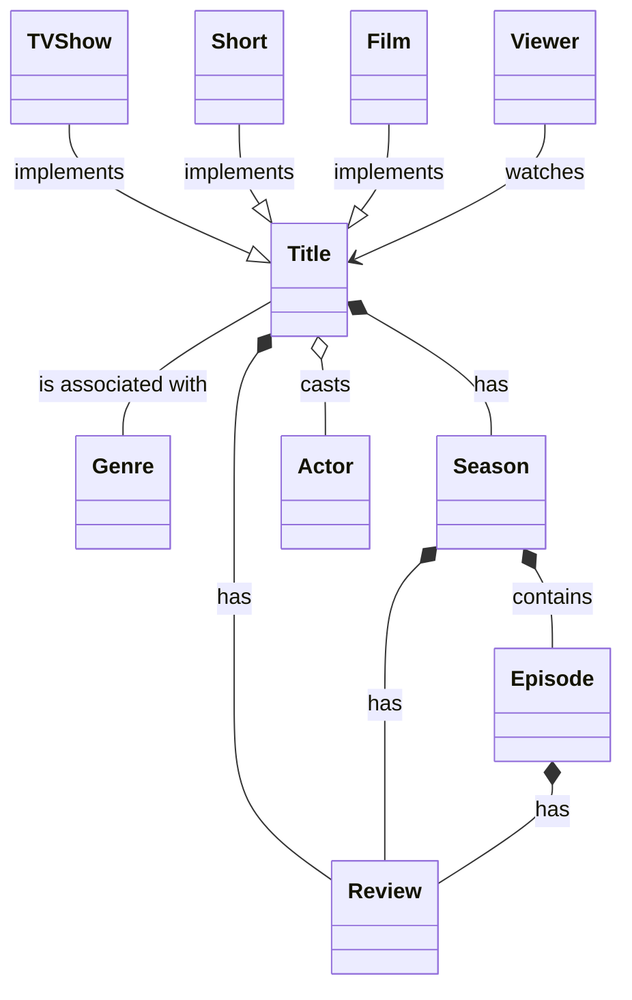
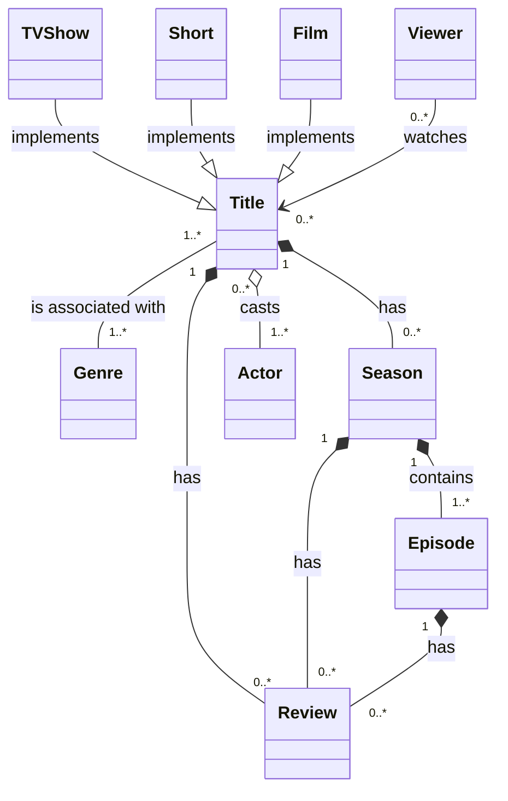
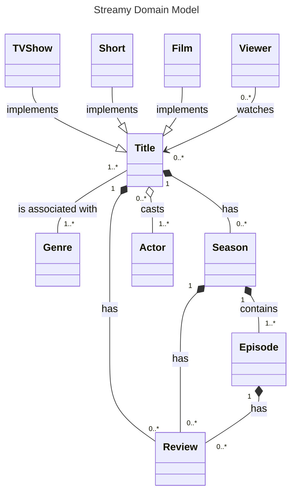

# 2. Enhance Domain

We can enhance the domain model with more rich information.

We will discuss how to show inheritance in order to show subtypes and how to provide more information to someone viewing the diagram with descriptions and multiplicity.

## Inheritance

We might want to represent subclasses of `Title`:

Generalization are defined using --|> and are rendered on the diagram as empty arrows.

## Relationship

One of the key features of a domain model written with UML is that you can describe how the entities interact with regard to their relationships.

In a lot of cases, a lot of the descriptions can be simply desscribed as _has_.

It is preferable to add more detailed description for relationships:

The relationship between `Viewer` entity and `Title` entity is a directional association. This means `Viewer` holds a reference to `Title`, but `Title` doesn't hold a reference to `Viewer`.

## Multiplicity

_Multiplicity_ describes how many of one type of entity relates to another. It allows us to define whether relationships are one-to-one, one-to-many, none-to-many, many-to-many, and everything in between.

## Title

We can add a title to any Mermaid diagram simply by adding a block of code to the top of the markup. It must go at the very top, even above the diagram type definition.

