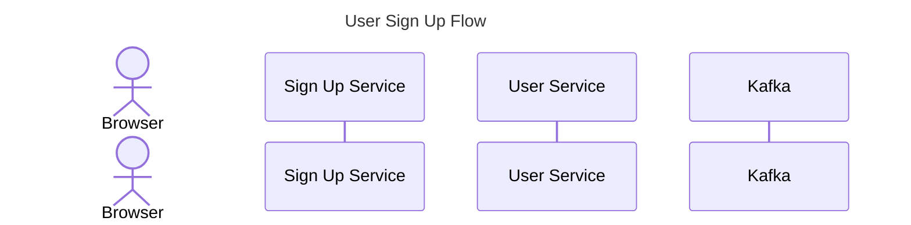
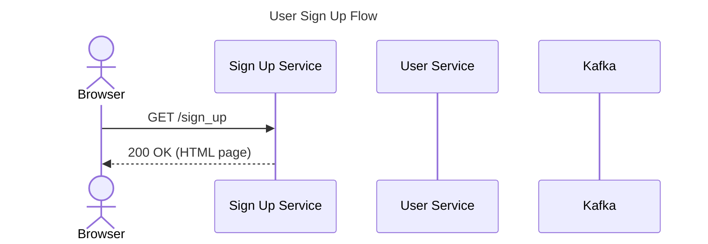
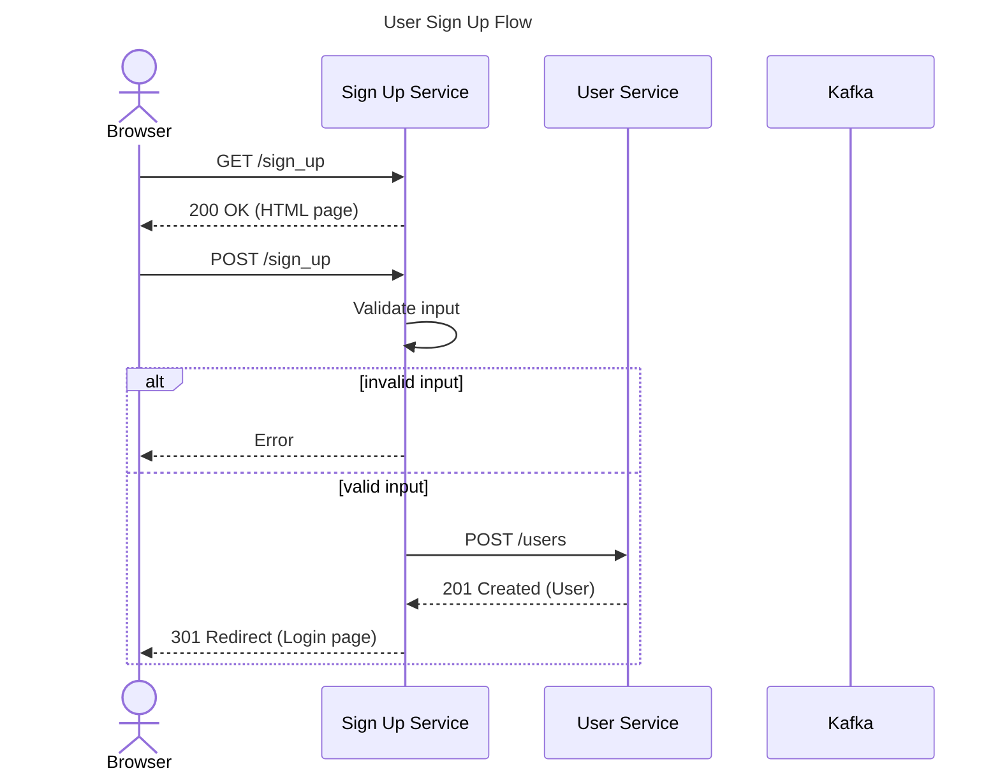
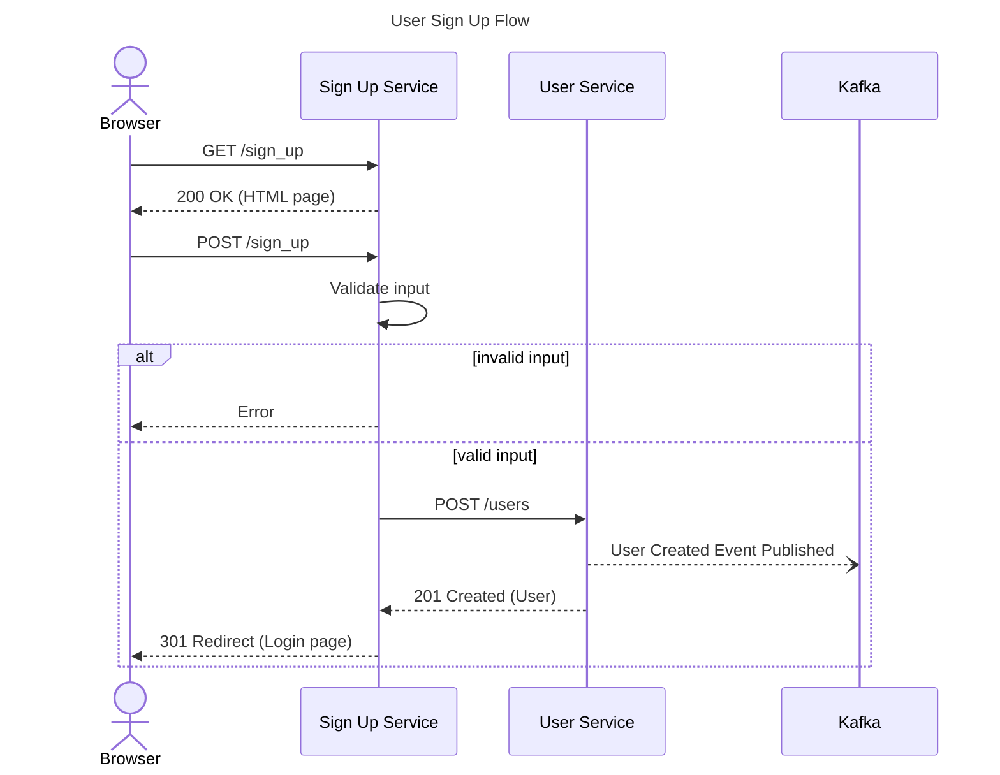

# 3. Visualize Application and User Flows

High-level interactions can be discussed with nontechnical colleagues to ensure what you're planning on building actually fulfuls the criteria of the project.

We can leverage a sequence diagram for this use case.

## Define Actors and Participants

All sequence diagrams must have actors and participants. An actor represents a human, and a participant represents a process such as a service or database.

## Add Interaction

We use ->> for synchronous calls, which will show a solid line with a solid arrowhead. For reply messages, we use -->> which will show a dotted line with a solid arrowhead.

## Branching Logic

The majority of flows will at least have a happy path and an unhappy path.

Steer clear of detailing everything that could go wrong for every unhappy path, but detailing a few major elements of an unhappy path is helpful to identify the major area on which error handling should be focused.

Branching logic, known as alternative paths in Mermaid, look exactly like conditional statements from conventional programming languages.

## Asynchronous Messages

Asynchronous messages are defined using --), which will render a dotted line with an empty arrowhead.

## Activations

## Notes
