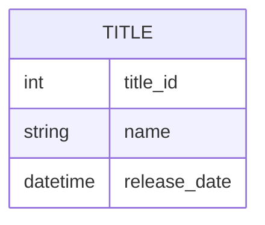
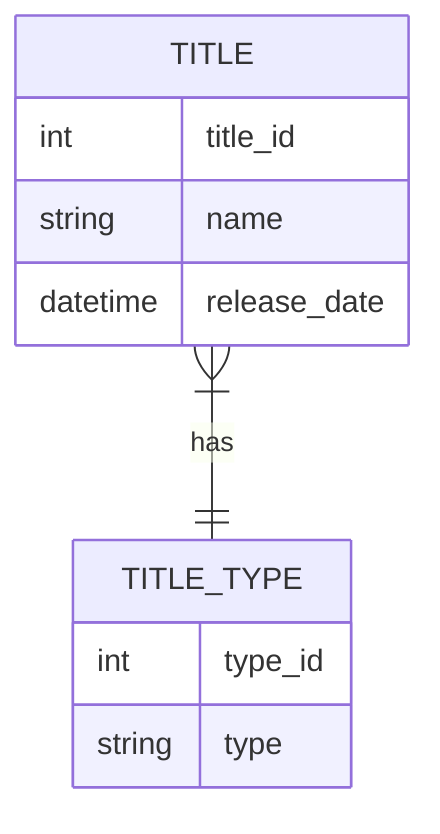

# 7. Design Database Schemas

While it's definitely possible that the domain entities you defined map one-to-one to entities in the database (such as tables), this isn't always the case.

## Entity Relationship Diagrams

A common diagram for designing database schemas is called an entity relationship diagram (ERD). Its purpose is to define the database schemas for those entities, such as their fields and data types, as well as how the entities link together.

## First entity

## Relate entities

