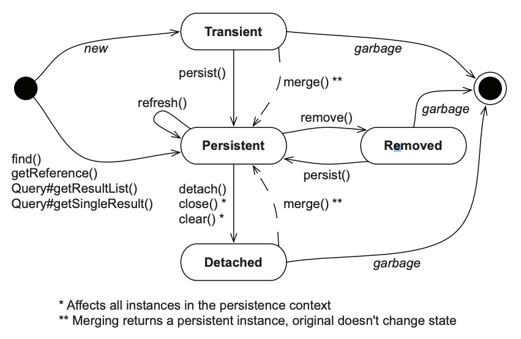

# 10. Managing data

## 10.1 The persistence lifecycle

Because JPA is a transparent persistence mechanism, it is possible to write

### 10.1.1 Entity instance states

JPA defines four states and their transitions.

#### TRANSIENT STATE

Instances created with the `new` Java operator are _transient_.

For an entity instance to transition from transient to _persistence_ state requires either a call to the `EntityManager#persist()` method or cascading of state from an already persistent instance.

#### PERSISTENT STATE

A _persistent_ entity instance has a representation in the database. It's stored in the database-or it will be stored when the unit of work completes.

Persistent instances are always associated with a persistence context.

#### REMOVED STATE

We can delete a persistent entity instance from the database in several ways. We can remove it with `EntityManager#remove()`. It may also become available for deletion if we remove a reference to it from a mapped collection with _orphan removal_ enabled.

An entity instance is then in the _removed_ state: the provider will delete it at the end of a unit of work.

#### DETACHED STATE

Consider loading an instance by calling `EntityManager#find()`, then ending our unit of work and closing the persistence context.
The application still has a _handle_—a reference to the instance we loaded. It's now in a detached state, and the data is becoming stale.

### 10.1.2 The persistent context

In a Java Persistence application, an `EntityManager` has a persistence context. We create a persistent context when we call `EntityManagerFactory#createEntityManager()`. The context is closed when we call `EntityManager#close()`. In JPA terminology, this is an *application_managed* persistence context; our application defines the scope of the persistence context, demarcating the unit of work.

The persistence context monitors and manages all entities in the persistent state.

The persistence context also allows the persistence engine to perform _automatic dirty checking_. The provider then synchronizes with the database the state of instances monitored by a persistence context, either automatically or on demand. Typically, when a unit of work completes, the provider propagates state that's held in memory to the database. This _flushing_ procedure may also occur at other times. For example, Hibernate may synchronize with the database before the execution of a query.

The persistence context also acts as a _first-level cache_.

The cache also affects the results of arbitrary queries, such as those executed with the `jakarta.persistence.Query` API. Hibernate ignores any potentially newer data in the result set, due to read-committed transaction isolation at the database level, if the entity instance is already present in the persistence context.

Persistence context cache ensures the following:

- The persistence layer isn't vulnerable to stack overflows in the case of circular references in an object graph.
- There can never be conflicting representations of the same database row at the end of a unit of work. The provider can safely write all changes made to an entity instance to the database.
- Changes made in a particular persistence context are always immediately visible to all other code executed inside that unit of work and its persistence context. JPA guarantees repeatable entity-instance reads.

The persistence context provides a _guaranteed scope of object identity_; in the scope of a single persistence context, only one instance represents a particular database row. Within one persistence context, Hibernate guarantees both `entityA == entityB` and `entityA.getId().equals(entityB.getId())` will yield the same result.

## 10.2 The `EntityManager` interface

Any transparent persistence tool includes a persistence manager API. This persistence manager usually provides services for basic CRUD operations, query execution, and controlling the persistence context. In Jakarta Persistence applications, the main interface we interact with is the `EntityManager` to create units of work.

### 10.2.1 The canonical unit of work

### 10.2.2 Making data persistent

### 10.2.3 Retrieving and modifying persistent data

### 10.2.4 Getting a reference

### 10.2.5 Making data transient
