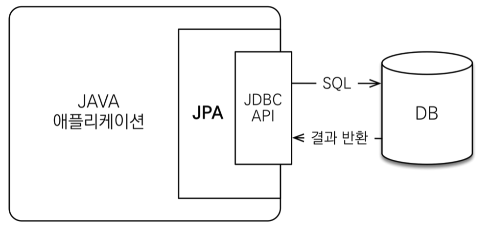

# 1. JPA 소개

자바로 작성한 애플리케이션은 JDBC API를 사용해서 SQL을 데이터베이스에 전달한다.

## 1.1 SQL을 직접 다룰 때 발생하는 문제점

객체를 데이터베이스에 CRUD하려면 너무 많은 SQL과 JDBC API를 코드로 작성해야 한다. 테이블마다 이런 비슷한 일을 반복해야 한다.

SQL에 의존적인 개발을 한다. 그 예로 데이터베이스 테이블에 새로운 컬럼을 추가하면 등록, 조회, 수정 SQL 쿼리 변경이 필요하다. 연관된 객체 조회가 필요 시 DAO를 열어서 SQL의 확인하기 전에는 어떤 객체들이 함께 조회되는지 일일이 확인해야 한다. 그런 의미에서 진정한 의미의 계층 분할이 어렵고 엔티티를 신뢰할 수 없다.

## 1.2 패러다임의 불일치

## 1.3 JPA란 무엇인가?

JPA는 자바 진영의 ORM 기술 표준이다.
