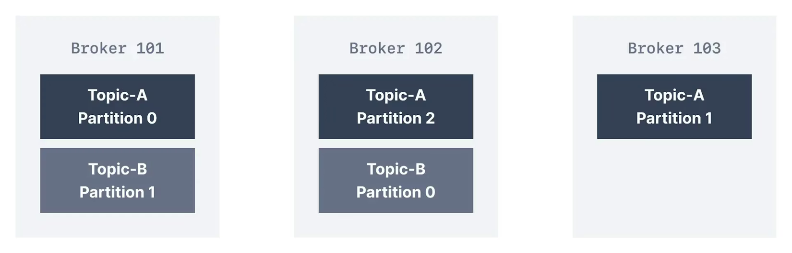
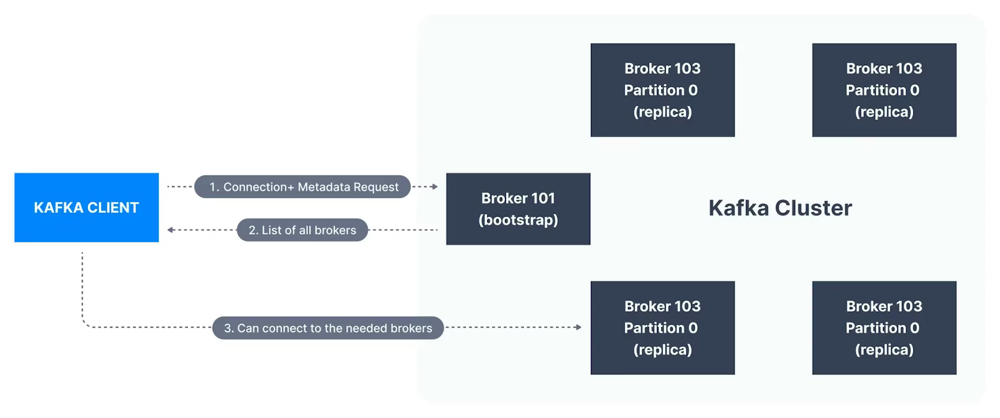

# Learn Apache Kafka for Beginners v3

## 1. Kafka Introduction

Move data from source system to target system. Can get complicated:

- Multiple integrations as sources and targets increase.
- Each integration comes with difficulties around
  - Protocol: how the data is transported (TCP, HTTP, REST, FTP, JDBC, ...)
  - Data format: how the data is parsed (Binary, CSV, JSON, Avro, Protobuf, ...)
  - Data schema & evolution: how the data is shaped may change over time
- Each source system will have an *increased load* from the connections.

Why Kafka? It allows decoupling of data streams and systems.

- Distributed, resilient architecture, fault tolerant
- Horizontal scalability
  - Can scale to 100s of brokers
  - Can scale to millions of messages per second
- High performance (latency of less than 10ms) - real time

Use cases:

- Messaging system
- Activity tracking
- Gather metrics from many different locations
- Application log gathering
- Stream processing (Kafka Streams API)
- De-coupling of system dependencies
- Integration with Spark, Flink, Storm, Hadoop, etc...
- Microservices pub/sub

## 3. Kafka Theory

### Topics, Partitions and Offsets

Topics: a particular stream of data

- Like a table in a database (without all the constraints)
- Can have as many topics as you want
- Identified by its name
- Any kind of message format
- Sequence of messages is called a data stream
- Cannot query topics, instead use Kafka Producers to send data. Kafka Consumers read the data.

Topics are split in *partitions*.

- Messages within each partition are ordered
- Each message within a partition gets an incremental id, called *offset*

Important notes

- Kafka topics are immutable: once data is written to a partition, it cannot be changed.
- Data is kept only for a limited time (default is one week - configurable)
- Offset only has meaning for a specific partition
- Order is guaranteed only within *a* partition
- Data is assigned randomly to a partition unless a key is provided
- Can have as many partitions per topic as you want

### Producers and Message Keys

Producers

- Producers write data to topics (which are made of partitions)
- Producers know to which partition to write to (and which Kafka broker has it)
- In case of broker failures, producers will automatically recover

Write load is balanced to many brokers thanks to the number of partitions.

Message keys

- Producer can choose to send a *key* with the message (string, number, binary, etc...)
- If key is null, data is sent round robin (Kafka 2.4+ uses sticky partitioning - batches message to same partition until batch is full)
- If key != null, then all messages for that key will always go to the same partition (hashing)
- Typically, a key is sent if you need message ordering for a specific field

Kafka message created by the producer consists of

- Key - binary (can be null)
- Value - binary (can be null)
- Compression type (none, gzip, snappy, lz4, zstd)
- Headers (optional)
- Partition + Offset
- Timestamp (system or user set)

Kafka Message Serializer

- Kafka only accepts bytes as an input from producers and sends bytes out as output to consumers
- Message serialization means transforming objects / data into bytes
- Used on the value and the key
- Common serializers:
  - String (incl. JSON)
  - Int, Float
  - Avro
  - Protobuf

Kafka partitioner is a code logic that takes a record and determines to which partition to send it into.
In the default Kafka partitioner, the keys are hashed using the Murmur2 algorithm

```pseudocode
targetPartition = abs(Utils.murmur2(keyBytes)) % numPartitions
```

### Consumers and Deserialization

Consumers

- Consumers read data from a topic - pull model
- Consumers automatically know which broker to read from
- In case of broker failures, consumers know how to recover
- Data is read in order from low to high offset *within each partition*

Consumer Deserializer

- Deserialization indicates how to transform bytes into objects/data
- They are used on the value and the key of the message
- Common deserializers
  - String (incl. JSON)
  - Int, Float
  - Avro
  - Protobuf
- The serialization/deserialization type must not change during topic lifecycle (create a new topic instead)

### Consumer Groups and Consumer Offsets

Consumer Groups

- All the consumers in an application read data as a consumer group
- Each consumer within a group reads from exclusive partitions

What if you have more consumers than partitions? Some consumers will be inactive.

- It is acceptable to have multiple consumer groups on the same topic.
- To create distinct consumer groups, use the consumer property `group.id`

Consumer Offsets

- Kafka stores the offsets at which a consumer group has been reading
- The offsets committed are in a Kafka topic named `__consumer_offsets`
- When a consumer in a group has processed data received from Kafka, it should be *periodically* committing the offsets (Kafka broker will write to `__consumer_offsets`, not the group itself)
- If a consumer dies, it will be able to read back from where it left off thanks to the committed consumer offsets

Delivery Semantics for Consumers

- Java consumers will automatically commit offsets (at least once)
- 3 delivery semantics if you choose to commit manually
- At least once (usually preferred)
  - Offsets are committed after the message is processed
  - If the processing goes wrong, the message will be read again
  - This can result in duplicate processing of messages. Make sure your processing is *idempotent* (i.e., processing the messages again won't impact your systems)
- At most once
  - Offsets are committed as soon as messages are received
  - If the processing goes wrong, some messages will be lost
- Exactly once
  - For Kafka -> Kafka workflows: use the Transactional API (easy with Kafka Streams API)
  - For Kafka -> External systems workflows: use an idempotent consumer

### Brokers and Topics

Kafka Brokers

- A Kafka cluster is composed of multiple brokers (servers)
- Each broker is identified with its ID (integer)
- Each broker contains certain topic partitions
- After connecting to any broker (called a bootstrap broker), clients (producers and consumers) will be connected to the entire cluster

Brokers and Topics



Kafka Broker Discovery

- Every Kafka broker is also called a "bootstrap server"
- That means clients only need to connect to one broker, and the clients will know how to be connected to the entire cluster (smart clients)



### Topic Replication

Topic Replication Factor

- Topic should have a replication factor > 1 (usually between 2 and 3)
- If a broker fails, another broker can serve the partition

Leader for a Partition

- At any time only *one* broker can be a leader for a given partition
- Producers can only send data to the broker that is the leader of a partition
- Other brokers will replicate the data
- Therefore, each partition has one leader and multiple ISR (in-sync replicas)

Default Producer and Consumer Behavior with Leaders

- Producers can only write to the leader broker for a partition
- Consumers by default will read from the leader broker for a partition

Kafka Consumer Replica Fetching (Kafka v2.4+)

- Since Kafka 2.4, it is possible to configure consumers to read from the closest replica
- May help improve latency, and also decrease network cost if using the cloud

### Producer Acknowledgments and Topic Durability

Acks

- Producers can choose to receive acknowledgments of data writes:
  - acks=0: Producer won't wait for acknowledgment (possible data loss)
  - acks=1: Producer will wait for leader acknowledgment (limited data loss)
  - acks=all: Leader + replicas acknowledgment (no data loss)

Kafka Topic Durability

- For a replication factor of N, you can permanently lose up to N-1 brokers and still recover your data

### Zookeeper

### Kafka KRaft
