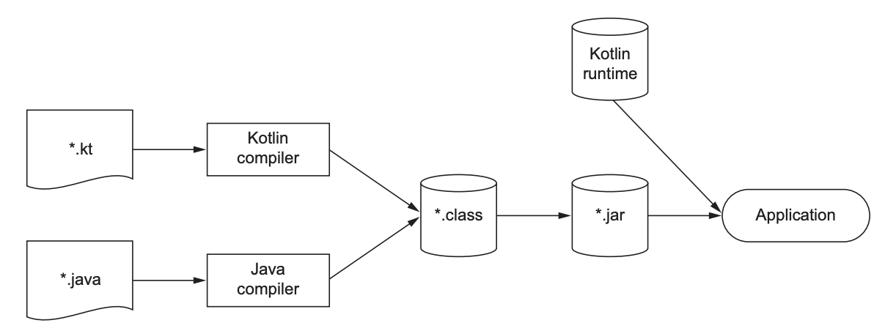

# 1. Kotlin: What and why

## A Taste of Kotlin

The following example demonstrates features and concepts in Kotlin including:

- Defining a data class with properties without the need to specify a body
- Declaring read-only properties with the `val` keyword
- Providing default values for arguments
- Explicit nullable values (`Int?`) in the type system
- Top-level function definitions without nesting them inside classes
- Named arguments when invoking functions and constructors
- Using trailing commas
- Using collection operations with lambda expressions
- Providing fallback values when a variable is `null` via the Elvis operator (`?:`)
- Using string templates as an alternative to manual concatenation
- Using autogenerated functions for data classes, such as `toString`

```kotlin
data class Person(
    val name: String,
    val age: Int? = null,
)

fun main() {
    val persons =
        listOf(
            Person("Alice", age = 29),
            Person("Bob"),
        )
    val oldest =
        persons.maxBy {
            it.age ?: 0
        }
    println("The oldest is: $oldest")
}

// The oldest is: Person(name=Alice, age=29)
```

## Primary traits

### Static typing

Kotlin is a statically typed programming language; the compiler can validate that the methods and fields you're trying to access on an object actually exist.

The ability of the compiler to determine types from context is called _type inference_. Type inference in Kotlin means that most of the extra verbosity associated with static typing disappears because you don't need to declare types explicitly.

Kotlin supports _nullable types_.

Kotlin's type system also has first-class support for _function types._

### Functional and object-oriented programming

The key concepts of functional programming are as follows:

- _First class functions_: You work with functions as values. You can store them in variables, pass them as parameters, or return them from other functions.
- _Immutability_: You work with immutable objects, which guarantees their state can't change after their creation.
- _No side effects_: You write _pure functions,_ functions that return the same result given the same inputs and don't modify the state of other objects.

The benefits of functional programming are _conciseness, safe concurrency, and easier testing._

Kotlin's support for functional programming includes:

- _Function types_: Allowing functions to receive other functions as arguments or return other functions
- _Lambda expressions_: Letting you pass around blocks of code with minimum boilerplate
- _Member references_: Allowing you to use functions as values and, for instance, pass them as arguments
- _Data classes_: Provide a concise syntax for creating classes that can hold immutable data
- _Standard library APIs_: A rich set in the standard library for working with objects and collections in the functional style

### Concurrent and Asynchronous code

Kotlin approaches the problem of concurrent and asynchronous programming using _suspendable computations_ called _coroutines,_ where code can suspend its execution and resume its work at a later point.

_Structured concurrency_ helps you manage the lifetime of your coroutines.

Coroutines are also a very lightweight abstraction, meaning you can launch millions of concurrent jobs without significant performance penalties. Together with abstractions, like _cold_ and _hot flows_, Kotlin coroutines become a powerful tool for building concurrent applications.

## Kotlin tools

### Compilation

Kotlin code can be compiled to different targets:

- JVM bytecode (stored in .class files) to run on the JVM
- JVM bytecode to be further transformed and run on Android
- Native targets to run natively on different systems
- JavaScript (and WebAssembly) to run in a browser

#### Compilation process for Kotlin/JVM

Kotlin source code is normally stored in files with the extension .kt. When compiling Kotlin code for the JVM target, the compiler analyzes the source code and generates .class files, just like the Java compiler. The generated .class files are then packaged and executed using the standard procedure for the type of application you're working on.

In simple cases, use `kotlinc` command to compile your code, then use `java` command to execute the code:

```bash
kotlinc <source file or directory> -include-runtime -d <jar name>
java -jar
```

Kotlin built-in classes and their APIs differ from those in Java, and to correctly run the compiled code, JVM needs the additional information as a dependency: the _Kotlin runtime library_.

The Kotlin runtime library contains the definitions of Kotlin's basic classes, like `Int` and `String`, and some extensions Kotlin adds to the standard Java APIs.



Additionally, you need the _Kotlin standard library_ included as a dependency. The standard library contains the definitions of such fundamental classes as `List`, `Map`, and `Sequence` as well as many methods for working with them.

Maven and Gradle take care of including both the Kotlin runtime library and (for the latest versions) Kotlin standard library as dependencies.
