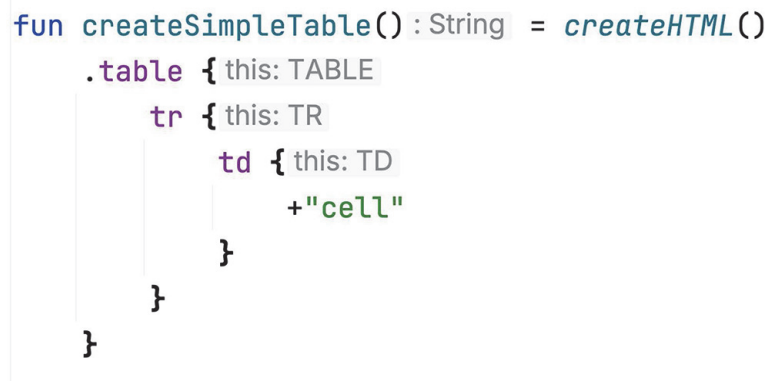

# 13. DSL construction

## From APIs to DSLs: Creating expressive custom code structures

Distinction between _general-purpose programming language_, with a set of capabilities complete enough to solve essentially any problem that can be solved with a computer, and a _domain-specific language_, which focuses on a specific task, or _domain_ and foregoes the functionality that's irrelevant for that domain.

As opposed to _external DSLs_, which have their own independent syntax, _internal DSLs_ are part of programs written in a general-purpose language.

One trait comes up often in DSLs and usually doesn't exist in other APIs: _structure_ or _grammar_. Method calls in a DSL exist in a larger structure, defined by the _grammar_ of the DSL. In a Kotlin DSL, structure is most commonly created through nesting of lambdas or through chained method calls.

## Building structured APIs: Lambdas with receivers in DSLs

### Lambdas with receivers and extension function types

We had a brief encounter with the idea of lambdas with receivers when we talked about the `buildList`, `buildString`, `with`, and `apply` standard library functions.

Let's define the `buildString` function so that it takes a regular lambda as an argument.

```kotlin
fun buildString(builderAction: (StringBuilder) -> Unit): String {
    val sb = StringBuilder()
    builderAction(sb)
    return sb.toString()
}

fun main() {
    val s =
        buildString {
            it.append("Hello, ")
            it.append("World!")
        }
    println(s)
    // Hello, World!
}
```

The main purpose of the lambda is to fill the `StringBuilder` with text, so you want to get rid of the repeated `it` prefixes and invoke the `StringBuilder` methods directly.

To do so, you need to convert the lambda into a _lambda with a receiver_. In effect, you can give one of the parameters of the lambda the special status of a _receiver_.

```kotlin
fun buildString(builderAction: StringBuilder.() -> Unit): String {
    val sb = StringBuilder()
    sb.builderAction()
    return sb.toString()
}

fun main() {
    val s =
        buildString {
            this.append("Hello, ")
            append("World!")
        }
    println(s)
    // Hello, World!
}
```

Let's discuss how the declaration of the `buildString` function has changed. We use an _extension function type_ instead of a regular function type to declare the parameter type. We replace `(StringBuilder) -> Unit` with `StringBuilder.() -> Unit`. This special type is called the _receiver type_, and the value of that type passed to the lambda becomes the _receiver object_.

The implementation of `buildString` in the standard library is shorter.

```kotlin
fun buildString(builderAction: StringBuilder.() -> Unit): String =
  StringBuilder().apply(builderAction).toString()
```

```kotlin
inline fun <T> T.apply(block: T.() -> Unit): T {
  // equivalent to this.block()
  block()
  return this
}
```

```kotlin
inline fun <T, R> with(receiver: T, block: T.() -> R): R =
  receiver.block()
```

The main difference is that `apply` returns the receiver itself, but `with` returns the result of calling the lambda.

### Using lambdas with receivers in HTML builders

Kotlin DSL for HTML is usually called an _HTML builder_, and it represents the more general concept of _type-safe builders_.

```kotlin
fun createSimpleTable() = createHTML().
    table {
        tr {
            td { +"cell" }
        }
    }
```

These lambdas _change the name-resolution rules_. In the lambda passed to the `table` function, you can use the `tr` function to create the `<tr>` HTML tag. Outside of that lambda, the `tr` function would be unresolved. Notice how the design of the API forces you to follow the grammar of the HTML language.



The name-resolution context in each block is defined by the receiver type of each lambda.

Note that if one lambda with a receiver is placed in the other one, the receiver defined in the outer lambda remains available in the nested lambda. For example, you could accidentally refer to the `href` property of a surrounding `a` tag from inside an `img` lambda.

```kotlin
createHTML().body {
    a {
        img {
            href = "https://..."
        }
    }
}
```

To avoid this, Kotlin provides the `@DslMarker` annotation, which constrains the availability of outer receivers in lambdas. The `@DslMarker` annotation is a meta-annotation; it can be applied to an annotation class. In `kotlinx.html`, that annotation is called `HtmlTagMarker`.

```kotlin
@DslMarker
annotation class HtmlTagMarker
```

Any declaration annotated with `@HtmlTagMarker` will have additional restrictions on its implicit receivers. Specifically, you can never have two implicit receivers within the same scope if their types are marked with the same `@DslMarker` annotation.

Now, let's implement a much simpler version of an HTML builder library. As the entry point for this simplified version, a top-level `table` function creates a fragment of HTML with `<table>` as a top tag.

```kotlin
fun createTable() =
    table {
        tr {
            tr {
            }
        }
    }

fun main() {
    println(createTable())
    // <table><tr><td></td></tr></table>
}
```

The `table` function creates a new instance of the `TABLE` tag, initializes it, and returns it:

```kotlin
fun table(init: TABLE.() -> Unit) = TABLE().apply(init)
```

The logic of initializing a given tag and adding it to the children of the outer tag is common for all tags, so you can extract it as a `doInit` member of the `Tag` superclass.

```kotlin
@DslMarker
annotation class HtmlTagMarker

@HtmlTagMarker
open class Tag(
    val name: String,
) {
    private val children = mutableListOf<Tag>()

    protected fun <T : Tag> doInit(
        child: T,
        init: T.() -> Unit,
    ) {
        child.init()
        children.add(child)
    }

    override fun toString(): String = "<$name>${children.joinToString("")}</$name>"
}

fun table(init: TABLE.() -> Unit) = TABLE().apply(init)

class TABLE : Tag("table") {
    fun tr(init: TR.() -> Unit) = doInit(TR(), init)
}

class TR : Tag("tr") {
    fun td(init: TD.() -> Unit) = doInit(TD(), init)
}

class TD : Tag("td")
```

We have seen how lambdas with receivers are a great tool for building DSLs because you can change the name-resolution context in a code block, they let you create _structure_ in your API.
