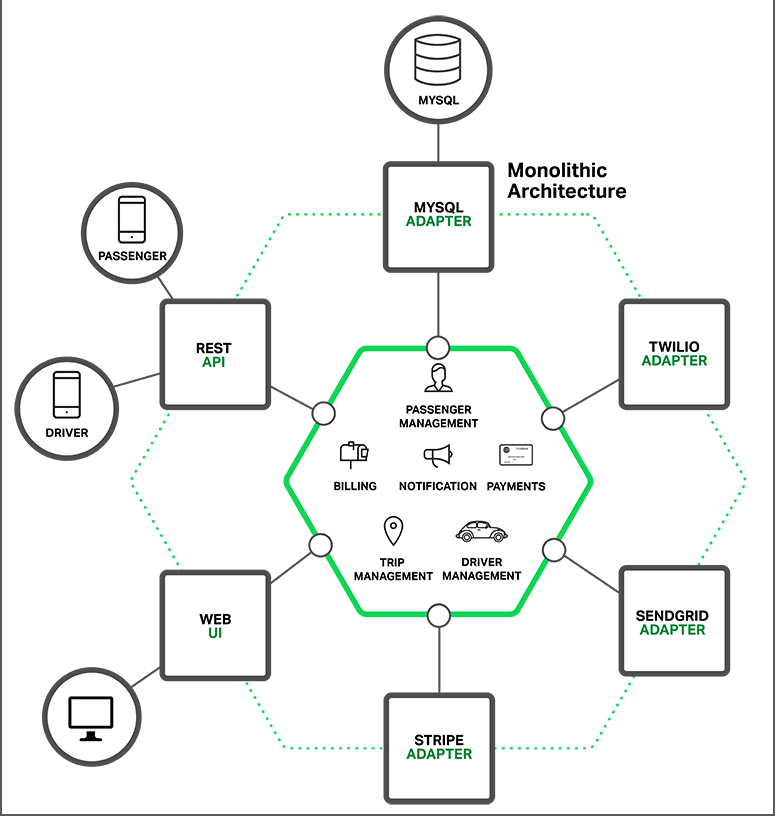
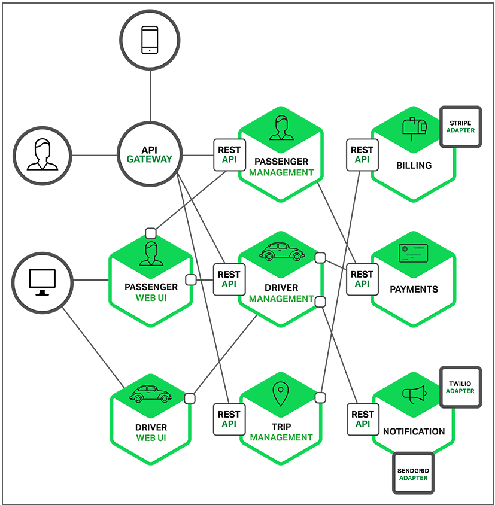

# 1장 - 마이크로서비스 아키텍처와 레디스

## NoSQL의 등장 배경

### 모놀리틱 아키텍처

모놀리틱 아키텍처는 전통적인 소프트웨어 개발 모델로, 전체 애플리케이션을 하나의 통합된 패키지로 개발, 배포하는 방식이다. 모든 시스템은 하나로 연결돼 관리된다.

### 마이크로서비스 아키텍처

마이크로서비스는 독립된 각각의 모듈을 조립해 하나의 서비스를 만드는 아키택처다. 업데이트, 테스트, 배포, 확장은 각 서비스별로 독립적으로 수행될 수 있다.

### 데이터 저장소 요구 사항의 변화

그동안 모놀리틱 서비스에서 애플리케이션 개발을 위해 가장 많이 사용된 데이터베이스는 관계형 데이터베이스였다. 하지만 최근의 서비스에서는 정해진 형태가 없고, 크기와 구조를 예측할 수 없는 비정형 데이터가 증가하고 있다.

## NoSQL이란?

NoSQL이란 용어는

### 실시간 응답

### 확장성

### 고가용성

### 클라우드 네이티브

### 단순성

### 유연성

## NoSQL 데이터 저상소 유형

### 그래프 유형

### 칼럼 유형

### 문서 유형

### 키-값 유형

## 레디스란?

Remote dictionary server의 약자인 Redis는 고성능 키-값 유형의 in-memory NoSQL 데이터베이스이다.

### 레디스의 특징

#### 실시간 응답(빠른 성능)

## 마이크로서비스 아키텍처와 레디스
