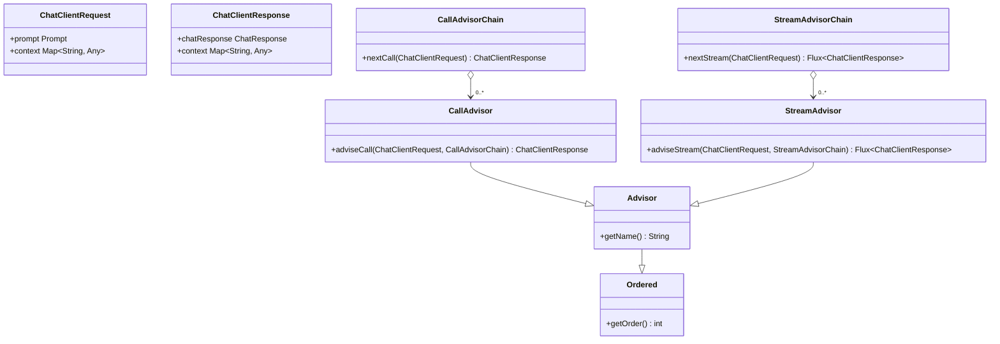

# Advisors API

Spring AI Advisors API provides a way to intercept, modify, and enhance AI-driven interactions in Spring applications.

You can configure existing advisors using the ChatClient API as shown below:

```kotlin
val chatMemory: ChatMemory = ... // Initialize chat memory store
val vectorStore: VectorStore = ... // Initialize vector store

val chatClient = ChatClient.builder(chatModel)
    .defaultAdvisor(
        MessageChatMemoryAdvisor.builder(chatMemory).build(), // chat-memory advisor
        QuestionAnswerAdvisor.builder(vectorStore).build()    // RAG advisor
    )
    .build()

val conversationId = "678"

val response = chatClient.prompt()
    // Set advisor parameters at runtime
    .advisors { it.param(ChatMemory.CONVERSATION_ID, conversationId) }
    .user(userText)
    .call()
    .content()
```

It is recommended to register the advisors at build time using the builder's `defaultAdvisors()` method.

## Core Components

The API consists of `CallAdvisor` and `CallAdvisorChain` for non-streaming scenarios, and `StreamAdvisor` and `StreamAdvisorChain` for streaming scenarios. It also includes `ChatClientRequest` to represent the unsealed Prompt request and `ChatClientResponse` for the Chat Completion response. Both hold an `advise-context` to share state across the advisor chain.


