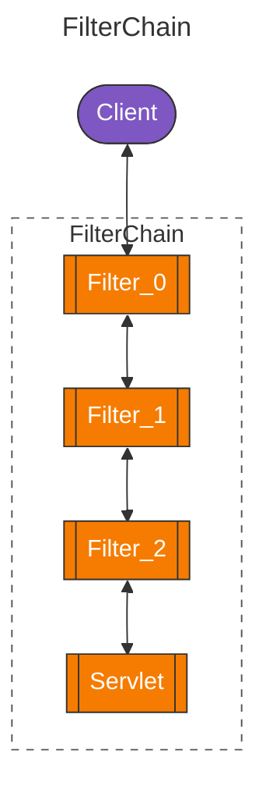
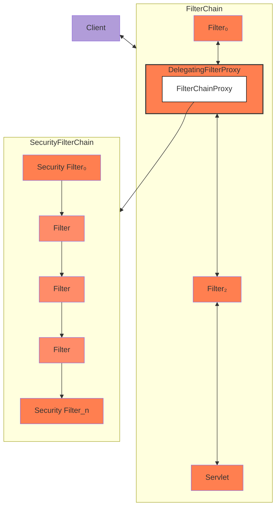
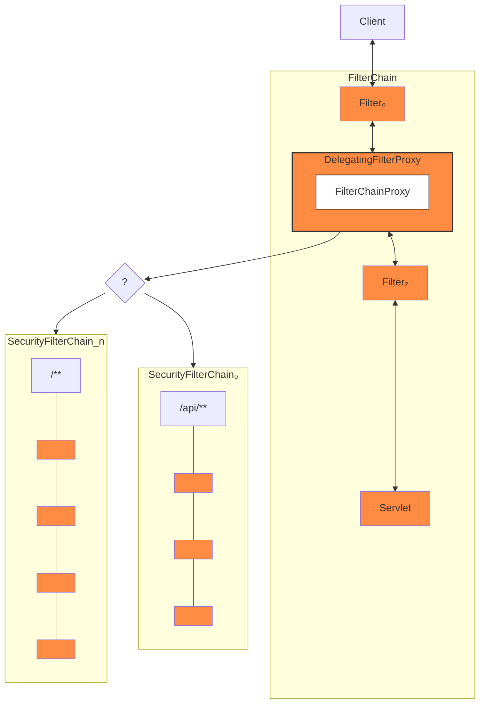
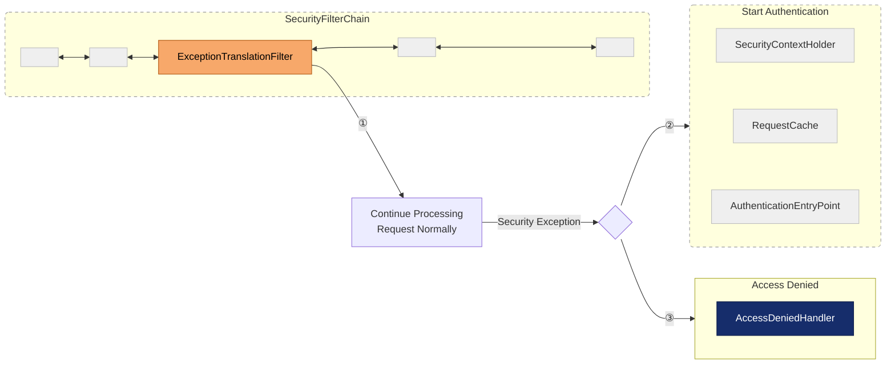

# Architecture

## Filters



Client sends a request to the application, and the servlet container creates a `FilterChain`, which
contains the `Filter` instances and the `Servlet` that should process the `HttpServletRequest`,
based on the path of the request URI. In a Spring MVC application, the `Servlet` is an instance of
`DispatcherServlet`.

Since a `Filter` impacts only downstream `Filter` instances and the `Servlet`, the order in which
each `Filter` is invoked is extremely important.

### DelegatingFilterProxy

Spring provides a `Filter` implementation named `DelegatingFilterProxy` that allows bridging between
the Servlet container's lifecycle and Spring's `ApplicationContext`. You can register
`DelegatingFilterProxy` through the standard Servlet container mechanisms but delegate all the work
to a Spring Bean that implements `Filter`.

`DelegatingFilterProxy` allows delaying the lookup of `Filter` bean instances. Container needs to
register the `Filter` instances before the container can start up; however, Spring typically uses a
`ContextLoaderListener` to load the Spring Beans, which is not done until after the `Filter`
instances need to be registered.

### FilterChainProxy

Spring Security's Servlet support is contained within `FilterChainProxy`. `FilterChainProxy` is a
special `Filter` provided by Spring Security that allows delegating to many `Filter` instances
through `SecurityFilterChain`. Since `FilterChainProxy` is a Bean, it is typically wrapped in a
DelegatingFilterProxy.

### SecurityFilterChain

`SecurityFilterChain` is used by *FilterChainProxy* to determine which Spring Security Filter
instances should be invoked for the current request.



The Security Filters in `SecurityFilterChain` are typically Beans, but they are registered with
`FilterChainProxy` instead of `DelegatingFilterProxy`. The advantages of using `FilterChainProxy` to
registering directly with the Servlet container or DelegatingFilterProxy are:

1. It provides a starting point for all of Spring Security's Servlet support. For that reason, when
   troubleshooting, adding a debug point in `FilterChainProxy` is a great place to start.
2. Since `FilterChainProxy` is central to Spring Security usage, it can perform tasks that are not
   viewed as optional. For example, it clears out the `SecurityContext` to avoid memory leaks. Also
   applies `HttpFirewall` to protect against certain types of attacks.
3. In a Servlet container, `Filter` instances are invoked based upon the URL alone.
   `FilterChainProxy` can determine invocation based upon anything in the `HttpServletRequest` by
   using the `RequestMatcher` instance.

The following image shows multiple `SecurityFilterChain` instances:



### Security Filters

SecurityFilters are inserted into the *FilterChainProxy* with the *SecurityFilterChain* API. Those filters can be used for a number of different purposes, like exploit protection, authentication, authorization, and more.

Security filters are most often declared using an `HttpSecurity` instance.

```kotlin
@Configuration
@EnableWebSecurity
class SecurityConfig {
    @Bean
    fun filterChain(http: HttpSecurity): SecurityFilterChain {
        http {
            csrf { }
            httpBasic { }
            formLogin { }
            authorizeHttpRequests {
                authorize(anyRequest, authenticated)
            }
        }
        return http.build()
    }
}
```

The above configuration will result in the following `Filter` ordering:

| Filter                      | Added by                             |
|-----------------------------|--------------------------------------|
| CsrfFilter                  | `HttpSecurity#csrf`                  |
| BasicAuthenticationFilter   | `HttpSecurity#httpBasic`             |
| FormLoginFilter             | `HttpSecurity#formLogin`             |
| AuthorizeHttpRequestsFilter | `HttpSecurity#authorizeHttpRequests` |

#### Printing the Security Filters

The list of filters is printed at DEBUG level on the application startup, so you can see something
like the following:

```text
2023-06-14T08:55:22.321-03:00  DEBUG 76975 --- [           main] o.s.s.web.DefaultSecurityFilterChain     : Will secure any request with [ DisableEncodeUrlFilter, WebAsyncManagerIntegrationFilter, SecurityContextHolderFilter, HeaderWriterFilter, CsrfFilter, LogoutFilter, UsernamePasswordAuthenticationFilter, DefaultLoginPageGeneratingFilter, DefaultLogoutPageGeneratingFilter, BasicAuthenticationFilter, RequestCacheAwareFilter, SecurityContextHolderAwareRequestFilter, AnonymousAuthenticationFilter, ExceptionTranslationFilter, AuthorizationFilter]
```

### Handling Security Exceptions

The `ExceptionTranslationFilter` allows translation of `AccessDeniedException` and
`AuthenticationException` into HTTP responses.

`ExceptionTranslationFilter` is inserted into the `FilterChainProxy` as one of the Security Filters.



- ①
- ②
- ③

### Logging

Spring Security provides logging of all security related events at the DEBUG and TRACE level. This
can be very useful for debugging your application.

Consider an example where a user tries to make a `POST` request to a resource that has CSRF
protection enabled without the CSRF token. With no logs, the user will see a 403 error with no
explanation of why the request was rejected. However, if you enable logging for Spring Security, you
will see a log message like this:

```text
2023-06-14T09:44:25.797-03:00 DEBUG 76975 --- [nio-8080-exec-1] o.s.security.web.FilterChainProxy        : Securing POST /hello
2023-06-14T09:44:25.797-03:00 TRACE 76975 --- [nio-8080-exec-1] o.s.security.web.FilterChainProxy        : Invoking DisableEncodeUrlFilter (1/15)
2023-06-14T09:44:25.798-03:00 TRACE 76975 --- [nio-8080-exec-1] o.s.security.web.FilterChainProxy        : Invoking WebAsyncManagerIntegrationFilter (2/15)
2023-06-14T09:44:25.800-03:00 TRACE 76975 --- [nio-8080-exec-1] o.s.security.web.FilterChainProxy        : Invoking SecurityContextHolderFilter (3/15)
2023-06-14T09:44:25.801-03:00 TRACE 76975 --- [nio-8080-exec-1] o.s.security.web.FilterChainProxy        : Invoking HeaderWriterFilter (4/15)
2023-06-14T09:44:25.802-03:00 TRACE 76975 --- [nio-8080-exec-1] o.s.security.web.FilterChainProxy        : Invoking CsrfFilter (5/15)
2023-06-14T09:44:25.814-03:00 DEBUG 76975 --- [nio-8080-exec-1] o.s.security.web.csrf.CsrfFilter         : Invalid CSRF token found for http://localhost:8080/hello
2023-06-14T09:44:25.814-03:00 DEBUG 76975 --- [nio-8080-exec-1] o.s.s.w.access.AccessDeniedHandlerImpl   : Responding with 403 status code
2023-06-14T09:44:25.814-03:00 TRACE 76975 --- [nio-8080-exec-1] o.s.s.w.header.writers.HstsHeaderWriter  : Not injecting HSTS header since it did not match request to [Is Secure]
```

To log all the security events, you can add the following:

```properties
logging.level.org.springframework.security=TRACE
```

```xml

<configuration>
  <appender name="STDOUT" class="ch.qos.logback.core.ConsoleAppender">
    <!-- ... -->
  </appender>
  <!-- ... -->
  <logger name="org.springframework.security" level="trace" additivity="false">
    <appender-ref ref="Console"/>
  </logger>
</configuration>
```
