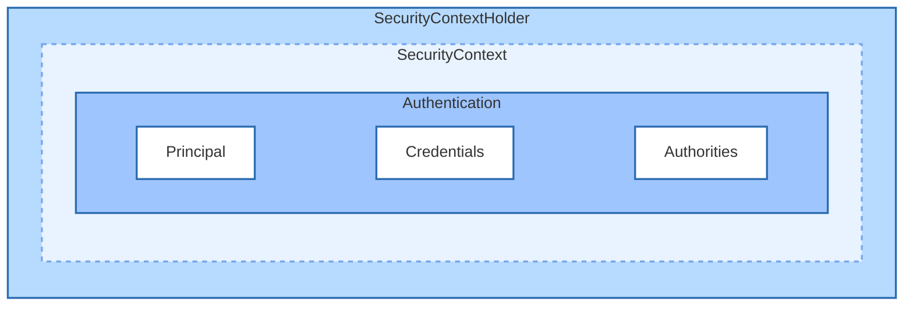
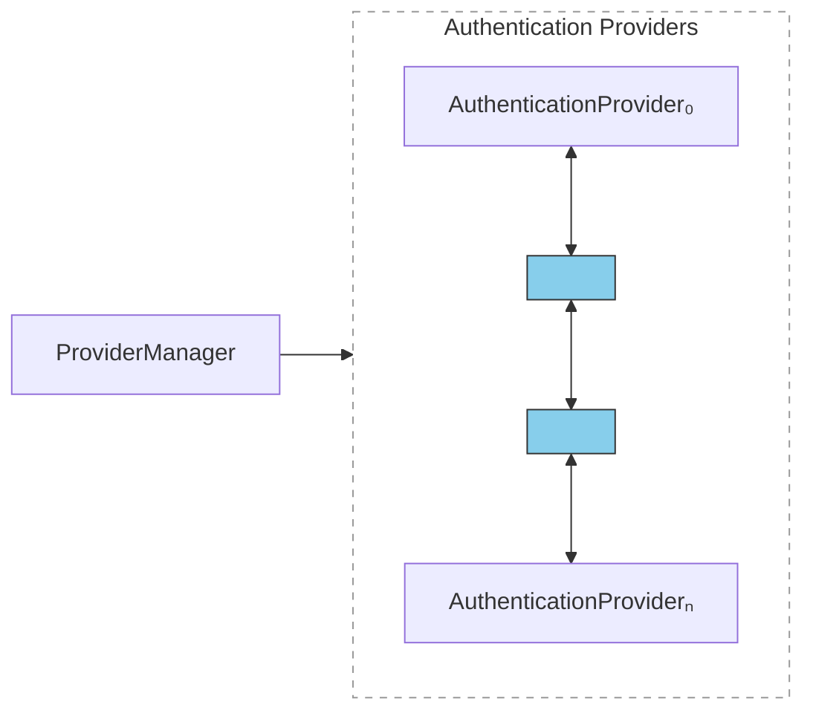
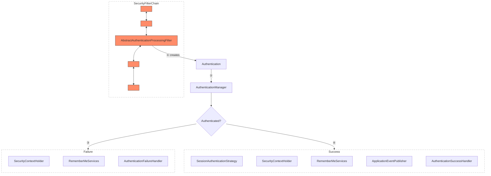

# Servlet Authentication Architecture

The main architectural components that Spring Security uses in Servlet authentication are as
follows:

- __SecurityContextHolder__ - where Spring Security stores the details of who is authenticated.
- __SecurityContext__ - obtained from the `SecurityContextHolder` and contains the `Authentication` of
  the currently authenticated user.
- __Authentication__ - Can be the input to `AuthenticationManager` to provide the credentials a user
  has provided to authenticate or the current user from the `SecurityContext`.
- __GrantedAuthority__ - An authority that is granted to the principal on the `Authentication` (
  roles, scopes, etc.)
- __AuthenticationManager__ - the API that defines how Spring Security's Filters perform authentication.
- __ProviderManager__ - the most common implementation of `AuthenticationManager`.
- __AuthenticationProvider__ - used by `ProviderManager` to perform a specific type of
  authentication.
- __Request Credentials with `AuthenticationEntryPoint`__ - used for requesting credentials from a client (redirecting to a login page, sending a `WWW-Authenticate` response, etc.)
- __AbstractAuthenticationProcessingFilter__ - a base `Filter` used for authentication.

## SecurityContextHolder

`SecurityContextHolder` contains the SecurityContext. It is also where Spring Security stores the details of who is authenticated. If `SecurityContextHolder` contains a value, it is used as the currently authenticated user.



Indicate a user is authenticated:

```kotlin
val context: SecurityContext = SecurityContextHolder.createEmptyContext()
val authentication: Authentication = TestingAuthenticationToken("username", "password", "ROLE_USER")
context.authentication = authentication

SecurityContextHolder.setContext(context)
```

To collect information about the authenticated principal:

```kotlin
val context = SecurityContextHolder.getContext()
val authentication = context.authentication
val username = authentication.name
val principal = authentication.principal
val authorities = authentication.authorities
```

By default, `SecurityContextHolder` uses a `ThreadLocal` to store these details. Spring Security's `FilterChainProxy` ensures that the `SecurityContext` is always cleared after the present principal's request is processed.

## SecurityContext

`SecurityContext` is obtained from the `SecurityContextHolder`. It contains the `Authentication` object.

## Authentication

`Authentication` interface serves two main purposes:

- An input to `AuthenticationManager` to provide the credentials a user has provided to authenticate.
- Represent the currently authenticated user.

`Authentication` contains:

- `principal`: Identifies the user. When authenticating with a username/password this is often an instance of `UserDetails`.
- `credentials`: Often a password.
- `authorities`: `GrantedAuthority` instances are high-level permissions the user is granted. Two examples are roles and scopes.

## GrantedAuthority

`GrantedAuthority` instances are high-level permissions that the user is granted. Such authorities are usually "roles", such as `ROLE_ADMINISTRATOR` or `ROLE_HR_SUPERVISOR`.

## AuthenticationManager

The API that defines how Spring Security's Filters perform authentication. The `Authentication` that is returned is then set on the `SecurityContextHolder` by the controller (SecurityFilterChain instances) that invoked the `AuthenticationManager`.

The most common implementation is `ProviderManager`.

## ProviderManager

Most commonly used implementation of `AuthenticationManager`. Delegates to a `List` of `AuthenticationProvider` instances.
Each `AuthenticationProvider` has an opportunity to indicate that authentication should be successful, fail, or indicate it cannot make a decision and allow a downstream `AuthenticationProvider` to decide.



## AuthenticationProvider

Can inject multiple `AuthenticationProvider` instances into `ProviderManager`. Each `AuthenticationProvider` performs a specific type of authentication. For example, `DaoAuthenticationProvider` supports username/password authentication, while `JwtAuthenticationProvider` supports authenticating a JWT token.

## Request Credentials with `AuthenticationEntryPoint`

`AuthenticationEntryPoint` is used to send an HTTP response that requests credentials from a client.

## AbstractAuthenticationProcessingFilter

`AbstractAuthenticationProcessingFilter` is used as a base `Filter` for authenticating a user's credentials.



- ① When the user submits their credentials, the `AbstractAuthenticationProcessingFilter` creates an `Authentication` from the `HttpServletRequest` to be authenticated. Type of `Authentication` created depends on the subclass of `AbstractAuthenticationProcessingFilter`.
- ② `Authentication` is passed into the `AuthenticationManager` to be authenticated.
- ③ If authentication fails,
  - `SecurityContextHolder` is cleared out.
  - `AuthenticationFailureHandler` is invoked.
- ④ If authentication is successful,
