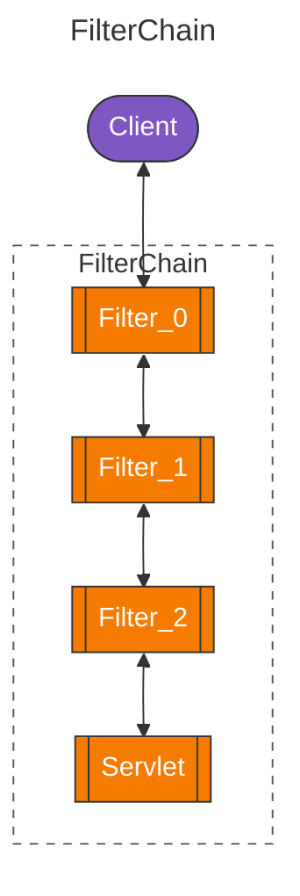
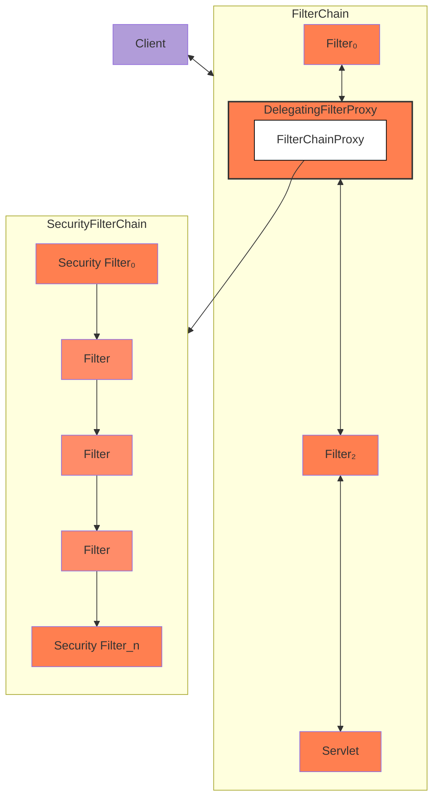

# Spring Security

Provides authentication, authorization, and protection against common attacks. Supports both
imperative and reactive applications.

## Features

### Authentication

Authentication is how we verify the identity of who is trying to access a particular resource.

### Authorization

Authorization is determining who is allowed to access a particular resource. Spring Security
provides defense in depth by allowing for request based authorization and method based
authorization.

### Protection Against Exploits

#### Cross Site Request Forgery (CSRF)

## Servlet Applications

### Architecture

#### Filters

Client sends a request to the application, and the servlet container creates a `FilterChain`, which contains the `Filter` instances and the `Servlet` that should process the `HttpServletRequest`, based onn the path of the request URI. In a Spring MVC application, the `Servlet` is an instance of `DispatcherServlet`

Since a `Filter` impacts only downstream `Filter` instances and the `Servlet`, the order in which each `Filter` is invoked is extremely important.

#### DelegatingFilterProxy

Spring provides a `Filter` implementation named `DelegatingFilterProxy` that allows bridging between the Servlet container's lifecycle and Spring's `ApplicationContext`. You can register `DelegatingFilterProxy` through the standard Servlet container mechanisms but delegate all the work to a Spring Bean that implements `Filter`.

`DelegatingFilterProxy` allows delaying looking up `Filter` bean instances. Container needs to register the `Filter` instances before the container can start up; however, Spring typically uses a `ContextLoaderListener` to load the Spring Beans, which is not done until after the `Filter` instances need to be registered. 

#### FilterChainProxy

Spring Security's Servlet support is contained within `FilterChainProxy`. `FilterChainProxy` is a special `Filter` provided by Spring Security that allows delegating to many `Filter` instances through `SecurityFilterChain`. Since `FilterChainProxy` is a Bean, it is typically wrapped in a DelegatingFilterProxy.

#### SecurityFilterChain

`SecurityFilterChain` is used by *FilterChainProxy* to determine which Spring Security Filter instances should be invoked for the current request.

The Security Filters in `SecurityFilterChain` are typically Beans, but they are registered with `FilterChainProxy` instead of `DelegatingFilterProxy`.

#### Security Filters

#### Handling Security Exceptions

#### Logging
