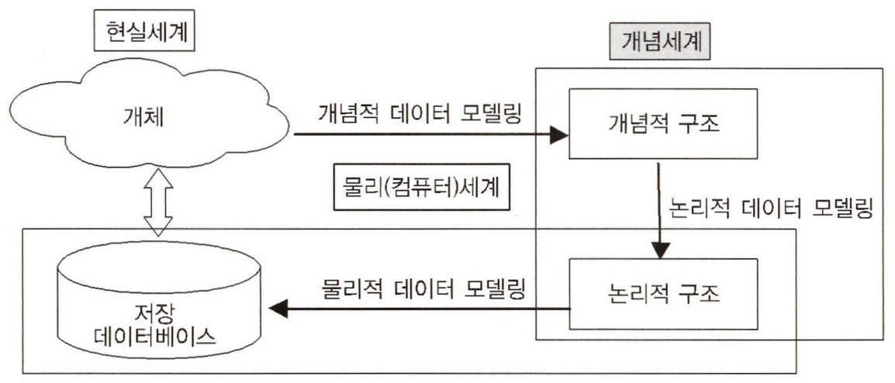
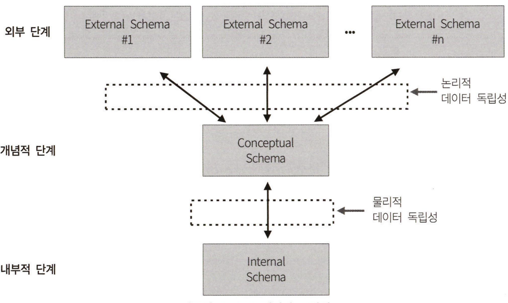

# 제1장 데이터 모델링의 이해

## 제1절 데이터 모델링의 이해

### 모델링의 이해

#### 모델링의 정의

모델링은 __복잡한 현실 세계를 추상화, 단순화하여 일정한 표기법에 의해 명확하게 표현하는 것이다.__

- 정보시스템을 구축하기 위한 데이터 관점의 업무 분석 기법
- 현실 세계의 데이터 (what)를 약속된 표기법에 의해 표현하는 과정
- 데이터베이스를 구축하기 위한 분석/설계의 과정

#### 모델링의 특징

1. __추상화__. 현실 세계를 일정한 형식으로 표현하는 것이다.
2. __단순화__. 복잡한 현실 세계를 정해진 표기법으로 단순하고 쉽게 표현한다는 의미이다.
3. __명확화__. 불분명함을 제거하고 명확하게 현상을 기술하는 것이다.

#### 모델링의 세 가지 관점

1. 데이터 관점 (What, Data)
   - 데이터와 데이터 간 관계, 업무와 데이터 간 관계를 모델링
   - 데이터에 접근하는 방법 (How), 사람 (Who)과는 무관
2. 프로세스 관점 (How, Process)
   - 업무가 실제로 하고 있는 일
   - 또는 해야할 일을 모델링
3. 데이터와 프로세스의 상관 관점 (Data vs Process, Interaction)
   - 업무 처리 방법에 따라 데이터가 받는 영향을 모델링.

#### 데이터 품질

데이터의 품질 (신뢰도, 정확성 등의 척도)을 보장하기 위해 유의할 사항들은 다음과 같다.

1. __중복 (Duplication)__: 같은 데이터가 여러 엔티티에 중복으로 저장되는 현상을 지양해야 한다.
2. __비유연성 (Inflexibility)__: 사소한 업무 변화에도 데이터 모델이 수시로 변경되어야 하는 상황이 생길 수 있다. 이런 상황에는 데이터 모델과 프로세스를 분리하여 유연성을 높이는 것이 바람직하다.
3. __비일관성 (Inconsistency)__: 중복이 없는 경우에도 비일관성이 발생할 수 있다. 개발자가 다른 데이터와 모순된다는 고려 없이 일련의 데이터를 수정할 수 있기 때문이다.

#### 데이터 모델링의 3단계 진행

1. __개념적 데이터 모델링 (Conceptual Data Modeling)__: 전사적 데이터 모덿링 수행 시 행해지며 추상화 레벨이 가장 높은 모델링이다. 업무 중심적이고 포괄적인 수준의 모델링이 진해된다.
2. __논리적 데이터 모델링 (Logical Data Modeling)__: 재사용성이 가장 높은 모델링으로 Key, 속성, 관계 등을 정확하게 표현하는 단계이다.
3. __물리적 데이터 모델링 (Physical Data Modeling)__: 실제로 데이터베이스에 구현할 수 있도록 성능이나 저장 등의 물리적인 성격을 고려하여 설계하는 단계이다.

#### 데이터의 독립성

##### 3단계 구조

1. __외부 스키마 (External Schema)__
   - 각 사용자 또는 응용프로그램이 바라보는 스키마 
2. __개념 스키마 (Conceptual Schema)__
   - 모든 사용자의 관점을 통합한 스키마
   - DB에 저장되는 데이터와 그들 간의 관계를 표현
3. __내부 스키마 (Internal Schema)__
   - DB가 물리적으로 저장된 형식

_데이터 모델링은 통합 관점의 개념 스키마를 만들어 가는 과정_

##### 데이터 독립성

- 논리적 독립성
  - 논리적 사상 (외부적/개념작 사상)을 통해 논리적 독립성이 보장됨
    - 개념 스키마가 변경되어도 외부 스키마에는 영향을 미치지 않음
    - 논리적 구조가 변경되어도 응용 프로그램에는 영향이 없음
- 물리적 독립성
  - 물리적 사상 (개념적/내부적 사상)을 통해 물리적 독립성이 보장됨
    - 내부스키마가 변경되어도 외부/개념 스키마는 영향을 받지 않음
    - 저장장치의 구조변경은 응용프로그램과 개념스키마에 영향을 주지 않음

#### 데이터 모델링의 3가지 구성 요소

#### ERD

## 제2절 엔터티 (Entity)
