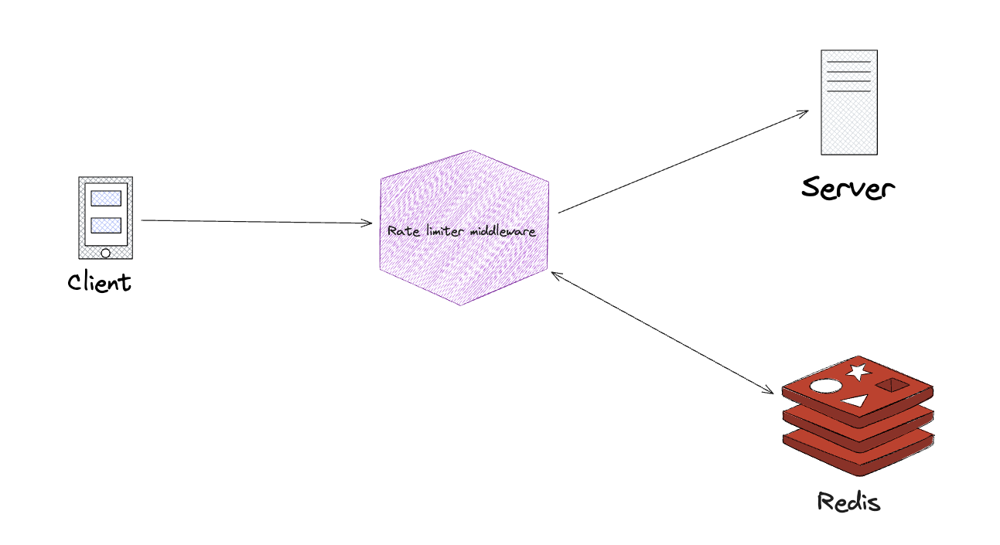
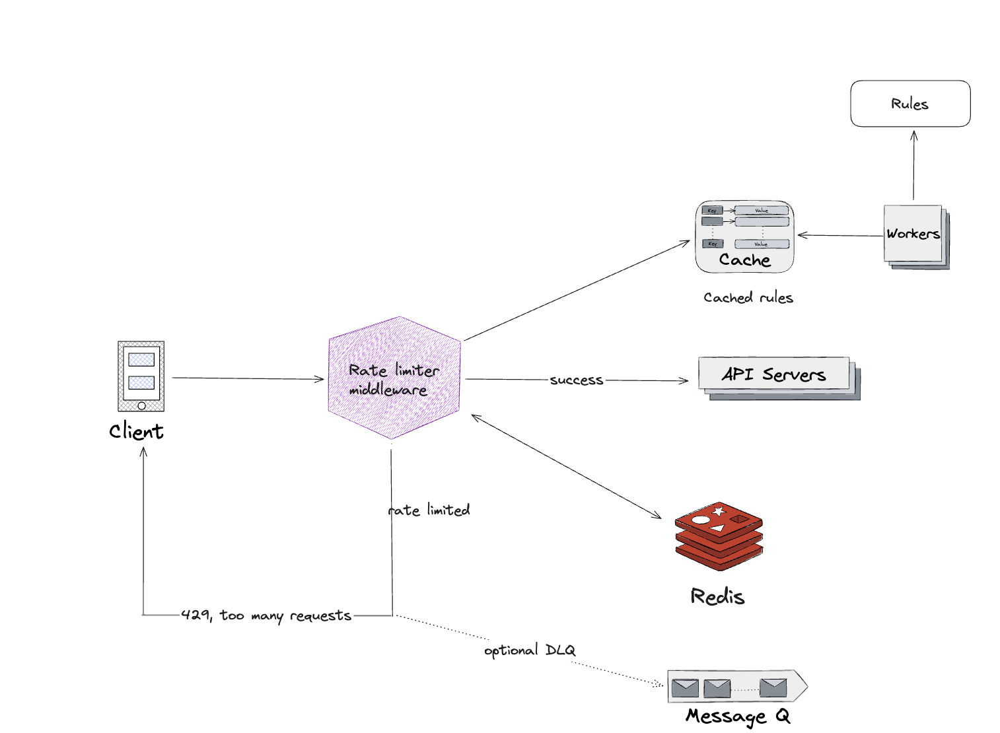

# 4. Design a Rate Limiter

Rate limiter is used to control the rate of traffic sent by a client or a service.

Benefits of using an API rate limiter:

- Prevent resource starvation caused by Denial of Service attack.
- Reduce cost.
- Prevent servers from being overloaded.

## Step 1 - Understand the problem and establish design scope

- Accurately limit excessive request.
- Low latency.
- Use as little memory as possible.
- Distributed rate limiting.
- Exception handling. Show clean exceptions to users when their request are throttled.
- High fault tolerance.

## Step 2 - Propose high-level design and get buy-in

### Where to put the rate limiter?

- Client-side. Generally unreliable because client request can easily be forged by malicious actors. Might not have control over the client implementation.
- Server-side
- Rate limiter middleware. Rate limiting is usually implemented within a component called API gateway in cloud microservices.

Few guidelines to consider while deciding where to implement the rate limiter:

- Current technology stack.
- Identify the rate limiting algorithm that fits your business needs.
- If already using a microservice architecture, add a rate limiter to the API gateway.
- Building your own rate limiting service takes time; a commercial API gateway could be a good option.

### Algorithms for rate limiting

Here is a list of popular algorithms:

- Token bucket
- Leaking bucket
- Fixed window counter
- Sliding window log
- Sliding window counter

#### Token bucket

We have a bucket whose capacity is defined as the number of tokens it can hold.

Whenever a consumer wants to access an API endpoint, it must get a token from the bucket. We remove a token from the bucket if it is available and accept the request and reject the request if the bucket doesn't have any tokens.

As requests are consuming tokens, we're also refreshing them at some fixed rate.

The two parameters are:

- Bucket size
- Refill rate

The number of buckets depends on the rate-limiting rules:

- Usually necessary to have different buckets for different API endpoints.
- If we need to throttle request based on IP addresses, each IP address requires a bucket.
- If the system allows maximum of 10,000 RPS, it makes sense to have a global bucket.

##### Pros

- The algorithm is easy to implement.
- Memory efficient.
- Token bucket allows a burst of traffic for short periods.

##### Cons

- It might be challenging to tune the two parameters (bucket size and token refill rate) in the algorithm.

#### Leaking bucket 

Similar to token bucket except that requests are processed at a fixed rate. It is usually implemented with a FIFO queue.

- When a request arrives, if the queue (bucket) is not full, the request is added to the queue.
- Otherwise, the request is dropped.
- Requests are pulled from the queue and proecessed at regular intervals.

Leaking bucket algorithm has the following two parameters:

- Bucket size
- Outflow rate

##### Pros

- Memory efficient given the limited queue size.
- Requests are processed at a fixed rate therefore it is suitable for use cases that needs a stable outflow rate.

##### Cons

- A burst of traffic fills up the queue with old request so recent requests will be rate limited.
- Two parameters to tune.

#### Fixed window counter algorithm

- Divides the timeline into fix-sized time windows and assign a counter for each window.
- Each request increments the counter by one.
- Once the counter reaches the pre-defined threshold, new requests are dropped until a new time window starts.

##### Pros

- Memory efficient.
- Easy to understand.
- Resetting available quota at the end of a unit time window fits certain use cases.

##### Cons

- Spike in traffic at the edges of a window could cause more request thatn the allowed quota to go through.

#### Sliding window log algorithm

Fixed window counter algorithm has a problem handling edges of a window. Sliding window log algorithm fixed the issue.

- Timestamp data is kept in cache, such as sorted sets of Redis.
- When a request comes in, remove all outdated timestamps.
- Add timestamp of the new request to the log.
- If the log size is less than or equal to the allowed count, the request is accepted.

##### Pros

- Rate limiting implemented by this algorithm is very accurate.

##### Cons

- Consumes a lot of memory because even if a request is rejected, its timestamp might be stored in memory.

#### Sliding window counter algorithm

Hybrid approach that combines fixed window counter and sliding window log.

The number of requests in the rolling window is calculated using the following formula:

- Requests in current window + request in the previous window * overlap percentage of the rolling window and previous window

##### Pros

- Smooths out spikes in traffic because the rate is based on the average rate of the previous window.
- Memory efficient.

##### Cons

- Assumes requests in the previous window are evenly distributed.

#### High-level architecture

At a high level, we need a counter to keep track of how many requests are sent from the same user, IP address, etc. If the counter is larger than the limit, the request is disallowed.

In-memory cache is chosen because it is fast and supports time-based expiration.

Redis is a popular option to implement rate limiting. It offers two commands: INCR and EXPIRE

- INCR: increases the stored counter by 1.
- EXPIRE: sets a timeout for the counter.



1. Client sends a request to the rate limiting middleware.
2. Rate limiting middleware fetches the counter from the corresponding bucket in Redis and checks if the limit is reached or not.
     - If the limit is exceeded, the request is rejected.
     - If the limit is not reached, the request is sent to API servers.
     - System increments the counter and saves it back to Redis.

## Step 3 - Design deep dive

### Rate limiting rules

Lyft open-sourced their [rate-limiting component](https://github.com/envoyproxy/ratelimit?tab=readme-ov-file).

As an example of rate limiting rules configuration:
```yaml
domain: messagin
descriptors:
  # Only allow 5 marketing messages a day
  - key: message_type
    value: marketing
    descriptors:
      - key: to_number
        rate_limit:
          unit: day
          requests_per_unit: 5
```

Rules are generally writting in configuration files and saved on disk.

### Exceeding the rate limit

If a request rate limited, API returns HTTP response code 429 (too many requests) to the client.

Depending on the use cases, we may enqueue the rate-limited requests to be processed later.

#### Rate limiter headers

In order to enhance the client experience of the API, we can respond with additional response headers to send information about the rate limit:

- _X-Rate-Limit-Remaining_: The remaining number of allowed requests within the window.
- _X-Rate-Limit_: How many calls the client can per time window.
- _X-Rate-Limit-Retry-After-Seconds_: Number of seconds to wait until the client can make a request again without being throttled.

When a user has sent too many requests, a 429 HTTP response status code and _X-Rate-Limit-Retry-After-Seconds_ header are returned to the client.

### Detailed design



- Rules are stored on disk. Workers frequently pull rules from disk and store them in the cache.
- Client request is first routed the rate limiter middleware.
- Rate limiter middleware loads rules from the cache and decides whether to forward the request to API servers or rate limit the request. The request is either dropped or forwarded to the queue.

### Distributed environment

There are two challenges in scaling the system to support multiple servers and concurrent threads:

- Race condition
- Synchronization

#### Race condition

#### Synchronization issue

### Performance optimization

### Monitoring

Gather analytics data to check whether the rate limiter is effective.

For example, if rate limiting rules are too strict, many valid requests are dropped. In this case, relax the rules.

In another example, we notice rate limiter becomes ineffective when there is a sudden increase in traffic like flash sales.
We may replace the algorithm with token bucket to support burst traffic.

## Step 4 - Wrap up
