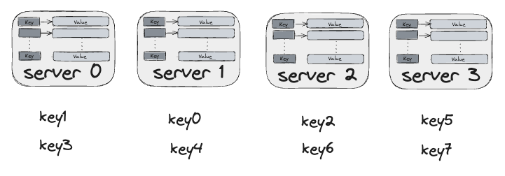
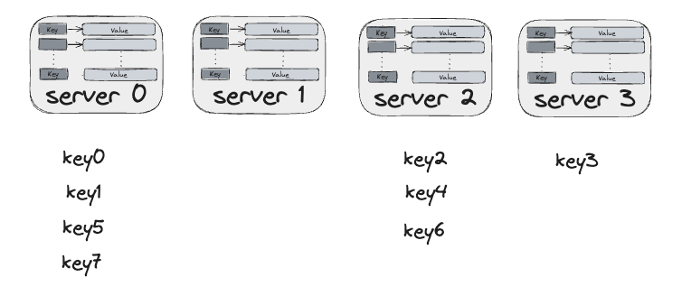

# 5. Design a Consistent Hashing

To achieve horizontal scaling, it is important to distribute request/data efficiently and evenly across servers.

Consistent hashing is a commonly used technique to achieve this goal.

## Rehashing problem

Given $n$ cache servers, a common way to balance the load is to use

$$server = hash(key) \% N$$

where N is the size of the server pool.

The approach works well when the size of the server pool is fixed, and the data is evenly distributed.

However, a problem arises when new servers are added, or existing servers are removed.

For example, consider the case of 4 servers (0, 1, 2, 3) and 9 keys with their hashes:

| key | hash | hash % 4 |
| --- | ---- | -------- |
| key0 | 18358617 | 1 |
| key1 | 26143584 | 0 |
| key2 | 18131146 | 2 |
| key3 | 35863496 | 0 |
| key4 | 34085809 | 1 |
| key5 | 27581703 | 3 |
| key6 | 38164978 | 2 |
| key7 | 22530351 | 3 |

Then, the keys are distributed among the 4 servers as follows:

If server 1 goes offline, keys are redistributed as follows as a result of modular operation with number of server reduced by 1:

| key | hash | hash % 3 |
| --- | ---- | -------- |
| key0 | 18358617 | 0 |
| key1 | 26143584 | 0 |
| key2 | 18131146 | 1 |
| key3 | 35863496 | 2 |
| key4 | 34085809 | 1 |
| key5 | 27581703 | 0 |
| key6 | 38164978 | 1 |
| key7 | 22530351 | 0 |

Most keys are redistributed, not just the ones originally stored in server 1. This means that when server 1 goes offline, most clients will connect to different servers resulting in a storm of cache misses.

## Consistent hashing

> Consistent hashing is a special kind of hashing such that when a hash table is re-sized and consistent hashing is used, only k/n keys need to be remapped on average, where k is the number of keys, and n is the number of slots. [^1]

The basic steps of consistent hashing algorithm introduced by Karger et al. [^2] are:

- Map servers and keys onto the hash ring using a uniformly distributed hash function.
- To find out which server a key is mapped to, go clockwise from the key position until the first server on the ring is found.

### Hash space and hash ring

A hash function maps elements to "buckets," such as 160-bits in the case of SHA-1.

In this case, _hash space_ is integers from $0$ to $2^{160} - 1$.

By identifying the two ends, $0$ to $2^{160} - 1$, we get a _hash ring._

### Hash servers

The key idea is that in addition to hashing the keys as before, _we also hash the names (or IPs) of the cache servers._

### Hash keys

### Server lookup

### Add a server

### Remove a server

### Two issues in the basic approach

### Virtual nodes

### Find affected keys

## Wrap up

Consistent hashing is widely used in real-world systems, including

- Partitioning component of Amazon's Dynamo database
- Data partitioning across the cluster in Apache Cassandra
- Discord chat application
- Akamai CDN
- Maglev network load balancer

[^1]: Consistent hashing: <https://en.wikipedia.org/wiki/Consistent_hashing>

[^2]: D. Karger, E. Lehman, T. Leighton, M. Levine, D. Lewin, and R. Panigrahy. Consistent
hashing and random trees: Distributed caching protocols for relieving hot spots on the
world wide web. In _Proceedings of the Twenty-ninth Annual ACM Symposium on Theory
of Computing (STOC)_, pages 654–663, 1997.
