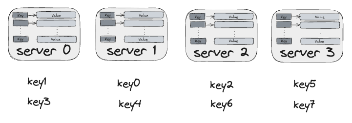
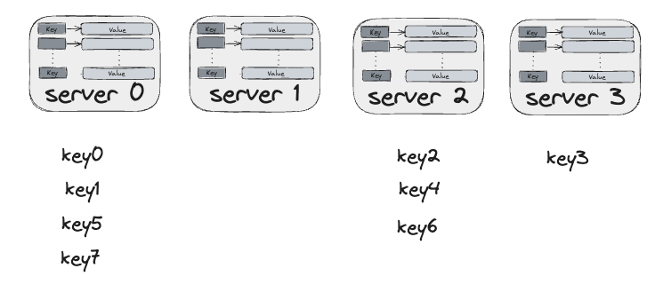

# Chapter 5. Design a Consistent Hashing

To achieve horizontal scaling, it is important to distribute request/data efficiently and evenly across servers.

Consistent hashing is a commonly used technique to achieve this goal.

## Rehashing problem

Given $n$ cache servers, a common way to balance the load is to use

$$server = hash(key) \% N$$

where N is the size of the server pool.

The approach works well when the size of the server pool is fixed, and the data is evenly distributed.

However, problem arises when new servers are added, or existing servers are removed.

For example, consider the case of 4 servers (0, 1, 2, 3) and 9 keys with their hashes:

| key | hash | hash % 4 |
| --- | ---- | -------- |
| key0 | 18358617 | 1 |
| key1 | 26143584 | 0 |
| key2 | 18131146 | 2 |
| key3 | 35863496 | 0 |
| key4 | 34085809 | 1 |
| key5 | 27581703 | 3 |
| key6 | 38164978 | 2 |
| key7 | 22530351 | 3 |

Then, the keys are distributed among the 4 servers as follows:

If server 1 goes offline keys are redistributed as follows as a result of modular operation with number of server reduced by 1:

| key | hash | hash % 3 |
| --- | ---- | -------- |
| key0 | 18358617 | 0 |
| key1 | 26143584 | 0 |
| key2 | 18131146 | 1 |
| key3 | 35863496 | 2 |
| key4 | 34085809 | 1 |
| key5 | 27581703 | 0 |
| key6 | 38164978 | 1 |
| key7 | 22530351 | 0 |

Most keys are redistributed, not just the ones originally stored in server 1. This means that when server 1 goes offline, most clients will connect to different servers resulting in a storm of cache misses.

## Consistent hashing

> Consistent hashing is a special kind of hashing such that when a hash table is re-sized and consistent hashing is used, only k/n keys need to be remapped onn average, where k is the number of keys, and n is the number of slots. [^1]

## Hash space and hash ring

### Two issues in the basic approach

## Wrap up

Consistent hashing is widely used in real-world systems, including

- Partitioning component of Amazon's Dynamo database
- Data partitioning across the cluster in Apache Cassandra
- Discord chat application
- Akamai CDN
- Maglev network load balancer

[^1]: Consistent hashing: https://en.wikipedia.org/wiki/Consistent_hashing
