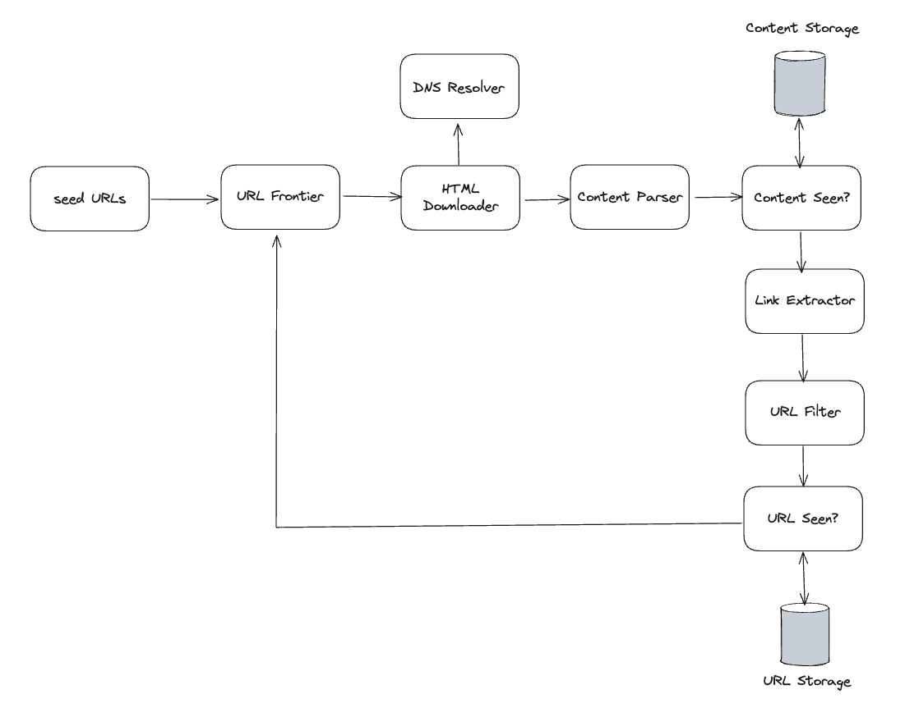

# 9. Design a Web Crawler

## Step 1 - Understand the prblem and establish design scope

The basic algorithm of a web crawler is simple:

1. Given a set of URLs, download all the web pages addressed by the URLs.
2. Extract URLs from these web pages
3. Add new URLs to the list of URLs to be downloaded. Repeat these 3 steps.

__Candidate:__ What is the main purpose of the crawler? Is is used for search engine indexing, data mining, or something else?

__Interviewer:__ Search engine indexing.

__Candidate:__ How many web pages does the web crawler collect per month?

__Interviewer:__ 1 billion pages

__Candidate:__ What content types are included? HTML only or other content types such as PDFs and images as well?

__Interviewer:__ HTML only.

__Candidate:__ Shall we consider newly added or edited web pages?

__Interviewer:__ Yes, we should consider newly added or edited web pages.

__Candidate:__ Do we need to store HTML pages crawled from the web?

__Interviewer:__ Yes, up to 5 years.

__Candidate:__ How do we handle web pages with duplicate content?

__Interviewer:__ Pages with duplicate content should be ignored.

Characteristics of a good web crawler:

- Scalability: The web is very large. There are billions of web pages out there. Web crawling should be extremely efficient using parallelization.
- Robustness: The web is full of traps. Bad HTML, unresponsive servers, crashes, malicious links, etc are all common. The crawler must handle all those edge cases.
- Politeness: The crawler should not make too many request to a website within a short time interval.
- Extensibility: The system is flexible so that minimal changes are needed to support new content types. For example, if we want to crawl image files in the future, we should not need to redesign the entire system.

### Back of the envelope estimation

- Assume 1 billion web pages are downloaded every month.
- QPS: 1,000,000,000 / 30 days / 24 hours / 3600 seconds = ~400 pages per second.
- Peak QPS = 2 * QPS = 800
- Assume the average web page site is 500kb.
- 1 billion page * 500kb = 500 TB storage per month.
- Assuming data are stored for five years, 500 TB * 12 months * 5 years = 30 PB.

## Step 2 - Propose high-level design and get buy-in

### Seed URLs

A web crawler uses seed URLs as a starting point for the crawl process.

To crawl the entire web, we need to be creative in selecting seed URLs. A good seed URL serves as a good starting point that a crawler can utilize to traverse as many links as possible.

### URL Frontier

### HTML Downloader

### DNS Resolver

### Content Parser

### Content Seen?

## Step 3 - Design Deep Dive

Next, we will discuss the most important building components and techniques in depth:

- DFS vs BFS
- URL frontier
- HTML Downloader
- Robustness
- Extensibility
- Detect and avoid problematic content

## Step 4 - Wrap up
