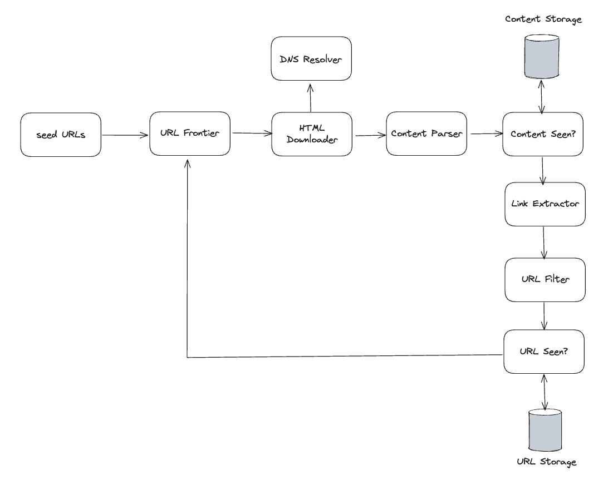
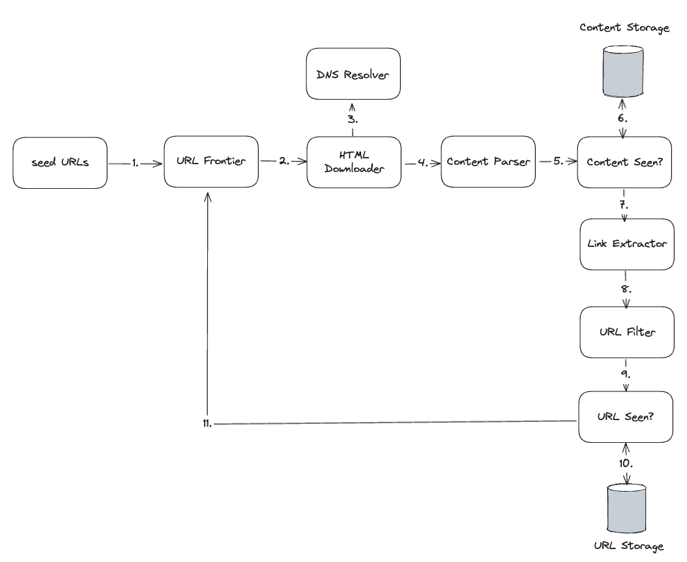

# 9. Design a Web Crawler

## Step 1 - Understand the problem and establish design scope

The basic algorithm of a web crawler is simple:

1. Given a set of URLs, download all the web pages addressed by the URLs.
2. Extract URLs from these web pages
3. Add new URLs to the list of URLs to be downloaded. Repeat these 3 steps.

__Candidate:__ What is the main purpose of the crawler? Is is used for search engine indexing, data mining, or something else?

__Interviewer:__ Search engine indexing.


__Candidate:__ How many web pages does the web crawler collect per month?

__Interviewer:__ 1 billion pages


__Candidate:__ What content types are included? HTML only or other content types such as PDFs and images as well?

__Interviewer:__ HTML only.


__Candidate:__ Shall we consider newly added or edited web pages?

__Interviewer:__ Yes, we should consider newly added or edited web pages.


__Candidate:__ Do we need to store HTML pages crawled from the web?

__Interviewer:__ Yes, up to 5 years.


__Candidate:__ How do we handle web pages with duplicate content?

__Interviewer:__ Pages with duplicate content should be ignored.

Characteristics of a good web crawler:

- Scalability: The web is very large. There are billions of web pages out there. Web crawling should be extremely efficient using parallelization.
- Robustness: The web is full of traps. Bad HTML, unresponsive servers, crashes, malicious links, etc are all common. The crawler must handle all those edge cases.
- Politeness: The crawler should not make too many request to a website within a short time interval.
- Extensibility: The system is flexible so that minimal changes are needed to support new content types. For example, if we want to crawl image files in the future, we should not need to redesign the entire system.

### Back of the envelope estimation

- Assume 1 billion web pages are downloaded every month.
- QPS: 1,000,000,000 / 30 days / 24 hours / 3600 seconds = ~400 pages per second.
- Peak QPS = 2 * QPS = 800
- Assume the average web page site is 500kb.
- 1 billion page * 500kb = 500 TB storage per month.
- Assuming data are stored for five years, 500 TB * 12 months * 5 years = 30 PB.

## Step 2 - Propose high-level design and get buy-in



### Components

#### Seed URLs

A web crawler uses seed URLs as a starting point for the crawl process.

To crawl the entire web, we need to be creative in selecting seed URLs.

One approach is based on locality as different countries may have different popular websites.

Another way is to choose seed URLs based on topics; for example, we can divide URL space into shopping, sports, healthcare, etc.

#### URL Frontier

Most modern web crawler split the crawl space into two: to be downloaded and already downloaded. The component that stores URLs to be downloaded is called the URL Frontier. It can be considered as a FIFO queue.

#### HTML Downloader

HTML downloader downloads web pages from the internet. Those URLs are provided by the URL Frontier.

#### DNS Resolver

To download a web page, URL must be translated into an IP address. HTML downloader calls the DNS resolver to get the corresponding IP address for the URL.

#### Content Parser

After a web page is downloaded, it must be parsed and validated because malformed web pages could provoke problems and waste storage space.

#### Content Seen?

"Content Seen?" data structure eliminates data redundancy and shortens processing time.

#### Content Storage

It is a storage system for storing HTML content. Both disk and memory are used.

#### URL Extractor

URL Extractor parses and extracts links from HTML pages.

Given,

```html
<html class="client-nojs" lang="en" dir="ltr">
  <head>
    <meta charset="UTF-8"/>
    <title>Wikipedia, the free encyclopedia</title>
  </head>
  <body>
    <li><a href="/wiki/Cong_Weixi" title="Cong Weixi">Cong Weixi</a></li>
    <li><a href="/wiki/Kay_Hagan" title="Kay Hagan"></a>Kay Hagan</li>
    <li><a href="/wiki/Vladimir_Bukovsky" title="Vladimir Bukovsky"></a>Vladimir Bukovsky</li>
    <li><a href="/wiki/John_Conyers" title="John Conyers">John Conyers</a></li>
  </body>
</html>
```

URL extractor extracts the following links:

- `https://en.wikipedia.org/wiki/Cong_Weixi`
- `https://en.wikipedia.org/wiki/Kay_Hagan`
- `https://en.wikipedia.org/wiki/Vladimir_Bukovsky`
- `https://en.wikipedia.org/wiki/John_Conyers`

#### URL Filter

URL filter excludes certain content types, file extensions, error links and URLs in "blacklisted" sites.

#### URL Seen?

"URL Seen?" is a data structure that keeps track of URLs that that have been visited before or already in the Frontier. "URL Seen?" helps to avoid adding the same URL multiple times as this can increase server load and cause potential infinite loops.

Bloom filter and hash tables are common techniques to implement the "URL Seen?" component.

#### URL Storage

URL Storage stores already visited URLs.

### Web crawler workflow



1. Add seed URLs to the URL Frontier.
2. HTML Downloader fetches a list of URLs from URL Frontier.
3. HTML Downloader gets IP addresses of URLs from DNS Resolver and starts downloading.
4. Content Parser parses HTML pages and checks if pages are malformed.
5. 

## Step 3 - Design Deep Dive

Next, we will discuss the most important building components and techniques in depth:

- DFS vs BFS
- URL frontier
- HTML Downloader
- Robustness
- Extensibility
- Detect and avoid problematic content

## Step 4 - Wrap up
