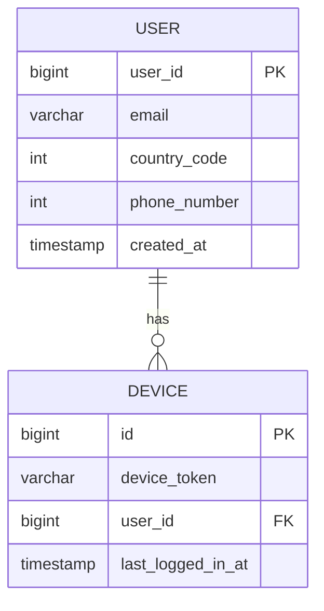

# 10. Design a Notification System

A notification is more than just mobile push notification. Three types of notification formats are: mobile push notification, SMS message, and email.

## Step 1 - Understand the problem and establish design scope

__Candidate:__ What type of notifications does the system support?

__Interviewer:__ Push notification, SMS message, and email.


__Candidate:__ Is it a real-time system?

__Interviewer:__ Let's say it is a soft real-time system. We want users to receive notifications as soon as possible. However, if the system is under a high workload, a slight delay is acceptable.


__Candidate:__ What are the supported devices?

__Interviewer:__ iOS, android, laptop/desktop


__Candidate:__ What triggers notifications?

__Interviewer:__ Notification can be triggered by client applications. They can also be scheduled on the server-side.


__Candidate:__ Will users be able to opt-out?

__Interviewer:__ Yes, users who choose to opt-out will no longer receive notifications


__Candidate:__ How many notifications are sent out each day?

__Interviewer:__ 10 million mobile push notifications, 1 million SMS messages, and 5 million emails.

## Step 2 - Propose high-level design and get buy-in

### Types of notifications

#### iOS push notification

We primarily need three components to send an iOS push notification:

- Provider: A provider builds and sends notification requests to Apple Push Notification Service (APNS). To construct a push notification, the provider provides the following data:
  - Device token: This is a unique identifier used for sending push notifications.
  - Payload: This is a JSON object that contains that notification's payload. Here is an example:
    ```json
    {
      "aps": {
        "alert": {
          "title": "Game Request",
          "body": "Bob wants to play chess",
          "action-loc-key": "PLAY"
        },
        "badge": 5
      }
    }
    ```
- APNS: This is a remote service provided by Apple to propagate push notifications to iOS devices.
- iOS Device: It is the end-client, which receives push notifications.

#### Android push notification

Instead of APNS, Firebase Cloud Messaging (FCM) is commonly used to send push notifications to android devices.

#### SMS message

For SMS messages, third party SMS services like Twilio, Nexmo, and many others are commonly used.

#### Email

Although companies can set up their own email servers, many of them opt for commercial email services. Sendgrid and Mailchimp are among the popular email services, which offer a better delivery rate and data analytics.

### Contact info gathering flow

To send notifications, we need to gather mobile device tokens, phone numbers, or email addresses. When a user installs our app or signs up for the first time, API servers collect user contact info and store it in a database.



### Notification sending/receiving flow

## Step 3 - Design deep dive

## Step 4 - Wrap up
