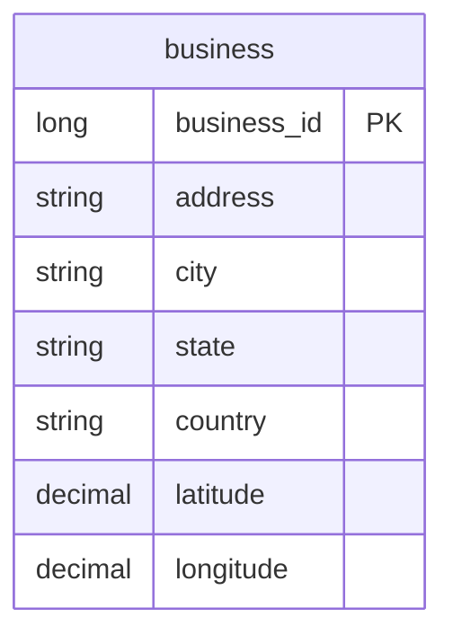
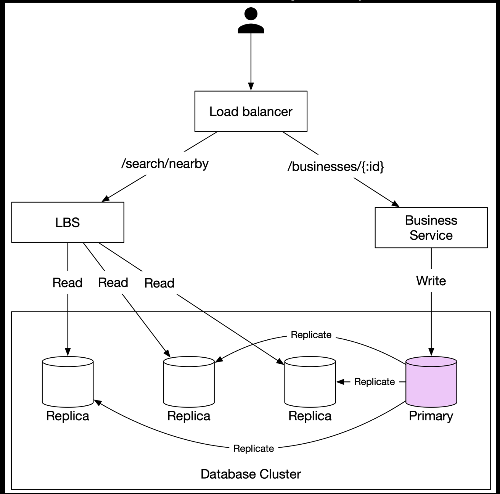
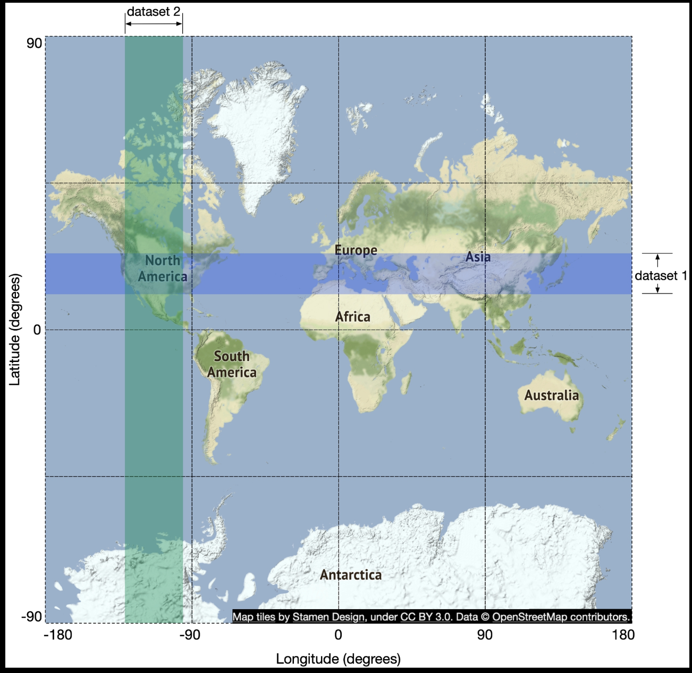
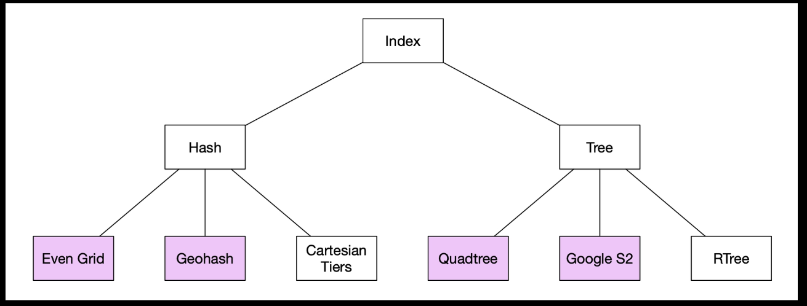

# 1. Proximity Service

A proximity service is used to discover nearby places such as restaurants, hotels, theaters, museums, etc.

## Step 1 - Understand the Problem and Establish Design Scope

It's important to narrow down the scope by asking questions.

- Can a user specify the search radius? If there are not enough businesses within the search radius, does the system expand the search?
- What's the maximal radius allowed? Can I assume it's 20km?
- Can a user change the search radius on the UI?
- How does business information get added, deleted, or updated? Do we need to reflect these operations in real-time?
- A user might be moving while using the app/website. Do we need to refresh the page to keep the results up to date?

### Functional requirements

- Return all businesses based on a user's location (latitude and longitude pair) and radius.
- Business owners can add, delete, or update a business, but this information doesn't need to be reflected in real-time.
- Customers can view detailed information about a business.

### Non-functional requirements

- Low latency. User should be able to see nearby businesses quickly.
- Data privacy. Location info is sensitive data. When we design a location-based service (LBS), we should always take user privacy into consideration.
- High availability and scalability requirements. We should ensure our system can handle the spike in traffic during peak hours in densely populated areas.

### Back-of-the-envelope estimation

Assume we have 100 million daily active users and 200 million businesses.

#### Calculate QPS

- Seconds in a day = $24 * 60 * 60 = 86,400$. We can round it up to $10^5$ for easier calculation.
- Assume a user makes 5 search queries per day.
- Search QPS = $100 million * 5 / 10^5$

## Step 2 - Propose High-Level Design and Get Buy-In

### API Design

#### `GET /v1/search/nearby`

This endpoint returns businesses based on certain search criteria.

Request parameters:

| Field | Description | Type |
| ----- | ----------- | ---- |
| latitude | Latitude of a given location | decimal |
| longitude | Longitude of a given location | decimal |
| radius | Optional. Default is 5000 meters | int |

Response body:

```json
{
  "total": 10,
  "businesses": [{business object}]
}
```

#### APIs for business

| API | Detail |
| --- | ------ |
| `GET /v1/businesses/{:id}` | Return detailed information about a business |
| `POST /v1/businesses` | Add a business |
| `PUT /v1/businesses/{:id}` | Update details of a business |
| `DELETE /v1/businesses/{:id}` | Delete a business |

### Data model

In this section, we discuss the read/write ratio and the schema design.

#### Read/write ratio

Read volume is high because the following two features are commonly used:

- Search for nearby businesses.
- View the detailed information of a business.

On the other hand, the write volume is low because adding, removing, and editing business info are infrequent operations.

#### Data schema

##### Business table



##### Geo index table

A geo index table is used for the efficient processing of spatial operations. This table requires some knowledge about geohash, so will discuss in the "Scale the database" section in deep dive.

### High-level design

The system comprises of two parts: location-based service (LBS) and business-related service.



#### Location-based service (LBS)

LBS service is the core part of the system which finds nearby businesses for a given radius and location.

- It is a read-heavy service with no write requests.
- QPS is high, especially during peak hours in dense areas.
- This service is stateless so it's easy to scale horizontally.

#### Business service

- Business owners create, update, or delete businesses. Those requests are mainly write operations, and the QPS is not high.
- Customers view detailed information about a business. QPS is high during peak hours.

#### Database cluster

The database cluster can use primary-secondary setup. Due to the replication delay, there might be some discrepancy between data read by the LBS and the data written to the primary database.

#### Scalability

Both the services are stateless, so it's easy to automatically add more servers and remove servers during off-peak hours. Set up different regions and availability zones to further improve availability.

### Algorithm to find nearby businesses

#### Option 1: Two-dimensional search

The most intuitive but naive way to get nearby businesses is to draw a circle with the predefined radius and find all businesses within the circle.

```sql
SELECT business_id, latitude, longitude
FROM business
WHERE latitude BETWEEN :minLat AND :maxLat
  AND longitude BETWEEN :minLon AND :maxLon;
```

Even if we have indexes on longitude and latitude columns, the dataset returned from each dimension could still be large since we have two-dimensional data. We would need to perform an intersect operation.



In a broad sense, there are two types of geospatial indexing approaches.

- Hash: even grid, geohash, cartesian tiers, etc.
- Tree: quadtree, Google S2, RTree, etc.



#### Option 2: Evenly divided grid

One simple approach is to evenly divide the world into small grids.

This approach works to some extend, but it has one major issue: the distribution of businesses is not even. Another potential challenge is to find neighboring grids of a fixed grid.

#### Option 3: Geohash
