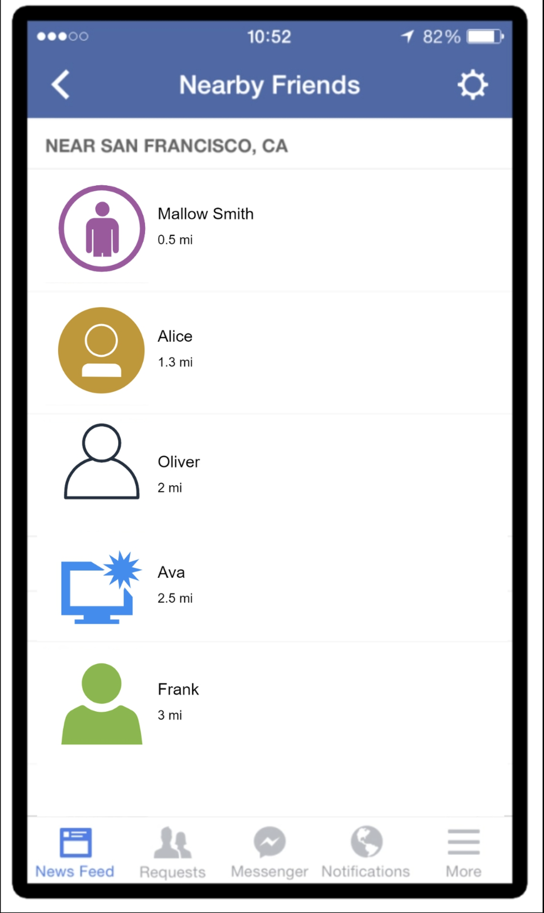
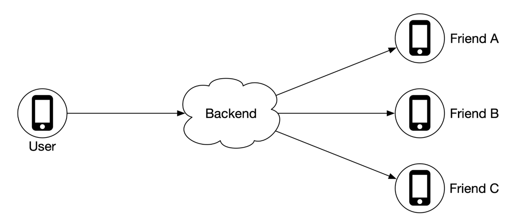
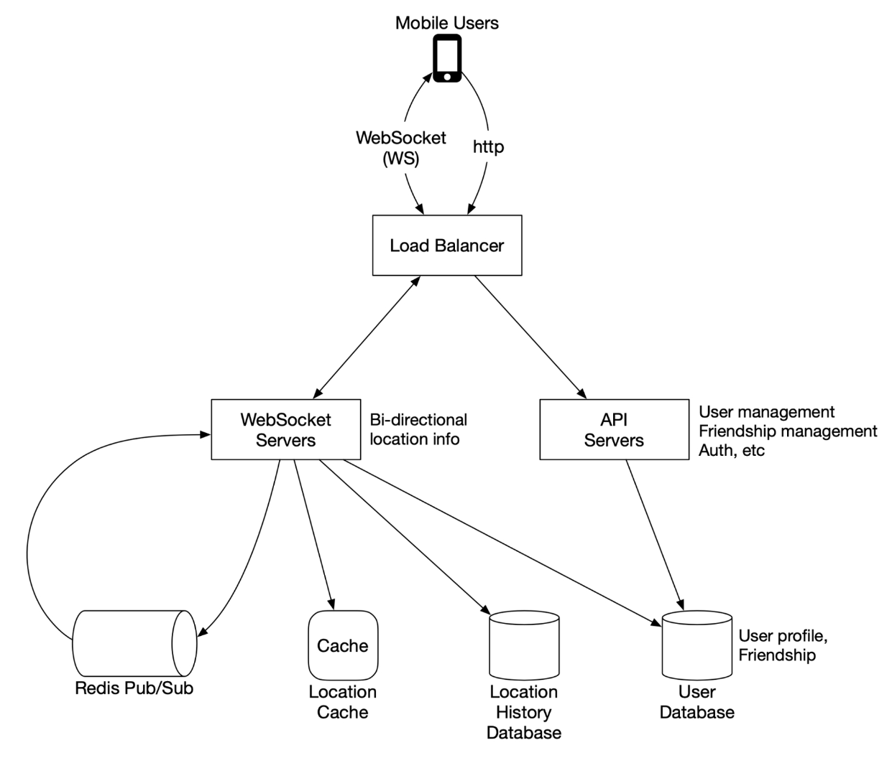
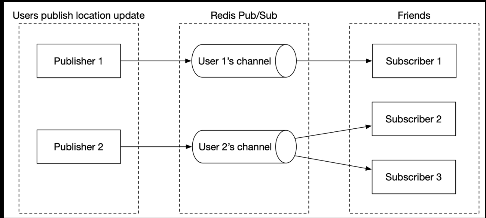
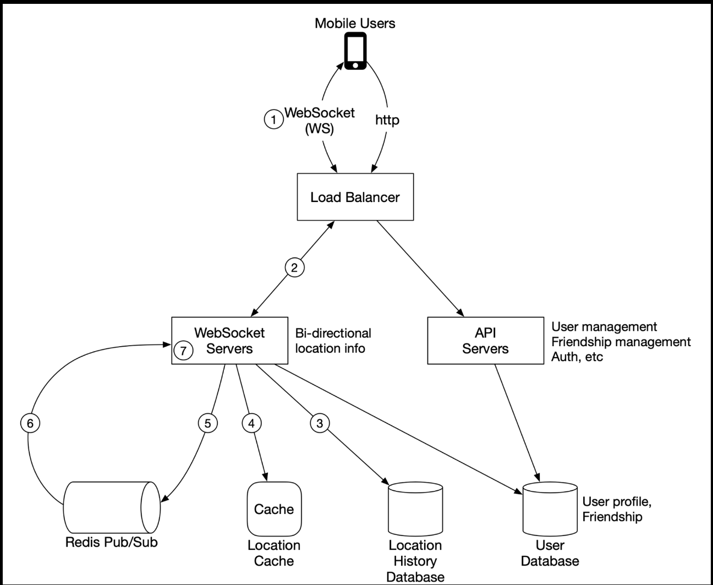
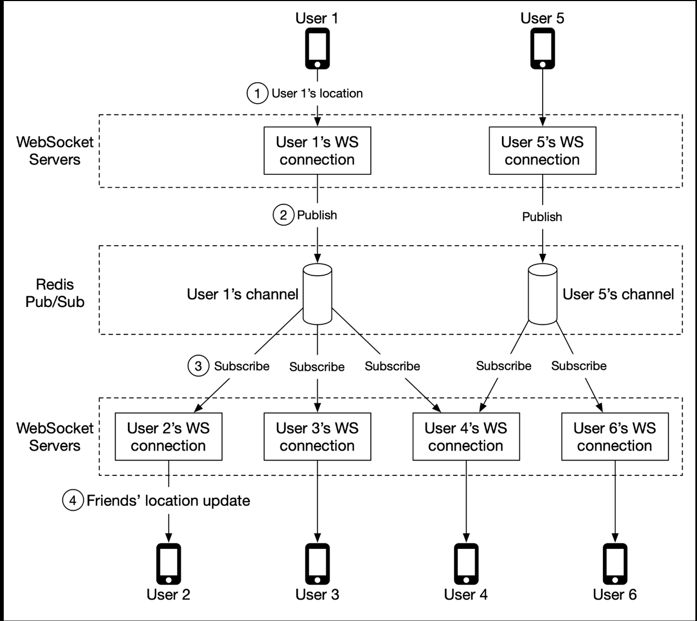

# 2. Nearby Friends

Mobile app feature called "Nearby Friends". Mobile client presents a list of friends who are geographically nearby.

In proximity services, the addresses for businesses are static, while in "nearby friends", data is more dynamic.

## Step 1 - Understand the Problem and Establish Design Scope

### Functional requirements

- Users should be able to see nearby friends. Each entry in the nearby friend list has a distance and timestamp indicating when the distance was last updated.
- Nearby friend lists should be updated every few seconds.

### Non-functional requirements

- Low latency.
- Reliability.
- Eventual consistency.

### Back-of-the-envelope estimation

- Nearby friends are defined as friends whose locations are within a 5-mile radius.
- Location refresh interval is 30 seconds. (Human walking speed is slow. The distance traveled in 30 seconds does not make a significant difference on the "nearby friends" feature).
- On average, 100 million users use the feature every day.
- Assume the number of concurrent users is 10% of DAU, so the number of concurrent users is 10 million.
- On average, a user has 400 friends. Assume all of them use the "nearby friends" feature.
- App displays 20 nearby friends per page and may load more nearby friends upon request.

### Calculate QPS

- 100 million DAU
- Concurrent users: 10% * 100 million = 10 million
- Users report their locations every 30 seconds
- Location update QPS = 10 million / 30 = ~334,000

## Step 2 - Propose High-Level Design and Get Buy-In

### High-level design

What are the responsibilities of the backend?

- Receive location updates from all active users.
- For each location update, find all the active friends who should receive it and forward it to those users' devices.
- If the distance between two users is over a certain threshold, do not forward it to the recipient's device.

The problem is the scale: 10 million active users. With each user updating their location every 30 seconds, there are 333K updates per second. If on average each user has 400 friends, and we further assume that roughly 10% of those friends are online and nearby, every second the backend forwards 333K \* 400 \* 10% = 13 million location updates per second.

### Proposed design

Backend at a lower scale; we will optimize the design for scale later.

#### Load balancer

Sits in front of the RESTful API servers and the stateful, bi-directional WebSocket servers.

#### RESTful API servers

API layer handles auxiliary tasks like adding/removing friends, updating user profiles, etc.

#### Websocket servers

Cluster of stateful servers that handles the near real-time update of friends' locations. Each client maintains one persistent WebSocket connection to one of these servers. When there is a location update from a friend who is within the search radius, the update is sent on this connection to the client.

Handle client initialization for the "nearby friends" feature. It seeds the mobile client with the locations of all nearby online friends.

#### Redis location cache

Redis is used to store the most recent location data for each active user. There is a TTL set on each entry in the cache. When the TTL expires, the user is no longer active and the location data is expunged from the cache. Every update refreshes the TTL.

#### User database

User database stores user data and user friendship data. Either relational database or NoSQL database can be used for this.

#### Location history database

This database stores users' historical location data. It is not directly related to the "nearby friends" feature.

#### Redis pub/sub server

Redis pub/sub is a very lightweight message bus. Channels in Redis pub/sub are very cheap to create. A modern Redis server with GBs of memory could hold millions of channels (also called topics).

Location updates received via the WebSocket server are published to the user's own channel in the Redis pub/sub server. A dedicated WebSocket connection handler for each active friend subscribes to the channel.

When there is a location update, the WebSocket handler function gets invoked, and for each active friend, the function recomputes the distance. If the new distance is within the search radius, the new location and timestamp are sent via the WebSocket connection to the friend's client.

#### Periodic location update

Mobile client sends periodic location updates over the persistent WebSocket connection.

1. Mobile client sends a location update to the load balancer.
2. LB forwards the location update to the persistent connection on the WebSocket server for that client.
3. WebSocket server saves the location data to the location history database.
4. WebSocket server updates the new location in the location cache. The update refreshes the TTL. WebSocket server saves the new location in a variable in the user's WebSocket connection handler for subsequent distance calculation.
5. WebSocket server publishes the new location to the user's channel in the Redis pub/sub server. Steps 3 ~ 5 can be executed in parallel.
6. Redis pub/sub broadcasts the location update to all subscribers (WebSocket connection handler). The subscribers are all the online friends of the user sending the update.
7. On receiving the message, the WebSocket server computes the distance between the user sending the new location and the subscriber.
8. If the distance does not exceed the search radius, the new location and the last updated timestamp are sent to the subscriber's client.

##### Concrete example

- User 1's friend: user 2, user 3, user 4
- User 5's friend: user 4 and user 6

1. User 1's location update is sent to the WebSocket server which holds user 1's connection.
2. The location is published to user 1's channel in Redis pub/sub server.
3. Redis pub/sub server broadcasts the location update to all subscribers. In this case, the subscribers are WebSocket connection handlers (user 1's friends).
4. If the distance between the user sending the location (user 1) and subscriber (user 2) is within the search radius, the new location is sent to the client (user 2).

### API design

**WebSocket**: Users send and receive location updates.

1. Periodic location update

   Request: Client sends latitude, longitude, and timestamp.

   Response: Nothing.
2. Client receives location updates

    Data sent: Friend location data and timestamp.

3. WebSocket initialization

    Request: Client sends latitude, longitude, and timestamp.

    Response: Client receives friends' location data.
4. Subscribe to a new friend

    Request: WebSocket server sends friend ID.

    Response: Friend's latest latitude, longitude, and timestamp.
5. Unsubscribe a friend

    Request: WebSocket server sends friend ID.

    Response: Nothing.

**HTTP requests**: adding/removing friends, updating user profiles, etc.

### Data model

#### Location cache

Stores the latest locations for all active users who have the nearby friends feature turned on.

|   key   |             value              |
| ------- | ------------------------------ |
| user_id | {latitude,longitude,timestamp} |

#### Location history database

| user_id | latitude | longitude | timestamp |
| ------- | -------- | --------- | --------- |

Need a database that handles the heavy-write workload well and can be horizontally scaled. Cassandra is a good candidate. Could also use a relational database. Need to shard that data. Basic approach: shard by user ID.
