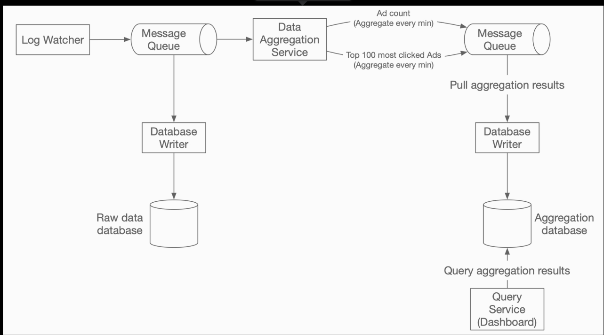

# 6. Ad Click Event Aggregation

Digital advertising has a core process called Real-Time Bidding (RTB), in which digital advertising inventory is bought and sold.


Ad click event aggregation plays a critical role in measuring the effectiveness of online advertising. The key metrics used in online advertising, including click-through rate and conversion rate, depend on aggregated ad click data.

## Step 1 - Establish Design Scope

### Functional requirements

- Aggregate the number of clicks of `ad_id` in the last M minutes.
- Return the top 100 most clicked `ad_id` every minute.
- Support aggregation filtering by different attributes (`ip`, `user_id`, `country`).
- Dataset volume is at Facebook or Google scale.

### Non-functional requirements

- Correctness is important as the data is used for RTB and ads billing.
- Properly handle delayed or duplicate events.
- Robustness. Resilient to partial failures.
- Latency requirement. End-to-end latency should be few minutes, at most.

### Back-of-the-envelope estimation

- 1 billion DAU
- Assume on average each user clicks 1 ad per day. That's 1 billion ad click events per day.
- Ad click QPS = $10^9$ events / $10^5$ seconds in a day = 10,000
- Assume peak ad click QPS is x5 the average number. Peak QPS = 50,000.
- Assume a single ad click event occupies 0.1 KB storage. Daily storage requirement is 0.1KB * 1 billion = 100 GB. The monthly storage requirement is about 3 TB.

## Step 2 - Propose High-Level Design

### Query API design

#### API 1: Aggregate the number of clicks of `ad_id` in the last M minutes

| API | Detail |
| --- | ------ |
| GET /ads/{ad_id}/aggregated_count | Return aggregated event count for a given `ad_id` |

##### Request parameters

##### Response body

#### API 2: Return top N most clicked `ad_id`s in the last M minutes

| API | Detail |
| --- | ------ |
| GET /ads/popular_ads | Return top N most clicked ads in the last M minutes |

##### Request parameters

##### Response body

### Data model

#### Raw data

Raw data in log files:

```
[AdClickEvent] ad001,2021-01-01 00:00:01,user1,207.148.22.22,USA
```

| ad_id | click_timestamp | user_id | ip | country |
| ----- | --------------- | ------- | -- | ------- |
| ad001 | 2021-01-01 00:00:01 | user1 | 207.148.22.22 | USA |
| ad001 | 2021-01-01 00:00:02 | user1 | 207.148.22.22 | USA |
| ad002 | 2021-01-01 00:00:02 | user2 | 209.153.56.11 | USA |

#### Aggregated data

Assume ad click events are aggregated every minute.

| ad_id | click_minute | count |
| ----- | ------------ | ----- |
| ad001 | 202101010000 | 5 |
| ad001 | 202101010001 | 7 |

#### Comparison

|   | Raw data only | Aggregated data only |
| - | ------------- | -------------------- |
| Pros |             |                      |
| Cons |            |                      |

### High-level design

In aggregation service, the input is the raw data (unbounded data streams), and the output is the aggregated results.


#### Asynchronous processing

A common solution is to adopt a message queue (Kafka) to decouple producers and consumers.

The database writer polls data from the message queue, transforms the data into the database format, and write it to the database.



First message queue ad click event data:

| ad_id | click_timestamp | user_id | ip | country |
| ----- | --------------- | ------- | -- | ------- |

Second message queue contains two types of data:

1. Ad click counts aggregated at per-minute granularity.
    | ad_id | click_minute | count |
    | ----- | ------------ | ----- |
1. Top N most clicked ads at per-minute granularity.
    | update_time_minute | most_clicked_ads |
    | ------------------ | ---------------- |

Why we don't write the aggregated result to the database directly: we need a second message queue like Kafka to achieve end-to-end exactly-once semantics (atomic commit).

#### Aggregation service

MapReduce framework is good option to aggregate ad click events.


##### Map node

Map node reads data from a data source, and then filters and transforms the data.

##### Aggregate node

##### Reduce node
