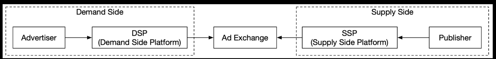
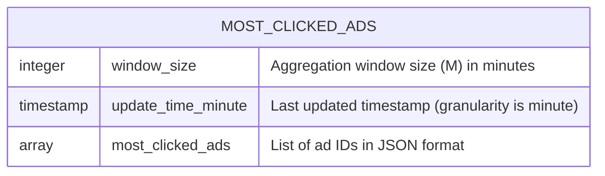
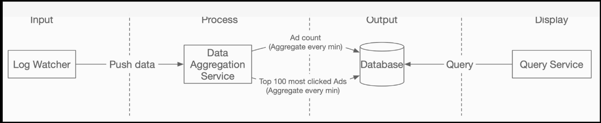
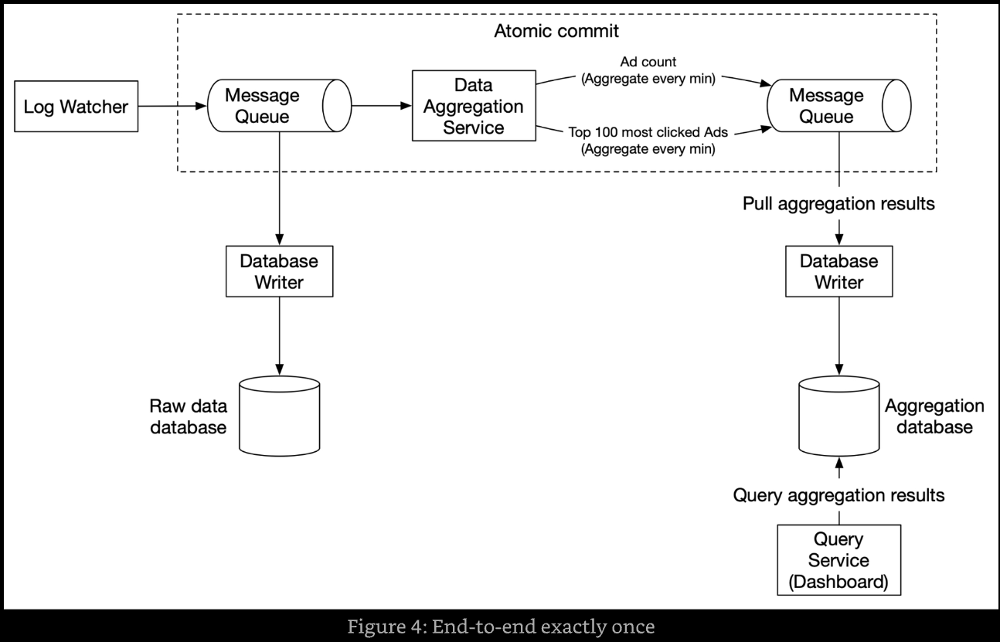
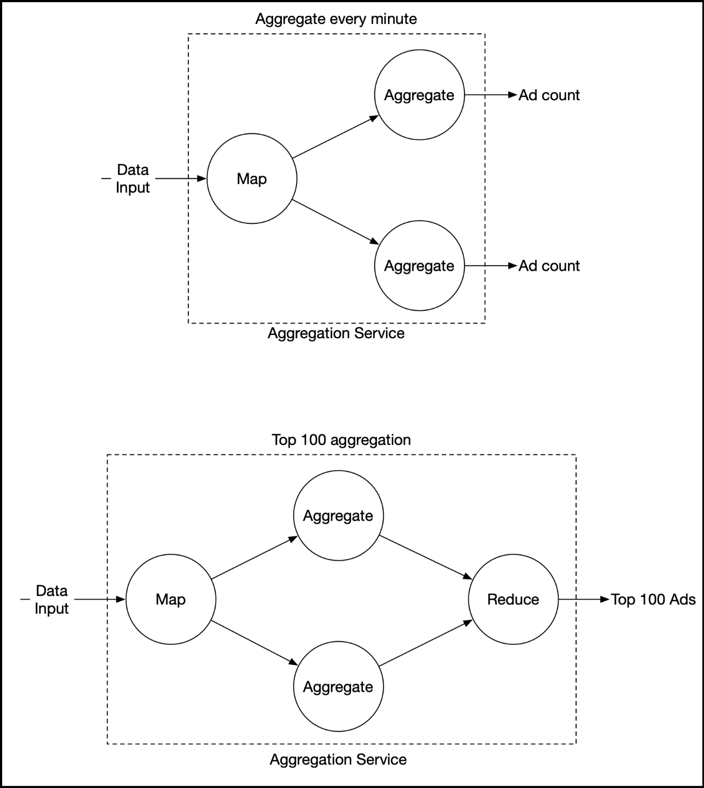
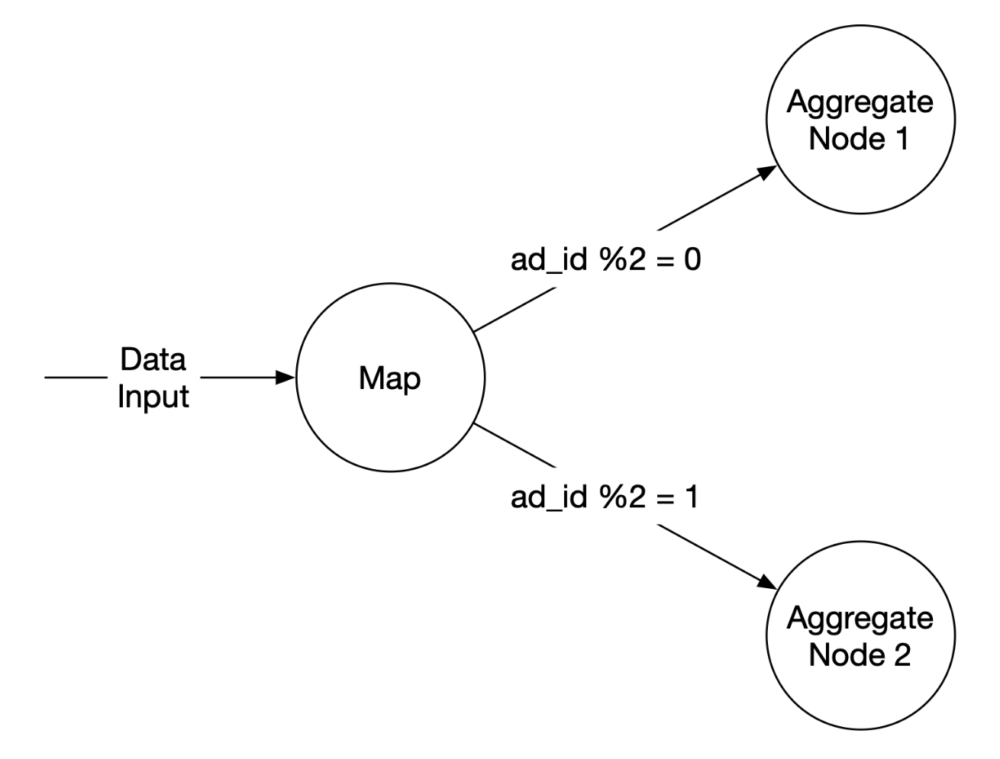
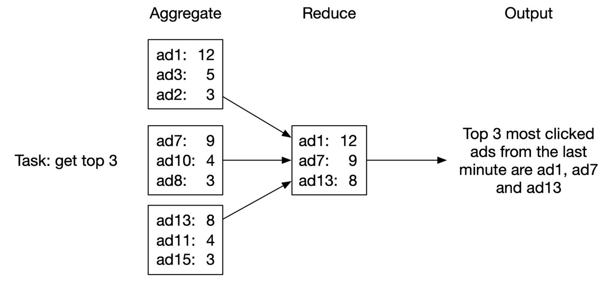
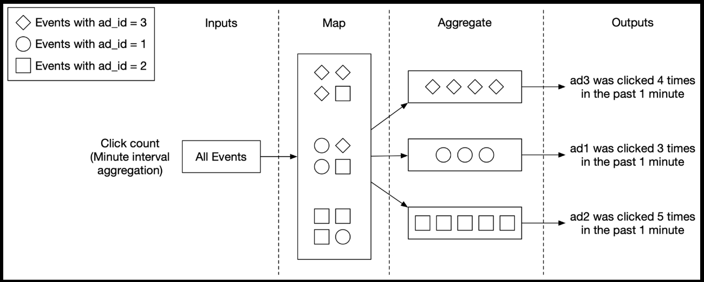
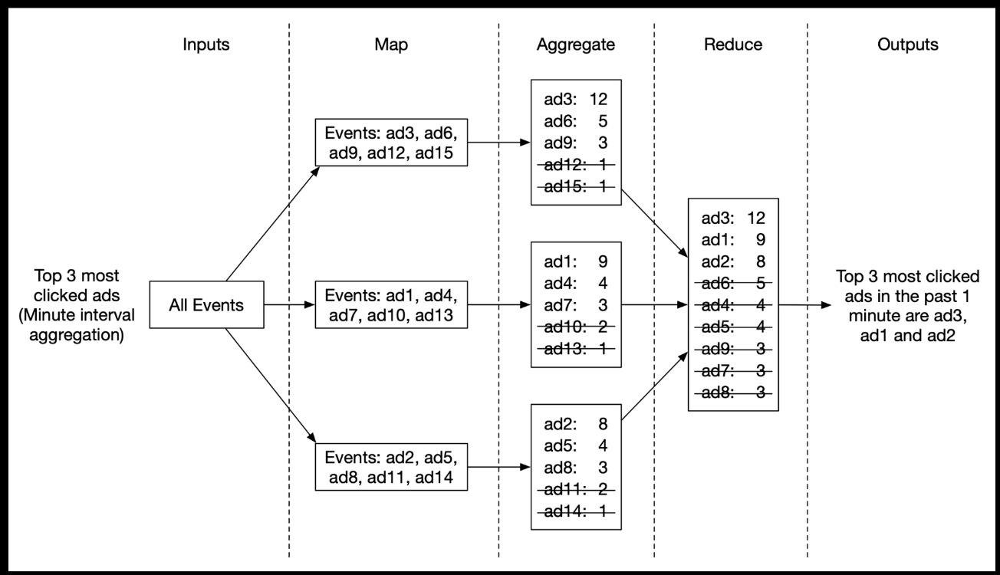

# 6. Ad Click Event Aggregation

## Core concepts of online advertising

Digital advertising has a core process called Real-Time Bidding (RTB), in which digital advertising inventory is bought and sold.



Ad click event aggregation plays a critical role in measuring the effectiveness of online advertising. The key metrics used in online advertising, including click-through rate and conversion rate, depend on aggregated ad click data.

The speed of the RTB process is important; it usually occurs in less than a second.

Data accuracy. Ad click event aggregation plays a critical role in measuring the effectiveness in online advertising. Based on click aggregation results, campaign managers can control the budget or adjust bidding strategies, such as targeted audience groups, keywords, etc. Key metrics used in online advertising, including click-through rate (CTR) and conversion rate (CVR), depend on aggregated ad click data.

## Step 1 - Establish Design Scope

### Functional requirements

- Aggregate the number of clicks of `ad_id` in the last M minutes.
- Return the top 100 most clicked `ad_id` every minute.
- Support aggregation filtering by different attributes (`ip`, `user_id`, `country`).
- Dataset volume is at Facebook or Google scale.

### Non-functional requirements

- Correctness is important as the data is used for RTB and ads billing.
- Properly handle delayed or duplicate events.
- Robustness. Resilient to partial failures.
- Latency requirement. End-to-end latency should be a few minutes, at most.

### Back-of-the-envelope estimation

- 1 billion DAU
- Assume on average each user clicks 1 ad per day. That's 1 billion ad click events per day.
- Ad click QPS = $10^9$ events / $10^5$ seconds in a day = 10,000
- Assume peak ad click QPS is x5 the average number. Peak QPS = 50,000.
- Assume a single ad click event occupies 0.1 KB storage. Daily storage requirement is 0.1KB * 1 billion = 100 GB. The monthly storage requirement is about 3 TB.

## Step 2 - Propose High-Level Design

### Query API design

#### API 1: Aggregate the number of clicks of `ad_id` in the last M minutes

| API | Detail |
| --- | ------ |
| GET /ads/{ad_id}/aggregated_count | Returns aggregated event count for a given `ad_id` |

##### Request parameters

##### Response body

#### API 2: Return top N most clicked `ad_id`s in the last M minutes

| API | Detail |
| --- | ------ |
| GET /ads/popular_ads | Returns top N most clicked ads in the last M minutes |

##### Request parameters

##### Response body

### Data model

#### Raw data

Raw data in log files:

```text
[AdClickEvent] ad001,2021-01-01 00:00:01,user1,207.148.22.22,USA
```

| ad_id | click_timestamp | user_id | ip | country |
| ----- | --------------- | ------- | -- | ------- |
| ad001 | 2021-01-01 00:00:01 | user1 | 207.148.22.22 | USA |
| ad001 | 2021-01-01 00:00:02 | user1 | 207.148.22.22 | USA |
| ad002 | 2021-01-01 00:00:02 | user2 | 209.153.56.11 | USA |

#### Aggregated data

Assume ad click events are aggregated every minute.

| ad_id | click_minute | count |
| ----- | ------------ | ----- |
| ad001 | 202101010000 | 5 |
| ad001 | 202101010001 | 7 |

To support ad filtering, add an additional field called `filter_id`. Records with the same `ad_id` and `click_minute` are grouped by `filter_id`.

| ad_id | click_minute | filter_id | count |
| ----- | ------------ | --------- | ----- |
| ad001 | 202101010000 | 0012 | 2 |
| ad001 | 202101010000 | 0023 | 3 |
| ad001 | 202101010001 | 0012 | 1 |
| ad001 | 202101010001 | 0023 | 6 |

| filter_id | region | ip | user_id |
| --------- | ------ | --- | ------- |
| 0012 | US | * | 0012 |
| 0013 | * | 123.1.2.3 | 0023 |

To support the query to return the top N most clicked ads in the last M minutes:



#### Comparison

| Category | Raw data only | Aggregated data only |
| --- | --- | -------------------- |
| Pros | Full data set | Smaller data set |
| Pros | Support data filter and recalculation | Fast query |
| Cons | Huge data storage | Data loss |
| Cons | Slow query | |

Recommend to store both raw and aggregated data:

- Keep raw data. If something goes wrong, we could use raw data for debugging.
- Store aggregated data as well. Raw data is huge. Run queries on aggregated data.
- Raw data serves as backup. Old raw data could be moved to cold storage to reduce costs.
- Aggregated data serves as active data. Tuned for query performance.

#### Choose the right database

Evaluate the following:

- What does the data look like? Relational? Document or a blob?
- Workflow read-heavy, write-heavy, or both?
- Is transaction support needed?
- Do queries rely on many online analytical processing (OLAP) functions like SUM, COUNT?

Average write QPS is 10,000 with peak of 50,000 so the system is write-heavy. Raw data is used as backup and source for recalculation so read volume is low.

### High-level design

In aggregation service, the input is the raw data (unbounded data streams), and the output is the aggregated results.



#### Asynchronous processing

A common solution is to adopt a message queue (Kafka) to decouple producers and consumers.

The database writer polls data from the message queue, transforms the data into the database format, and writes it to the database.



First message queue ad click event data:

| ad_id | click_timestamp | user_id | ip | country |
| ----- | --------------- | ------- | -- | ------- |

Second message queue contains two types of data:

1. Ad click counts aggregated at per-minute granularity.

    | ad_id | click_minute | count |
    | ----- | ------------ | ----- |

2. Top N most clicked ads at per-minute granularity.

    | update_time_minute | most_clicked_ads |
    | ------------------ | ---------------- |

Why we don't write the aggregated result to the database directly: we need a second message queue like Kafka to achieve end-to-end exactly-once semantics (atomic commit).

#### Aggregation service

MapReduce framework is good option to aggregate ad click events.



##### MapReduce

###### Map node

Map node reads data from a data source, and then filters and transforms the data.



Alternative option is to set up Kafka partitions or tags and let the aggregate nodes subscribe to Kafka directly. Input data may need to be cleaned or normalized or we may not have control over how data is produced and therefore events with the same `ad_id` might land in different Kafka partitions.

###### Aggregate node

Aggregate node counts ad click events by `ad_id` in memory every minute.

###### Reduce node

Reduce node reduces aggregated results from all "Aggregate" nodes to the final result.



#### Main use cases

##### Use case 1: aggregate number of clicks



##### Use case 2: return top N most clicked ads

Aggregate node maintains a heap data structure to get the top N ads within the node efficiently.



##### Use case 3: data filtering

To support data filtering, pre-define filtering criteria and aggregate based on them.

| ad_id | click_minute | country | count |
| ----- | ------------ | ------- | ----- |
| ad0001 | 202101010001 | USA | 100 |
| ad0001 | 202101010001 | GPB | 200 |
| ad0001 | 202101010001 | others | 3000 |
| ad0002 | 202101010001 | USA | 10 |
| ad0002 | 202101010001 | GPB | 25 |
| ad0002 | 202101010001 | others | 12 |

This technique is called star schema, which is widely used in data warehouses. Filter fields are called dimensions.

## Step 3 - Design Deep Dive
