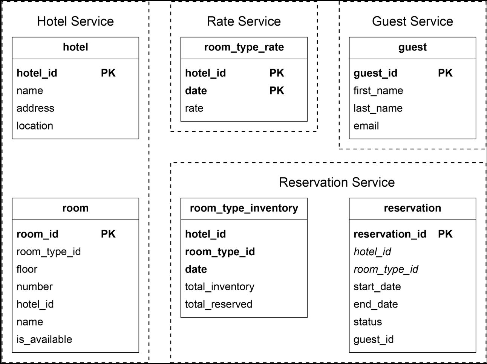
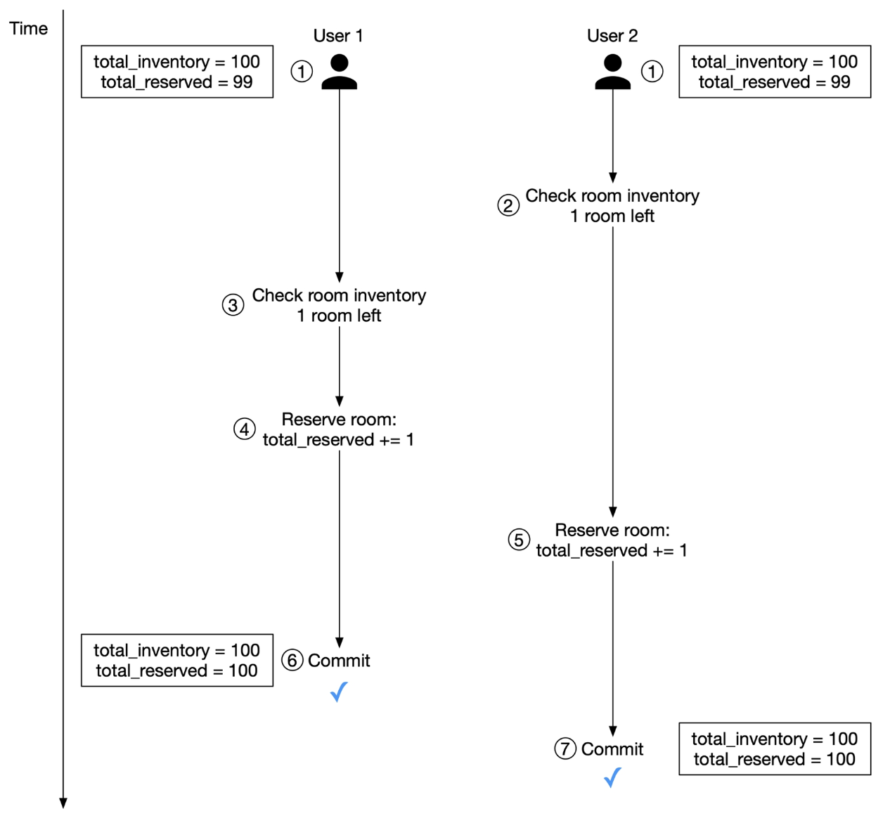
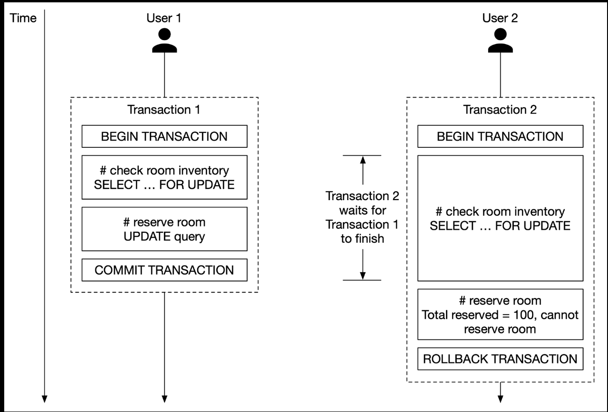
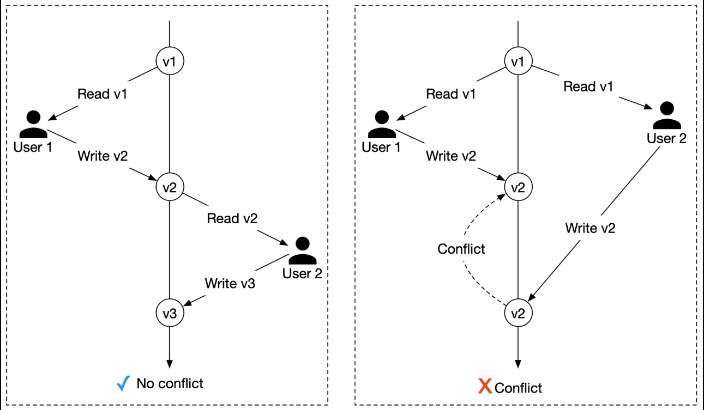
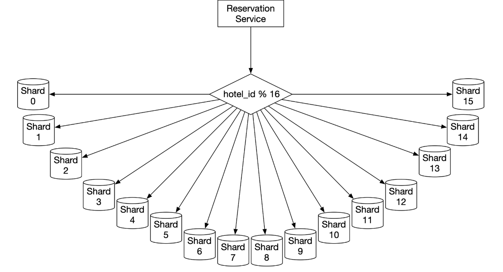
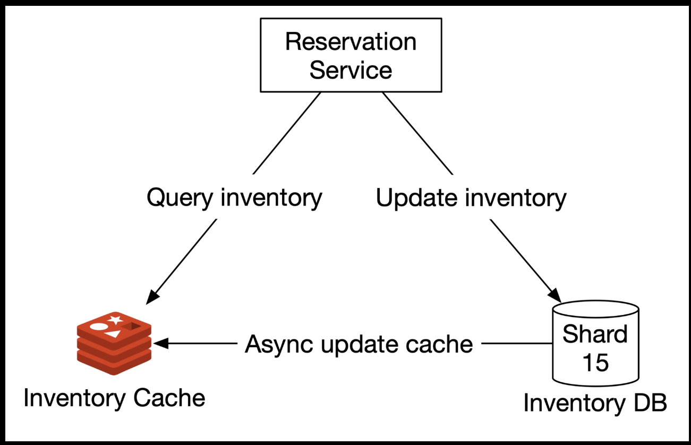
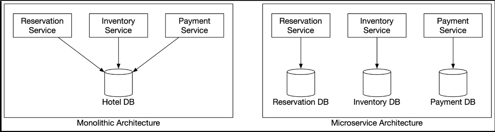
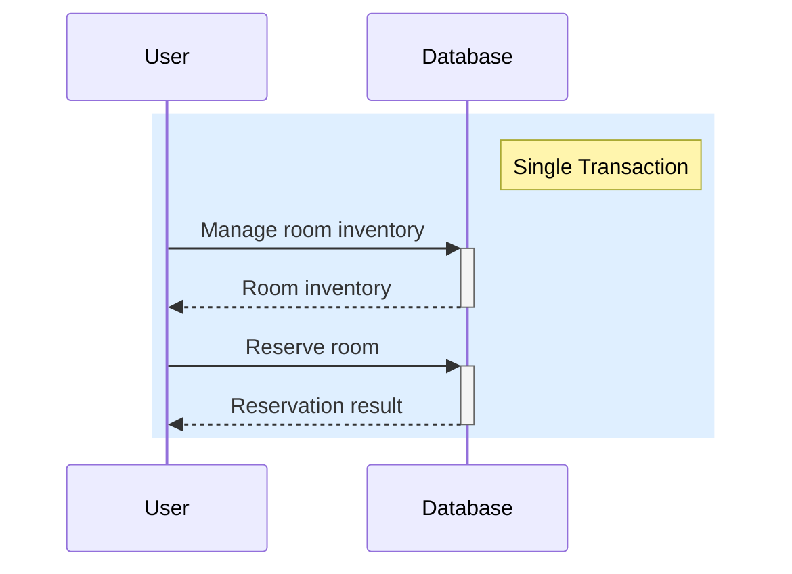
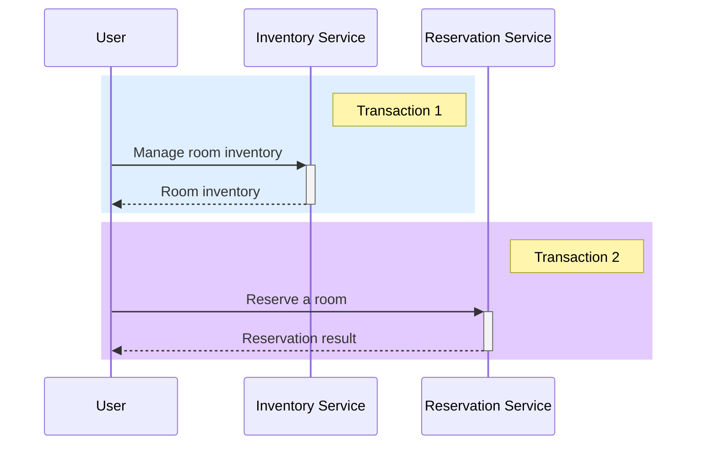

# 7. Hotel Reservation System

The design and techniques used in this chapter are also applicable to other popular booking-related interview topics:

- Design Airbnb
- Design a flight reservation system
- Design a movie ticket booking system

## Step 1 - Understand the Problem and Establish Design Scope

### Functional requirements

- Show the hotel-related page.
- Show the hotel room-related detail page.
- Reserve a room.
- Admin panel to add/remove/update hotel or room info.
- Support the overbooking feature.

### Non-functional requirements

- High concurrency. During peak season or big events, may have a lot of customers trying to book the same room.
- Moderate latency.

### Back-of-the-envelope estimation

- 5000 hotels and 1 million rooms in total.
- Assume 70% of the rooms are occupied and the average stay duration is 3 days.
- Daily reservations: (1 million * 0.7) / 3 = 233,333 (~240,000)
- Reservations per second = $240,000 / 10^5$ seconds in a day = ~3.

Rough calculation of the QPS of all pages in the system.

1. View hotel/room detail page.
2. View the booking page.
3. Reserve a room.


## Step 2 - High-Level Design

### API design

#### Hotel-related APIs

| API | Detail |
| --- | ------ |
| GET /v1/hotels/{id} | Get detailed information about a hotel |
| POST /v1/hotels | Add a new hotel. (Only available to hotel staff) |
| PUT /v1/hotels/{id} | Update hotel information. (Only available to hotel staff) |
| DELETE /v1/hotels/{id} | Delete a hotel. (Only available to hotel staff) |


#### Room-related APIs

| API | Detail |
| --- | ------ |
| GET /v1/hotels/{hotelID}/rooms/{id} | Get detailed information about a room |
| POST /v1/hotels/{hotelId}/rooms | Add a room. (Only available to hotel staff) |
| PUT /v1/hotels/{hotelId}/rooms | Update room information. (Only available to hotel staff) |
| DELETE /v1/hotels/{hotelId}/rooms | Delete a room. (Only available to hotel staff) |

#### Reservation related APIs

| API | Detail |
| --- | ------ |
| GET /v1/reservations | Get the reservation history of the logged-in user |
| GET /v1/reservations/{id} | Get detailed information about a reservation |
| POST /v1/reservations | Make a new reservation |
| DELETE /v1/reservations | Cancel a reservation |

Request parameters of making a new reservation:

```json
{
  "startDate": "2021-04-28",
  "endDate": "2021-04-30",
  "hotelID": 245,
  "roomID": "U12345673389",
  "reservationID": "U12354673390"
}
```

`reservationID` is used as the idempotency key to prevent double booking.

### Data model

Data access patterns:

- Query 1: View detailed information about a hotel
- Query 2: Find available types of rooms given a date range
- Query 3: Record a reservation
- Query 4: Look up a reservation or past history of reservations


### High-level design


- User: User books a hotel room on their mobile phone or computer.
- Admin (hotel staff): Authorized hotel staff perform administrative operations such as refunding a customer, canceling a reservation, updating room information, etc.
- CDN: Used to cache all static assets.
- Public API Gateway: Fully managed service that supports rate limiting, authentication, etc. API gateway directs requests to a specific service based on the endpoints.
- Internal APIs: Only available to authorized hotel staff. Usually further protected by a VPN.
- Hotel Service: Provides detailed information on hotels and rooms. Hotel and room data are generally static, so can be easily cached.
- Rate Service: Provides room rates for different future dates.
- Reservation Service: Receives reservation requests and reserves the hotel rooms. Also tracks room inventory as rooms are reserved and reservations are canceled.
- Payment Service: Executes payment from a customer and updates the reservation status to "paid" once a payment transaction succeeds, or "rejected" if the transaction fails.
- Hotel Management Service: Only available to authorized hotel staff. Hotel staff are eligible to use the following features: view the record of an upcoming reservation, reserve a room for a customer, cancel a reservation, etc.

## Step 3 - Design Deep Dive

### Improved data model

When we reserve a hotel room, we actually reserve a type of room, as opposed to a specific room.

For the reservation API, `roomID` is replaced by `roomTypeID` in the request parameter.

POST /v1/reservations

request parameters:

```json
{
  "startDate": "2021-04-28",
  "endDate": "2021-04-30",
  "hotelID": 245,
  "roomID": 12354673389,
  "roomCount": 3,
  "reservationID": "U12354673390"
}
```



#### `room_type_inventory` table

`room_type_inventory`: stores inventory data about hotel rooms. Important for reservation system.

- Having one row per date makes managing reservations within a date range and queries easy.
- `(hotel_id, room_type_id, date)` is the composite primary key
- Rows of the table are pre-populated by querying the inventory data across all future dates within 2 years. We have a scheduled daily job that pre-populates inventory data when the dates advance further.

#### Storage volume estimation

Storage volume estimation:

- 5,000 hotels
- Assume each hotel has 20 types of rooms.
- 5,000 hotels x 20 types of rooms x 2 years x 365 days = 73 million rows

73 million is not a lot of data and a single database is enough to store the data. To achieve high availability, we could set up database replication across multiple regions or availability zones.

#### Reservation

Sample data of the `room_type_inventory` table:

| `hotel_id` | `room_type_id` | `date` | `total_inventory` | `total_reserved` |
| ---------- | -------------- | ------ | ----------------- | ---------------- |
| 211 | 1001 | 2021-06-01 | 100 | 80 |
| 211 | 1001 | 2021-06-02 | 100 | 82 |
| 211 | 1001 | 2021-06-03 | 100 | 86 |
| 211 | 1001 | ... | ... | ... |
| 211 | 1001 | 2023-05-31 | 100 | 0 |
| 211 | 1002 | 2021-06-01 | 200 | 164 |
| 2210 | 101 | 2021-06-01 | 30 | 23 |
| 2210 | 101 | 2021-06-02 | 30 | 25 |

To check if a customer can reserve a specific type of room or not:

- input: `startDate`, `endDate`, `roomTypeId`, `hotelId`, `numberOfRoomsToReserve`
- output: Returns whether the specified type of room has inventory and users can book it.

From the SQL perspective:

1. Select rows within a date range
   ```sql
   SELECT date, total_inventory, total_reserved
   FROM room_type_inventory
   WHERE
      room_type_id = :roomTypeId AND
      hotel_id = :hotelId AND
      date between :startDate and :endDate
   ```
1. For each entry, the application checks the condition below:
   `if (total_reserved + numberOfRoomsToReserve) <= 110% * total_inventory` to support 10% overbooking.

#### If the reservation data is too large for a single database

- Store only current and future reservation data. Reservation history can be archived.
- Database sharding. Most frequent queries include making a reservation or looking up a reservation by name. In both cases, `hotel_id` is a good sharding key. hash(hotel_id) % number_of_servers.

### Concurrency issues

Double booking. 1) The same user clicks on the "book" button multiple times. 2) Multiple users try to book the same room at the same time.

#### Same user clicks on the "book" button multiple times

There are two common approaches to solve the problem of the first scenario:

- Client-side implementation. Client can gray out, hide or disable the "submit" button once request is sent.
- API solution. Add an idempotency key in the reservation API request.

##### Idempotency key


1. Generate reservation order request. After a customer enters detailed information about the reservation (room type, check-in date, check-out date, etc.) and clicks the "continue" button, a request to generate a reservation order is sent to the reservation service.
2. Generates a reservation order for the customer to review. Unique `reservation_id` is generated by a globally unique ID generator and returned as part of the API response.
3. Submit reservation. `reservation_id` is included as part of the request. Note that the idempotency key doesn't have to be the `reservation_id`.
4. Reservation made.
5. If the user clicks the "Complete my booking" button a second time, because `reservation_id` is the primary key of the reservation table, we can rely on the unique constraint of the key to ensure no double reservations happen.


#### Multiple users book the same type of room at the same time when there is only one room left



The SQL pseudo-code used to reserve a room has two parts:

- Check room inventory
- Reserve a room

```sql
# step 1: check room inventory
START TRANSACTION;

SELECT date, total_inventory, total_reserved
FROM room_type_inventory
WHERE
    room_type_id = :roomTypeId AND
    hotel_id = :hotelId AND
    date between :startDate and :endDate

# For every entry returned from step 1
if (total_reserved + numberOfRoomsToReserve > 110% * total_inventory) {
  ROLLBACK;
}

# step 2: reserve rooms
UPDATE room_type_inventory
SET total_reserved = total_reserved + :numberOfRoomsToReserve
WHERE
    room_type_id = :roomTypeId AND
    date between :startDate and :endDate

COMMIT;
```

##### Option 1: Pessimistic locking

Prevents simultaneous updates by placing a lock on a record as soon as one user starts to update it. Other users who attempt to update the record have to wait until the first user has released the lock (committed the changes).

For MySQL, the "SELECT ... FOR UPDATE" statement works by locking the rows returned by a selection query.



Pros:

- Prevents applications from updating data that is being, or has been, changed.
- Easy to implement and it avoids conflict by serializing updates. Pessimistic locking is useful when data contention is heavy.

Cons:

- Deadlocks may occur when multiple resources are locked. Writing deadlock-free application code could be challenging.
- Not scalable. If a transaction is locked for too long, other transactions cannot access the resource. This has significant impact on database performance, especially when transactions are long-lived or involve a lot of entities.

Due to these limitations, we do not recommend pessimistic locking for the reservation system.

##### Option 2: Optimistic locking

Allows multiple concurrent users to attempt to update the same resource.



Pro:

- Prevents applications from editing stale data.
- Don't need to lock the database resource. There's no locking from the database point of view. Entirely up to the application to handle the logic with the version number.
- Used when the data contention is low. When conflicts are rare, transactions can complete without the expense of managing locks.

Cons:

- Performance is poor when data contention is heavy.

Optimistic locking is a good option for a hotel reservation system since the QPS for reservation is usually not high.

##### Option 3: Database constraints

To the `room_type_inventory` table, add the following constraint:

```sql
CONSTRAINT check_room_count CHECK(total_inventory - total_reserved >= 0)
```

Pros:

- Easy to implement
- Works well when data contention is minimal.

Cons:

- When data contention is heavy, it can result in a high volume of failures.
- Database constraint cannot be version-controlled easily like application code.
- Not all databases support constraint. Might cause problems when we migrate from one database solution to another.

Easy to implement and data contention is not high (low QPS), so is another good option.

### Scalability

Interviewer might follow up with: "what if the hotel reservation system is used not just for a hotel chain, but for a popular travel site such as booking.com or expedia.com?"
QPS should be 1,000 times higher.

Services are stateless, so can be expanded by adding more servers; however, the database contains all the states and cannot be scaled up by simply adding more databases.

#### Database sharding

Apply database sharding.

Most queries need to filter by `hotel_id`. So we shard data by `hotel_id`. In the following figure, the load is spread among 16 shards.



Assume the QPS is 30,000. After database sharding, each shard handles 30,000 / 16 = 1875 QPS, which is within a single MySQL server's load capacity.

#### Caching

Only current and future hotel inventory data are meaningful because customers can only book rooms in the near future.

So for storage choice, ideally we want to have a time-to-live (TTL) mechanism to expire old data automatically. Historical data can be queried on a different database. Redis is a good choice because TTL and Least Recently Used (LRU) cache eviction policy helps us make optimal use of memory.

We can add a cache layer on top of the database and move the check room inventory and reserve room logic to the cache layer.



##### Reservation service

Supports the following inventory management APIs:

- Query the number of available rooms for a given room type and date range.
- Reserve a room by executing `total_reserved` += 1.
- Update inventory when a user cancels a reservation.

##### Inventory cache

All inventory management query operations are moved to the inventory cache (Redis) and we need to pre-populate inventory data to the cache. Cache is key-value structure:

key: `{hotelID}_{roomTypeID}_{date}`
value: number of available rooms for a given hotel ID, room type ID and date

Volume of read operations is an order of magnitude higher than write operation.

##### Inventory DB

Stores inventory data as source of truth.

##### New challenges posed by the cache

Adding a caching layer increases scalability and throughput, but it also introduces a new challenge: how to maintain data consistency between the database and the cache.

When a user books a room, two operations are executed in the happy path:

1. Query room inventory to find out if there are enough rooms left. Runs on inventory cache.
2. Update inventory data. The DB is updated first, then the change is propagated to the cache asynchronously. Asynchronous cache update could be invoked by the application code, or propagated using change data capture (CDC).

Pros:

- Reduced database load.
- High performance.

Cons:

- Maintaining data consistency between database and cache. Need to think carefully about how this inconsistency affects user experience.

### Data consistency among services

Reservation Service handles both reservation and inventory API, so that inventory and reservation database tables are stored in the same relational database. This arrangement allows us to leverage the ACID properties of the relational database to handle concurrency issues.

Microservice purist:



In a monolithic architecture, different operations can be wrapped within a single transaction to ensure ACID properties.



However, in a microservice architecture, each service has its own database.



In microservice architecture, each service has its own database. This means we cannot use a single transaction to ensure data consistency.

To address the data inconsistency, here is a high-level summary of industry-proven techniques.

- Two-phase commit (2PC). 2PC is a database protocol used to guarantee atomic transactions across multiple nodes. i.e., either all nodes succeed or all nodes fail. 2PC is a blocking protocol, a single node failure blocks the progress until the node has recovered. It's not performant.
- Saga. A saga is a sequence of local transactions. Each transaction updates and publishes a message to trigger the next transaction step. If a step fails, the saga executes compensating transactions to undo the changes that were made by preceding transactions.

2PC works as a single commit to perform ACID transactions while Saga consists of multiple steps and relies on eventual consistency.

>[!NOTE] For this problem, we went with a pragmatic approach of storing reservation and inventory data under the same relational database.
