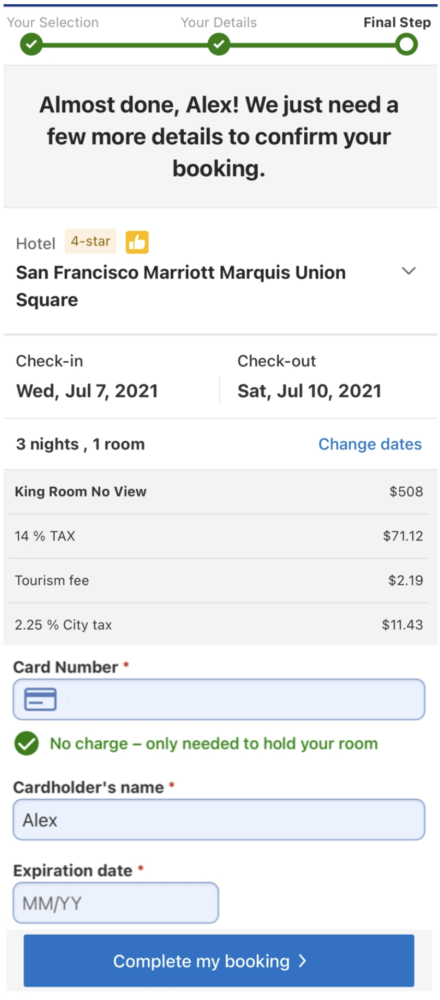

# 7. Hotel Reservation System

The design and techniques used in this chapter are also applicable to other popular booking-related interview topics:

- Design Airbnb
- Design a flight reservation system
- Design a movie ticket booking system

## Step 1 - Understand the Problem and Establish Design Scope

### Functional requirements

- Show the hotel-related page.
- Show the hotel room-related detail page.
- Reserve a room.
- Admin panel to add/remove/update hotel or room info.
- Support the overbooking feature.

### Non-functional requirements

- High concurrency. During peak season or big events, may have a lot of customers trying to book the same room.
- Moderate latency.

### Back-of-the-envelope estimation

- 5000 hotels and 1 million rooms in total.
- Assume 70% of the rooms are occupied and the average stay duration is 3 days.
- Daily reservations: (1 million * 0.7) / 3 = 233,333 (~240,000)
- Reservations per second = $240,000 / 10^5$ seconds in a day = ~3.

Rough calculation of the QPS of all pages in the system.

1. View hotel/room detail page.
2. View the booking page.
3. Reserve a room.


## Step 2 - High-Level Design

### API design

#### Hotel-related APIs

| API | Detail |
| --- | ------ |
| GET /v1/hotels/{id} | Get detailed information about a hotel |
| POST /v1/hotels | Add a new hotel. (Only available to hotel staff) |
| PUT /v1/hotels/{id} | Update hotel information. (Only available to hotel staff) |
| DELETE /v1/hotels/{id} | Delete a hotel. (Only available to hotel staff) |


#### Room-related APIs

| API | Detail |
| --- | ------ |
| GET /v1/hotels/{hotelID}/rooms/{id} | Get detailed information about a room |
| POST /v1/hotels/{hotelId}/rooms | Add a room. (Only available to hotel staff) |
| PUT /v1/hotels/{hotelId}/rooms | Update room information. (Only available to hotel staff) |
| DELETE /v1/hotels/{hotelId}/rooms | Delete a room. (Only available to hotel staff) |

#### Reservation related APIs

| API | Detail |
| --- | ------ |
| GET /v1/reservations | Get the reservation history of the logged-in user |
| GET /v1/reservations/{id} | Get detailed information about a reservation |
| POST /v1/reservations | Make a new reservation |
| DELETE /v1/reservations | Cancel a reservation |

Request parameters of making a new reservation:

```json
{
  "startDate": "2021-04-28",
  "endDate": "2021-04-30",
  "hotelID": 245,
  "roomID": "U12345673389",
  "reservationID": "U12354673390"
}
```

`reservationID` is used as the idempotency key to prevent double booking.

### Data model

Data access patterns:

- Query 1: View detailed information about a hotel
- Query 2: Find available types of rooms given a data range
- Query 3: Record a reservation
- Query 4: Look up a reservation or past history of reservations


### High-level design


- User: User books a hotel room on their mobile phone or computer.
- Admin (hotel staff): Authorized hotel staff perform administrative operations such as refunding a customer, canceling a reservation, updating room information, etc.
- CDN: Used to cache all static assets.
- Public API Gateway: Fully managed service that supports rate limiting, authentication, etc. API gateway direct requests to specific service based on the endpoints.
- Internal APIs: Only available to authorized hotel staff. Usually further protected by a VPN.
- Hotel Service: Provides detailed information on hotels and rooms. Hotel and room data are generally static, so can be easily cached.
- Rate Service: Provides room rates for different future dates.
- Reservation Service: Receives reservation requests and reserves the hotel rooms. Also tracks room inventory as rooms are reserved and reservations are canceled.
- Payment Service: Executes payment from a customer and updates the reservation status to "paid" once a payment transaction succeeds, or "rejected" if the transaction fails.
- Hotel Management Service: Only available to authorized hotel staff. Hotel staff is eligible to use the following features: view the record of an upcoming reservation, reserve a room for a customer, cancel a reservation, etc.

## Step 3 - Design Deep Dive

### Improved data model

When we reserve a hotel room, we actually reserve a type of room, as opposed to a specific room.


`(hotel_id, room_type_id, date)` is the composite primary key of `room_type_inventory` table. Rows of the table are pre-populated by querying the inventory data across all future dates within 2 years. We have a scheduled daily job that pre-populates inventory data when the dates advance further.

If the reservation data is too large for a single database...

- Store only current and future reservation data. Reservation history can be archived.
- Database sharding. Most frequent queries include making a reservation or looking up a reservation by name. In both cases, `hotel_id` is a good sharding key. hash(hotel_id) % number_of_servers.

### Concurrency issues

Double booking. 1) The same user clicks on the "book" button multiple times. 2) Multiple users try to book the same room at the same time.

#### Same user clicks on the "book" button multiple times

There are two common approaches to solve the problem of the first scenario:

- Client-side implementation. Client can gray out, hide or disable the "submit" button once request is sent.
- API solution. Add an idempotency key in the reservation API request.

##### Idempotency key


1. Generate reservation order request. After a customer enters detailed information about the reservation (room type, check-in date, check-out date, etc) and clicks the "continue" button, request to generate reservation order is sent to the reservation service.
2. Generates a reservation order for the customer to review. Unique `reservation_id` is generated by a globally unique ID generator and returned as part of the API response.
3. Submit reservation. `reservation_id` is included as part of the request. Note that the idempotency key doesn't have to be the `reservation_id`.
4. Reservation made.
5. If user clicks the "Complete my booking" button a second time, because `reservation_id` is the primary key of the reservation table, we can rely on the unique constraint of the key to ensure no double reservation happens.



#### Multiple users book the same type of room at the same time when there is only one room left


##### Option 1: Pessimistic locking

##### Option 2: Optimistic locking

##### Option 3: Database constraints

### Scalability

#### Database sharding

#### Caching

### Data consistency among service

Reservation Service handles both reservation and inventory API, so that inventory and reservation database tables are stored in the same relational database. This arrangement allows us to leverage the ACID properties of the relational database to handle concurrency issues.

Microservice purist:


In a monolithic architecture, different operations can be wrapped within a single transaction to ensure ACID properties.


However, in a microservice architecture, each service has itw own database.


To address the data inconsistency, here is a high-level summary of industry-proven techniques.

- Two-phase commit (2PC).
- Saga.
