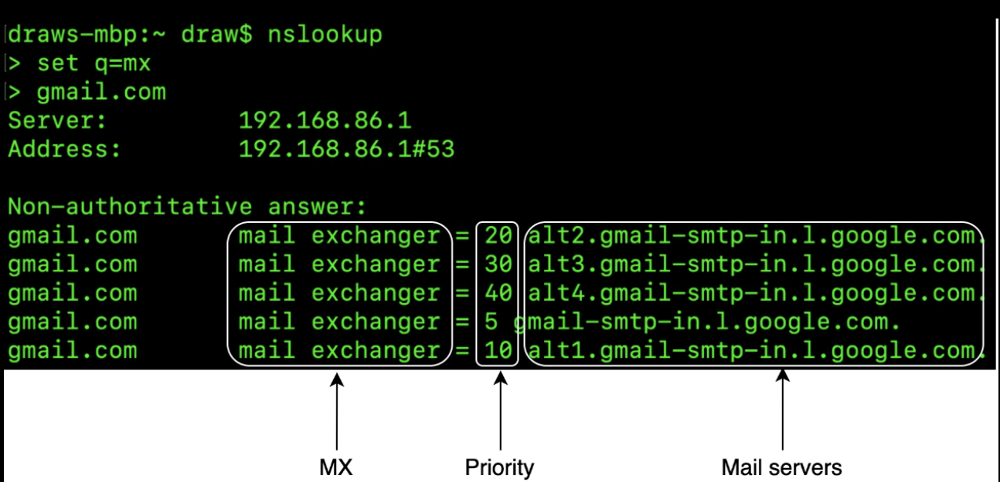
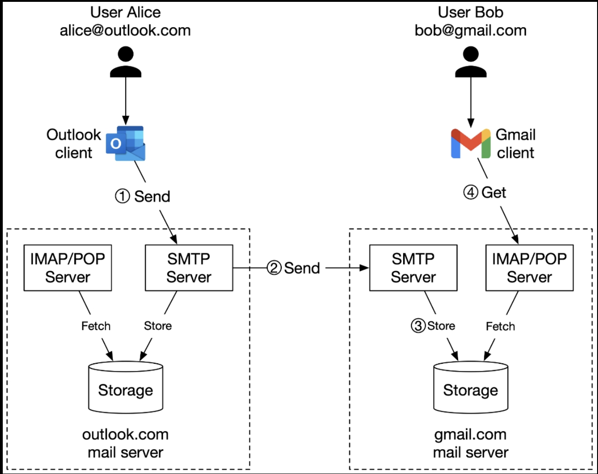
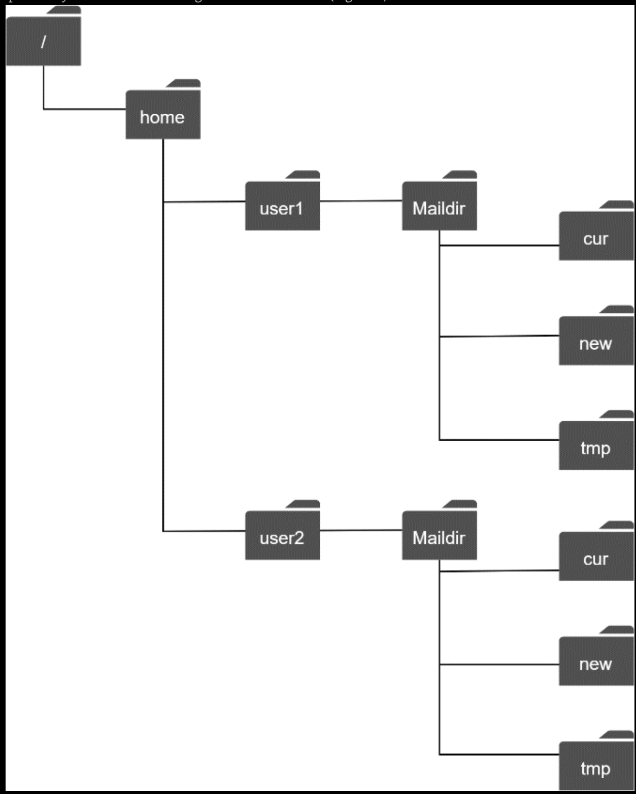

# 8. Distributed Email Service

## Step 1 - Establish Design Scope

### Functional requirements

- Send and receive emails.
- Fetch all emails.
- Filter emails by read and unread status.
- Search emails by subject, sender, and body.
- Anti-spam and anti-virus.

### Non-functional requirements

- Reliability: Should not lose email data.
- Availability: Email and user data should be automatically replicated across multiple nodes to ensure availability. The system should continue to function despite partial system failures.
- Scalability: The performance of the system should not degrade with more users or emails.
- Flexibility and extensibility: Traditional email protocols such as POP and IMAP have very limited functionality. We may need custom protocol to satisfy the flexibility and extensibility requirements.

### Back-of-the-envelope estimation

- 1 billion users.
- Assume the average number of emails a person sends per day is 10. QPS for sending emails = $10^9$ x 10 / $10^5$ = 100,000.
- Assume the average number of emails a person receives in a day is 40 and the average email metadata is 50KB. (Metadata refers to everything related to an email, excluding attachment files.)
- Assume metadata is stored in a database. Storage requirements for maintaining metadata in 1 year: 1 billion users x 40 emails / day x 365 days x 50KB = 730 PB.
- Assume 20% of emails contain an attachment and the average attachment size is 500 KB.
- Storage for attachments in 1 year is: 1 billion users x 40 emails / day x 365 days x 20% x 500 KB = 1,460 PB.

## Step 2 - High-Level Design

### Email 101

#### Email Protocols

__SMTP__: Simple Mail Transfer Protocol (SMTP) is the standard protocol for sending emails from one mail server to another.

The most popular protocols for retrieving emails are known as Post Office Protocol (POP) and the Internet Mail Access Protocol (IMAP).

__POP__ is a standard mail protocol to receive and download emails from a remote mail server to a local email client. Once emails are downloaded to your computer or phone, they are deleted from the email server. The details are covered in [RFC 1939](http://www.faqs.org/rfcs/rfc1939.html). POP requires mail clients to download the entire email. This can take a long time if an email contains a large attachment.

__IMAP__ is also standard mail protocol for receiving emails for a local email client. When you read an email, you are connected to an external mail server, and data is transferred to your local device. IMAP only downloads a message when you click it, and emails are not deleted from mail servers, meaning that you can access emails from multiple devices.

__HTTPS__ is not technically a mail protocol, but it can be used to access your mailbox. For example, it's common for Microsoft Outlook to talk to mobile devices over HTTPS, on a custom-made protocol called ActiveSync.

#### DNS

A DNS server is used to look up the mail exchanger record (MX record) for the recipient's domain. If you run DNS lookup for gmail.com from the command line, you may get MX records as shown:

The priority numbers indicate preferences, where the mail server with a lower priority number is more preferred. A sending mail server will attempt to connect and send messages to this mail server first. If the connection fails, the sending mail server will attempt to connect to the mail server with the next lowest priority.

#### Attachment

An email attachment is sent along with an email message, commonly with Base64 encoding. There is usually a size limit for an email attachment. For example, Outlook and Gmail limit the size of attachments to 20MB and 25MB respectively as of June 2021. Multipurpose Internet Mail Extension (MIME) is a specification that allows the attachment to be sent over the internet.

### Traditional mail server

#### Traditional mail server architecture

The figure below describes what happens when Alice sends an email to Bob.

1. Alice logs into her Outlook client, composes an email, and presses "send." The email is sent to the Outlook mail server. The communication protocol between the Outlook client and mail server is SMTP.
2. Outlook mail server queries the DNS to find the address of the recipient's SMTP server. Next, it transfers the email to the Gmail mail server. The communication protocol between the mail servers is SMTP.
3. Gmail server stores the email and makes it available to Bob, the recipient.
4. Gmail client fetches new emails through the IMAP/POP server when Bob logs in to Gmail.

#### Storage

Most email systems at large scale such as Gmail, Outlook, and Yahoo use highly customized databases. In the past, emails were stored in local file directories and each email was stored in a separate file with unique name. Each user maintained a user directory to store configuration data and mailboxes. `Maildir` was a popular way to store email messages on the mail server.

As the email volume grew and the file structure became more complex, disk I/O became a bottleneck. The local directories also don't satisfy our high availability and reliability requirements.
