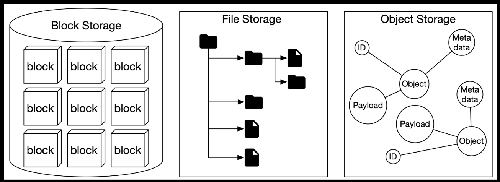

# 9. S3-like Object Storage

## Storage System 101

At a high-level, storage systems fall into three broad categories:

- Block storage
- File storage
- Object storage

### Block storage

Came first in the 1960s. Common storage devices like hard disk drives (HDD) and solid-state drives (SSD) that are physically attached to servers are all considered as block storage.

### File storage

Built on top of block storage. Provided higher-level abstraction to make it easier to handle files and directories. File storage could be made accessible by a large number of servers using common file-level network protocols like SMB/CIFS and NFS.

### Object storage

Object storage makes a very deliberate tradeoff to sacrifice performance for high durability, vast scale, and low cost. Targets relatively "cold" data and is mainly used for archival and backup. Object storage stores all data as objects in a flat structure. There is no hierarchical directory structure. Data access is normally provided via a RESTful API.

### Terminology

Core object storage concepts.

__Bucket__

__Object__

__Versioning__

__Uniform Resource Identifier (URI)__

__Service-level agreement (SLA)__

## Step 1 - Establish Design Scope
