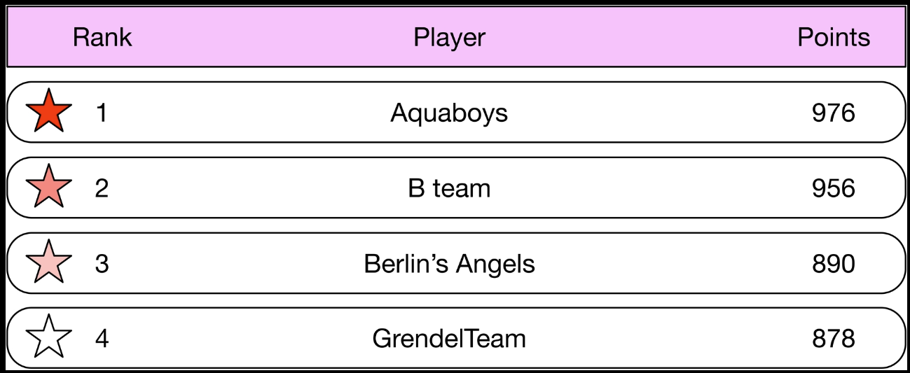
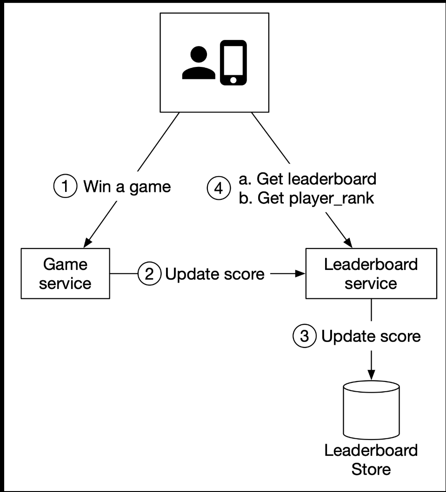

# 10 Real-time Gaming Leaderboard

Design a leaderboard for an online mobile game.



## Step 1 - Establish Design Scope

### Functional requirements

- Display top 10 players on the leaderboard.
- Show a user's specific rank.
- Display players who are four places above and below the desired user (bonus).

### Non-functional requirements

- Real-time update on scores.
- Score update is reflected on the leaderboard in real-time.
- General scalability, availability, and reliability requirements.

### Back-of-the-envelope estimation

- 5 million DAU
- If the game had an even distribution of players during a 24-hour period, would have an average of 50 users per second (5,000,000 DAU / $10^5$ seconds = ~50).
- Assume peak load would be 5 times the average. Peak load of 250 users per second.

QPS for users scoring a point: if a user plays 10 games per day on average, the QPS for users scoring a point is 50 x 10 = ~500. Peak QPS is 5x the average: 500 x 5 = 2,500.

QPS for fetching the top 10 leaderboard: assume a user opens the game once per day and the top 10 leaderboard is loaded only when a user first opens the game. QPS for this is around 50.

## Step 2 - High-Level Design

### API design

#### POST /v1/scores

Update user's position on the leaderboard when a user wins a game. This should be an internal API that can only be called by the game servers. The client should not be able to update the leaderboard score directly.

##### Request

| Field | Description |
| ----- | ----------- |
| user_id | User who won a game |
| points | |

##### Response

| Name | Description |
| ---- | ----------- |
| 200 OK | |
| 400 Bad Request | |

#### GET /v1/scores

Fetch the top 10 players from the leaderboard.

##### Sample response

```json
{
  "data": [
    {
      "user_id": "user_id1",
      "user_name": "alice",
      "rank": 1,
      "score": 976
    },
    {
      "user_id": "user_id1",
      "user_name": "alice",
      "rank": 1,
      "score": 976
    }
    ...
    "total": 10
  ]
}
```

#### GET /v1/scores/{user_id}

Fetch the rank of a specific user.

##### Request

##### Sample response

```json
{
  "user_info": {
    "user_id": "user5",
    "score": 1000,
    "rank": 6
  }
}
```

### High-level architecture

There are two services in this design. The game service allows users to play the game and the leaderboard service creates and displays a leaderboard.



#### Should the client talk to the leaderboard service directly?

#### Do we need a message queue between the game service and the leaderboard service?

### Data models

#### Relational database solution

#### Redis solution
