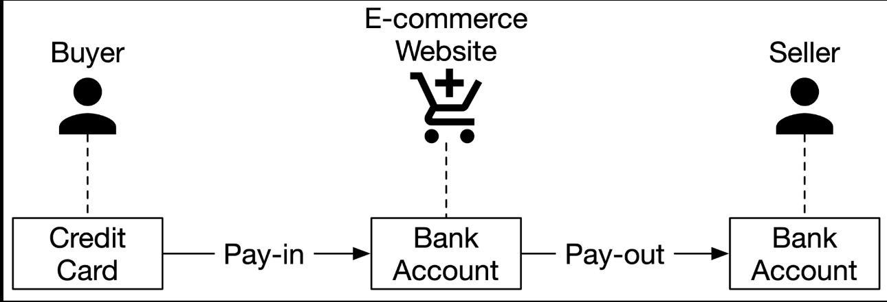
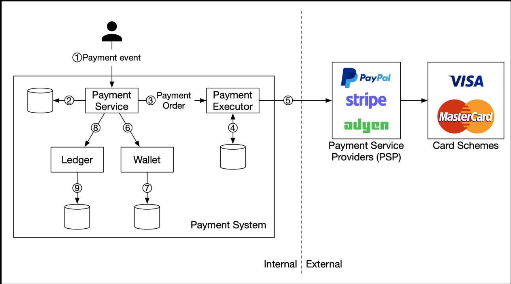
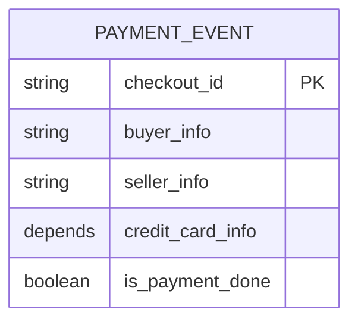
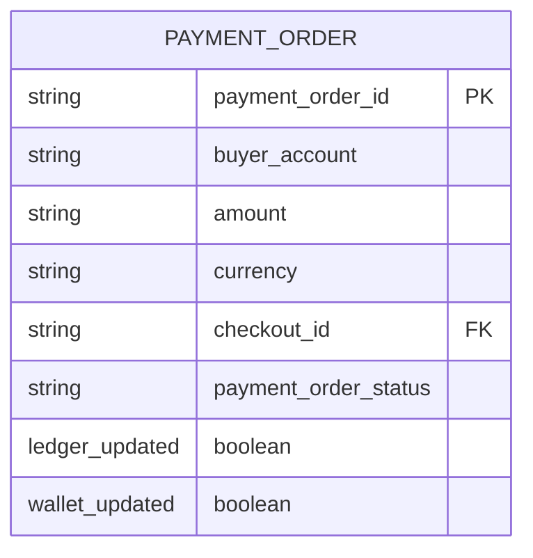
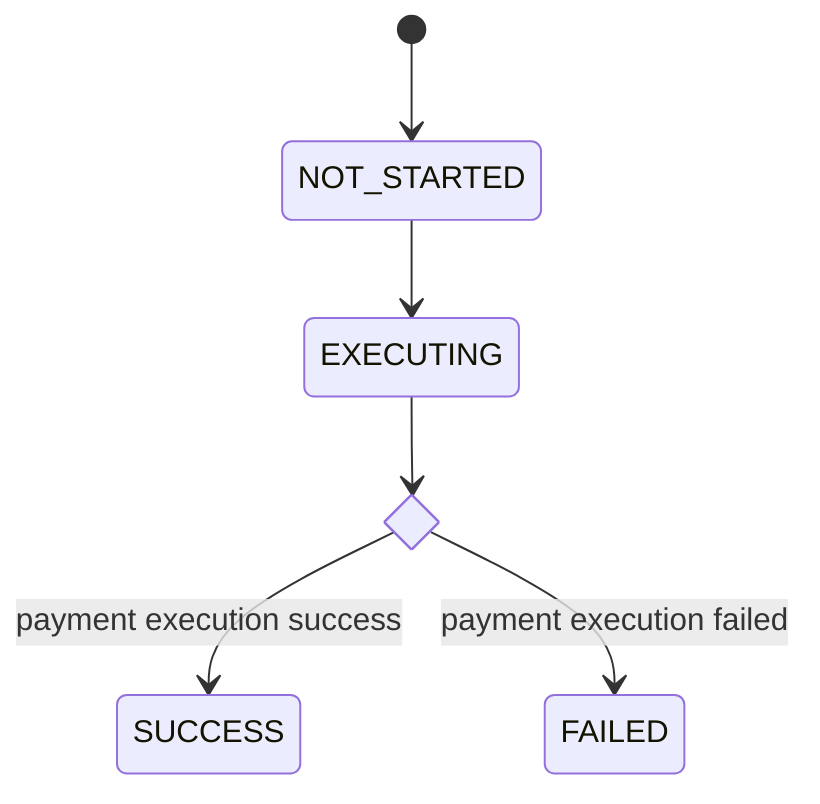
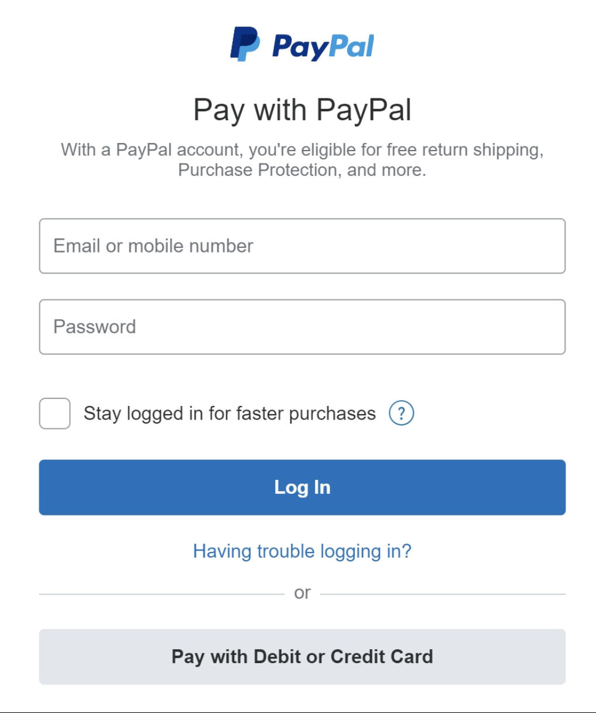

# 11. Payment System

According to Wikipedia,
> a payment system is any system used to settle financial transactions through the transfer of monetary value.

## Step 1 - Establish Design Scope

Some may think a payment system is a digital wallet like Apple Pay or Google Pay. Others may think it's a backend system that handles payments such as PayPal or Stripe.

### Functional requirements

- Pay-in flow: payment system receives money from customers on behalf of sellers.
- Pay-out flow: payment system sends money to sellers around the world.

### Non-functional requirements

- Reliability and fault tolerance. Failed payments need to be carefully handled.
- A reconciliation process between internal services (payment systems, accounting systems) and external services (payment service providers) is required. The process asynchronously verifies that the payment information across these systems is consistent.

### Back-of-the-envelope estimation

- 1 million transactions per day.
- 1,000,000 transactions / $10^5$ seconds = 10 TPS.

10 TPS is not a big number for a typical database, which means the focus of this system design is on how to correctly handle payment transactions, rather than aiming for high throughput.

## Step 2 - High-Level Design

Simplified pay-in and pay-out flow:

### Pay-in flow

#### Payment service

Accepts payment events from users and coordinates the payment process. The first thing it usually does is a risk-check, assessing for compliance with regulations such as AML/CFT, and for evidence of criminal activity such as money laundering or financing of terrorism.

#### Payment executor

Executes a single payment order via a Payment Service Provider (PSP).

#### Payment Service Provider (PSP)

Moves money from account A to account B. In this simplified example, the PSP moves the money out of the buyer's credit card account.

#### Card schemes

Organizations that process credit card operations. Visa, MasterCard, Discover, etc.

#### Ledger

Keeps a financial record of the payment transactions. For example, when a user pays the seller $1, we record it as debit $1 from a user and credit $1 to the seller.

The ledger system is very important in post-payment analysis, such as calculating the total revenue of the e-commerce website or forecasting future revenue.

#### Wallet

Keeps the account balance of the merchant. It may also record how much a given user has paid in total.

#### Pay-in flow sequence

Typical pay-in flow works like this:

1. When a user clicks the "place order" button, a payment event is generated and sent to the payment service.
2. The payment service stores the payment event in the database.
3. A single payment event may contain several payment orders. For example, you may select products from multiple sellers in a single checkout process. If the e-commerce website splits the checkout into multiple payment orders, the payment service calls the payment executor for each payment order.
4. Payment executor stores the payment order in the database.
5. Payment executor calls an external PSP to process the credit card payment.
6. After the payment executor has successfully processed the payment, payment service updates the wallet to record how much money a given seller has.
7. The wallet server stores the updated balance information in the database.
8. After the wallet service has successfully updated the seller's balance information, the payment service calls the ledger to update it.
9. The ledger service appends the new ledger information to the database.

### APIs for payment service

#### POST /v1/payments

This endpoint executes a payment event. A single payment event may contain multiple payment orders.

##### Request

| Field | Description | Type |
| ----- | ----------- | ---- |
| `buyer_info` | Information of the buyer | json |
| `checkout_id` | Globally unique ID for this checkout | string |
| `credit_card_info` | Could be encrypted credit card information or a payment token. The value is PSP-specific | json |
| `payment_orders` | List of payment orders | list |

`payment_orders` look like this:

| Field | Description | Type |
| ----- | ----------- | ---- |
| `seller_account` | Which seller will receive the money | string |
| `amount` | Transaction amount for the order | string |
| `currency` | Currency of the order | string (ISO 4217) |
| `payment_order_id` | Globally unique ID for this payment | string |

> [!NOTE] `payment_order_id` is globally unique. When the payment executor sends a payment request to a third-party PSP, `payment_order_id` is used by the PSP as the deduplication ID, also called the idempotency key.
>
> [!TIP] Data type of the "amount" field is "string". Double is not a good choice because:
>
> 1. Different protocols, software, and hardware may support different numeric precisions in serialization and deserialization. This difference might cause unintended rounding errors.
> 2. The number could be extremely big (for example, Japan's GDP is around $5 * 10^{14}$ yen for 2020), or extremely small (a satoshi of Bitcoin is $10^{-8}$).

#### GET /v1/payments/{id}

Returns the execution status of a single payment order based on `payment_order_id`

### Data model for payment

Need two tables: payment event and payment order.

When we select a storage solution, performance is usually not the most important factor. Instead, we focus on the following:

1. Proven stability. Whether the storage system has been used by other big financial firms for many years (for example more than 5 years) with positive feedback.
2. The richness of supporting tools, such as monitoring and investigation tools.
3. Maturity of the DBA job market.

Usually, we prefer a traditional relational database with ACID transaction support over NoSQL.

Payment event table contains detailed payment event information.

Payment order table stores the execution status of each payment order.

- `checkout_id` is the foreign key. A single checkout creates a payment event that may contain several payment orders.
- When we call a third-party PSP to deduct money from the buyer's credit card,

In the `PAYMENT_ORDER` table, `payment_order_status` is an enumerated type that keeps the execution status of the payment order. Execution status includes `NOT_STARTED`, `EXECUTING`, `SUCCESS`, `FAILED`

#### Double-entry ledger system

Very important design principle in the ledger system. Double-entry system is fundamental to any payment system and is key to accurate bookkeeping. It records every payment transaction into two separate ledger accounts with the same amount.

| Account | Debit | Credit |
| ------- | ----- | ------ |
| buyer | $1 | |
| seller | | $1 |

Double-entry system states that the sum of all transaction entries must be 0. It provides end-to-end traceability and ensures consistency throughout the payment cycle.

To find out more about implementing the double-entry system, see Square's engineering blog about [immutable double-entry accounting database service](https://developer.squareup.com/blog/books-an-immutable-double-entry-accounting-database-service).

### Hosted payment page

Most companies prefer not to store credit card information internally (regulation such as Payment Card Industry Data Security Standard (PCI DSS) in the US). To avoid handling credit card information, companies use hosted credit card pages provided by PSPs. For websites, it is a widget or an iframe, while for mobile applications, it may be a pre-built page from the payment SDK.

Example of the checkout experience with PayPal integration. The point is that the PSP provides a hosted payment page that captures the customer card information directly.

### Pay-out flow

The components of the pay-out flow are very similar to pay-in flow. One difference is that instead of using PSP to move money from the buyer's credit card to the e-commerce website's bank account, the pay-out flow uses a third-party pay-out provider to move money from the e-commerce website's bank account to the seller's bank account.

Usually, the payment system uses third-party account payable providers like Tipalti to handle pay-outs. There are a lot of bookkeeping and regulatory requirements with pay-outs as well.
