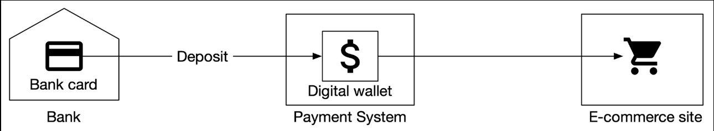
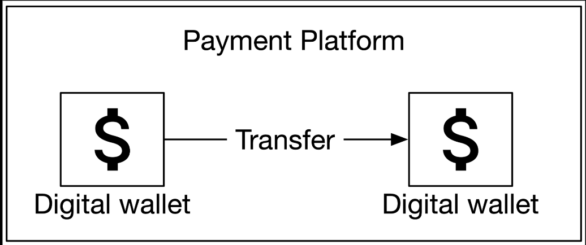
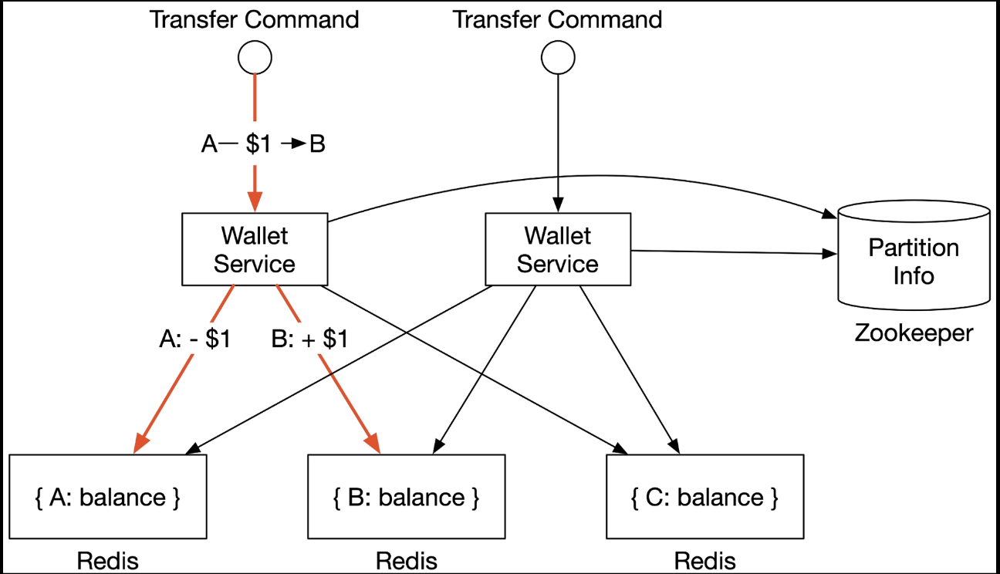
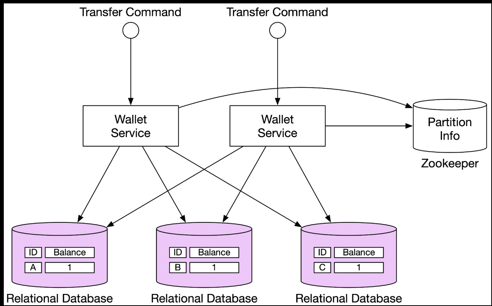
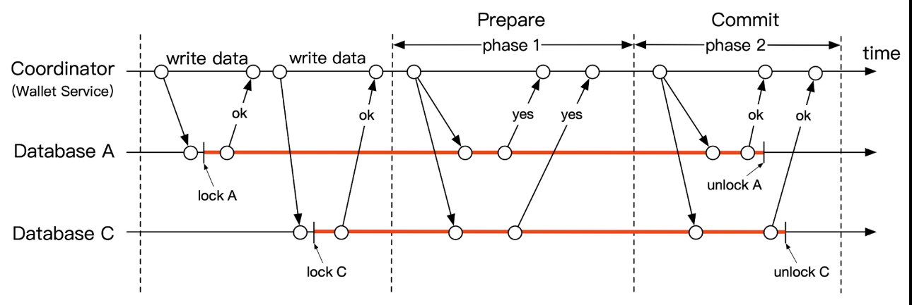
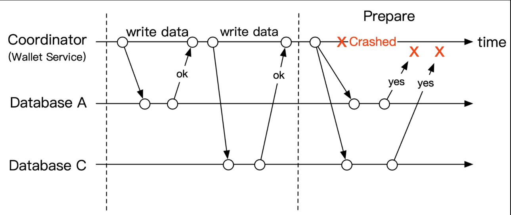

# 12. Digital Wallet

Payment platforms usually provide a digital wallet service to clients, so they can store money in the wallet and spend it later.



Design the backend of a digital wallet application that supports the cross-wallet balance transfer operation.



## Step 1 - Establish Design Scope

### Requirements

- Support balance transfer operation between two digital wallets.
- Support 1,000,000 TPS.
- Availability is at least 99.99%.
- Support transactions.
- Support reproducibility: can reconstruct historical balance by replaying the data from the very beginning.

### Back-of-the-envelope estimation

Assume a database node can support 1,000 TPS.

Each transfer command requires two operations: deducting money from one account and depositing money to the other account.

| Per-node TPS | Node Number |
| ------------ | ----------- |
| 100 | 20,000 |
| 1,000 | 2,0000 |
| 10,000 | 200 |

## Step 2 - High-Level Design

### API Design

| API | Detail |
| --- | ------ |
| POST /v1/wallet/balance_transfer | Transfer balance from one wallet to another |

#### Request parameters

| Field | Description | Type |
| ----- | ----------- | ---- |
| from_account | Debit account | string |
| to_account | Credit account | string |
| amount | Amount of money | string |
| currency | Currency type | string (ISO 4217) |
| transaction_id | ID used for deduplication | uuid |

#### Sample response body

```json
{
  "status": "success",
  "transaction_id": "01589980-11ec-9621-0242ac130002"
}
```

### In-memory sharding solution

Number of partitions and address of all Redis nodes can be stored in a centralized place. We could use Zookeeper as a highly-available configuration storage solution.

Wallet service has several key responsibilities:

1. Receives the transfer command.
2. Validates the transfer command.
3. If the command is valid, it updates the account balances for the two users involved in the transfer, most likely in two different Redis nodes.



> [!WARNING]
> Does not meet the correctness requirement. Wallet service updates two Redis nodes for each transfer. The two updates need to be done in a single atomic transaction.

### Distributed transactions

#### Database sharding



#### Two-phase commit

There are tow ways to implement a distributed transaction: a low-level solution and a high-level solution.

Low-level solution relies on the database itself.



1. The coordinator (wallet service), performs read and write operations on multiple databases as normal. Both databases A and C are locked.
2. When the application is about to commit the transaction, the coordinator asks all databases to prepare the transaction.
3. In the second phase, the coordinator collects replies from all databases and does the following:
   1. If all database reply with a "yes", the coordinator asks all databases to commit the transaction it has received.
   2. If any database replies with a "no", the coordinator asks all databases to abort the transaction.

It is a low-level solution because the prepare step requires a special modification to the database transaction.

The biggest problem with 2PC is that it's not performant, as locks can be held for a very long time while waiting for a message from the other nodes. Another issue is that the coordinator can be a SPoF:



#### Try-Confirm/Cancel (TC/C)

TC/C is a type of compensating transaction that has two steps:

1. In the first phase, the coordinator asks all databases to reserve resources for the transactions.
2. In the second phase, the coordinator collects replies from all databases:
   1. If all databases reply with "yes", the coordinator
   2. If any database replies with "no", the coordinator

It's important to be aware that the two phases in 2PC are wrapped in the same transaction, but in TC/C each phase is a separate transaction.

#### Saga

### Event sourcing
