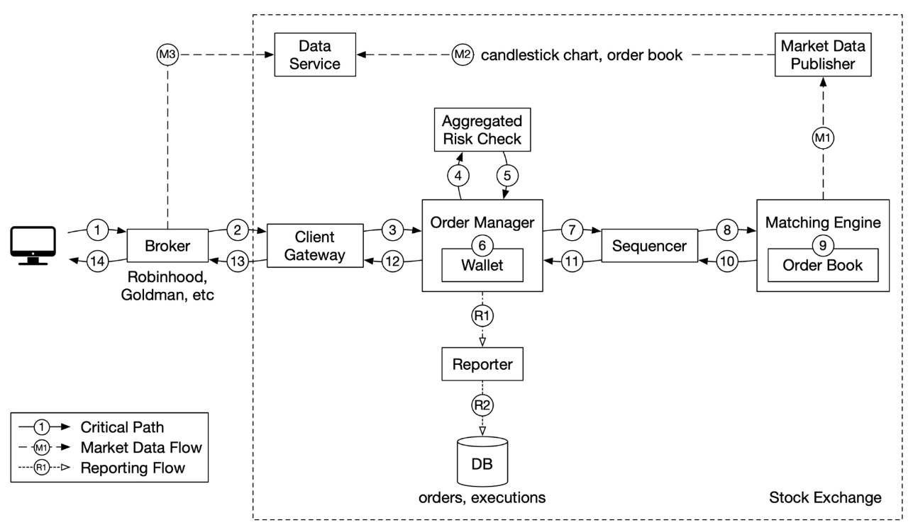

# 13. Stock Exchange

Design an electronic stock exchange system.

## Step 1 - Establish Design Scope

### Functional requirements

- Trade stocks during normal trading hours.
- Place a new order and canceling an order.
- Support limit orders.
- Risk checks. For example, a user can only trade a maximum of 1 million shares of Apple stock in one day.
- Wallet management. Make sure users have sufficient funds when they place orders.

### Non-functional requirements

- Availability. At least 99.99%.
- Fault tolerance. Fault tolerance and fast recovery mechanism are needed to limit the impact of production incidents.
- Latency. Round-trip latency should be at the millisecond level, with a particular focus on the 99th percentile latency.
- Security. Should have an account management system. For legal compliance, the exchange performs a KYC check to verify a user's identity before a new account is opened. For public resources, such as web pages containing market data, we should prevent DDoS attacks.

### Back-of-the-envelope estimation

- 100 symbols
- 1 billion orders per day
- NYSE open Monday through Friday from 9:30 AM to 4:00 PM EST. That's 6.5 hours in total.
- QPS: 1 billion / 6.5 / 3600 = ~43,000
- Peak QPS: 5 x QPS = 215,000. The trading volume is significantly higher when the market first opens in the morning and before it closes in the afternoon.

## Step 2 - High-Level Design

### Business Knowledge 101

#### Broker

#### Institutional client

#### Limit order

#### Market order

#### Market data levels

US stock market has three tiers of prices quotes: L1, L2, and L3.

### High-level design

Let's trace the life of an order through various components in the diagram to see how the pieces fit together.

__Trading flow__. This is the critical path with strict latency requirements.

1. A client places an order via the broker's web or mobile app.

2. The broker sends the order to the exchange.

3. Order enters the exchange through the client gateway. The client gateway performs basic gatekeeping functions such as input validation, rate limiting, authentication, normalization, etc. The client gateway then forwards the order to the order manager.

4 - 5. Order manager performs risk checks based on rules set by the risk manager.

6. After passing risk checks, the order manager verifies there are sufficient funds in the wallet for the order.

7 - 9. The order is sent to the matching engine. When a match is found, the matching engine emits two executions (also called fills), with one each for the buy and sell sides. To guarantee that matching results are deterministic when replayed, both orders and executions are sequenced in the sequencer.

10 - 14. The executions are returned to the client.

__Market data flow__ and trace the order executions from the matching engine to the broker via the data service.

M1: Matching engine generates a stream of executions (fills) as matches are made. The stream is sent to the market data publisher.

M2: Market data publisher constructs the candlestick charts and the order books from the stream of executions as market data.

M3: Market data publisher sends the market data to the data service. The published market data is saved to specialized storage for real-time analytics. The brokers connect to the data service to obtain timely market data. Brokers relay market data to their clients.

__Reporter flow__

R1 - R2 (reporting flow): Reporter collects all

#### Trading flow

#### Market data flow
